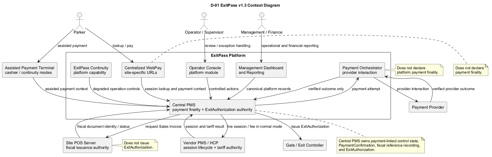
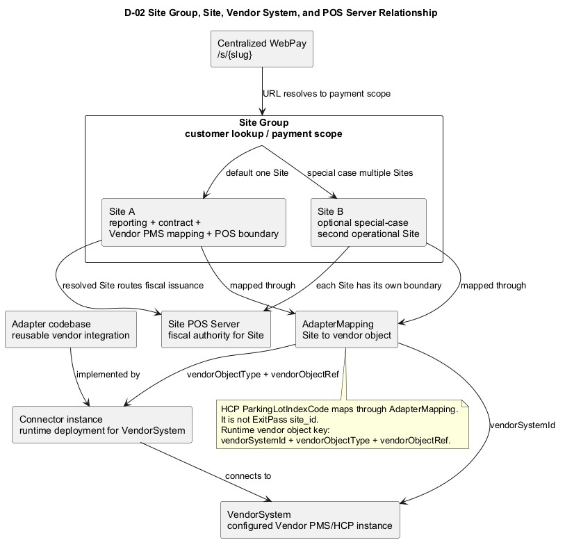
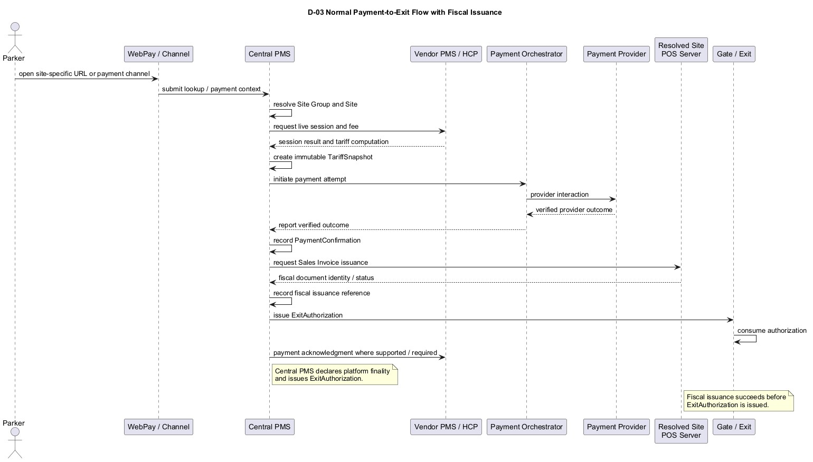
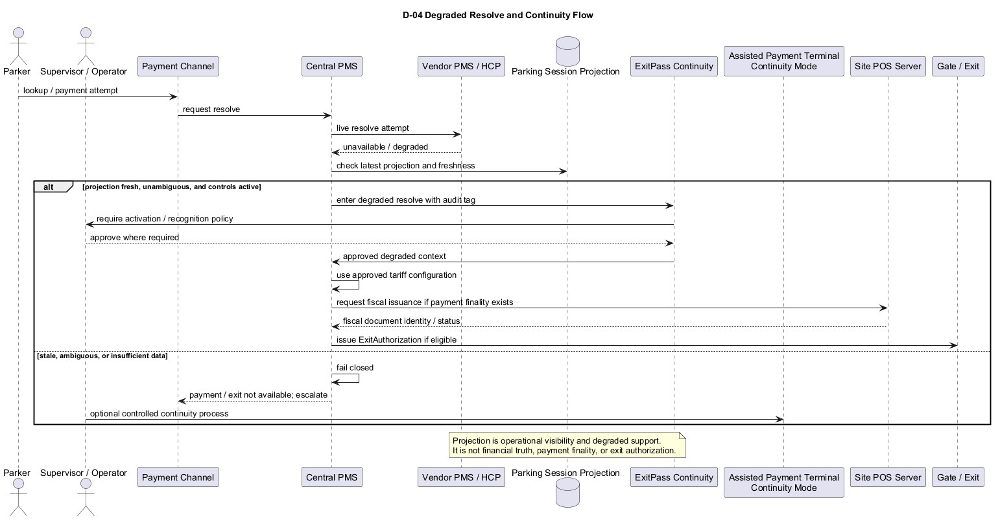
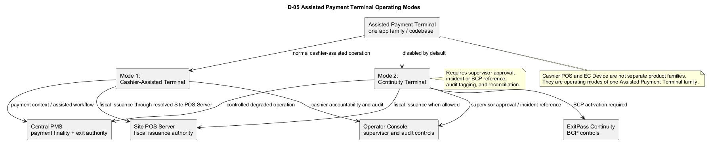

# ExitPass Business Requirements Document v1.3

Version: v1.3  
Status: Draft for review  
Generated: 2026-07-01  
Document type: Business Requirements Document  
Product scope: ExitPass core platform

## 1. Document Control

### 1.1 Version History

| Version | Date | Author / owner | Summary |
| --- | --- | --- | --- |
| v1.2 | Baseline | ExitPass documentation baseline | Established ExitPass business requirements for Site Group QR-based payment, Vendor PMS tariff authority, Central PMS payment and exit authority, payment orchestration, statutory discount handling, audit controls, and fail-closed degraded operation posture. |
| v1.3 | 2026-07-01 | ExitPass documentation stream | Controlled minor-version update to the v1.2 baseline. Preserves the v1.2 authority model and clarifies centralized WebPay, Site Group/Site semantics, physical lot versus ExitPass Site modeling, Vendor PMS connector modeling, projection-based operational visibility, normal and degraded resolve boundaries, platform-wide POS/Invoicing, Site-level POS Server, fiscal issuance before ExitAuthorization, Assisted Payment Terminal positioning including cashier-facing statutory discount validation capture, Operator Console separation, Continuity, and Management Dashboard/Reporting companion scope. |

### 1.2 Approvals

| Role | Name | Approval status | Date |
| --- | --- | --- | --- |
| Product owner | TBD | Pending review | TBD |
| Parking operations owner | TBD | Pending review | TBD |
| Finance / revenue assurance owner | TBD | Pending review | TBD |
| Technical architecture owner | TBD | Pending review | TBD |
| Compliance / audit owner | TBD | Pending review | TBD |

### 1.3 Document Ownership

This BRD is owned by the ExitPass product and documentation stream. It is the business baseline for ExitPass v1.3 core platform requirements. It shall be used as input to the later ExitPass System Design v1.3, companion BRDs, companion technical designs, Database/API/Engineering Pack v1.3, and implementation planning.

This document does not replace detailed companion BRDs or technical design documents. It anchors shared business scope, terminology, authority boundaries, and acceptance criteria.

### 1.4 Writing Order Control

ExitPass v1.3 documentation shall follow this order:

| Order | Documentation layer | Current status |
| --- | --- | --- |
| 1 | v1.3 planning artifacts | Complete baseline input |
| 2 | ExitPass BRD v1.3 | Current document |
| 3 | Companion BRDs | Not drafted in this document |
| 4 | ExitPass System Design v1.3 | Not drafted in this document |
| 5 | Companion technical designs | Not drafted in this document |
| 6 | Database/API/Engineering Pack v1.3 | Not drafted in this document |

## 2. Executive Summary

### 2.1 Problem Statement

ExitPass enables controlled digital parking payment and exit authorization across multiple parking operations while preserving clear authority boundaries between parking session systems, payment systems, fiscal issuance systems, and gate execution.

The v1.2 baseline established the core model: Vendor PMS remains the authority for raw parking session lifecycle and tariff computation in normal mode, Central PMS owns payment-linked platform control state and ExitAuthorization, and payment providers are abstracted through Payment Orchestrator.

ExitPass v1.3 clarifies how the platform operates as a centralized service across Site Groups and Sites, how WebPay URLs route customers into the right payment scope, how Vendor PMS connector instances and projection records support operational visibility, and how POS/Invoicing and fiscal issuance are incorporated before exit authorization without shifting payment or exit authority away from Central PMS.

### 2.2 Purpose of ExitPass

ExitPass provides a controlled parking payment and exit authorization platform that:

- Allows parkers to locate eligible parking sessions through WebPay, APM, assisted terminal, or operator-assisted channels.
- Uses Vendor PMS/HCP as the normal authority for parking session lifecycle and tariff computation.
- Uses Central PMS as the authority for payment-linked platform control state.
- Coordinates payment provider interaction through Payment Orchestrator.
- Records immutable payment and tariff facts for reconciliation and audit.
- Routes fiscal issuance through the resolved Site POS Server before exit authorization.
- Issues ExitAuthorization only from Central PMS.
- Supports controlled degraded operations and continuity workflows when Vendor PMS/HCP or network dependencies are unavailable.

### 2.3 Business Objectives

The business objectives for ExitPass v1.3 are:

- Preserve the v1.2 authority model while clarifying v1.3 operating scope.
- Standardize centralized WebPay access through site-specific or payment-scope URLs.
- Clarify Site Group and Site semantics for lookup, payment, reporting, vendor mapping, POS routing, and operations.
- Improve vendor connector planning through explicit VendorSystem, connector instance, adapter codebase, and AdapterMapping concepts.
- Support operational visibility through projection records without converting projections into financial truth.
- Define normal and degraded resolve boundaries at the business level.
- Anchor platform-wide POS/Invoicing and Site-level POS Server routing.
- Require fiscal issuance before Central PMS issues ExitAuthorization.
- Position Assisted Payment Terminal, Operator Console, Continuity, and Management Dashboard/Reporting as formal v1.3 documentation areas.
- Clarify that the Cashier-Assisted Terminal may capture statutory discount validation inputs during assisted payment while Central PMS / Discount workflow remains authority for policy resolution, validation persistence, and payable-basis update.

### 2.4 Scope Overview

#### 2.4.1 In Scope

The v1.3 core BRD covers:

- Centralized WebPay and site-specific public URL behavior.
- Site Group and Site business semantics.
- Physical parking lot versus ExitPass Site modeling principles.
- Vendor PMS connector business concepts.
- HikCentral/HCP projection and polling posture at the business level.
- Normal resolve mode using live Vendor PMS/HCP fee calculation.
- Degraded resolve mode using controlled projection-based fallback where approved.
- Platform-wide POS/Invoicing anchor.
- Site-level POS Server fiscal routing.
- Fiscal issuance before ExitAuthorization.
- Assisted Payment Terminal positioning.
- Operator Console as a formal platform module.
- ExitPass Continuity as a formal platform capability.
- Management Dashboard and Reporting as companion BRD scope.

#### 2.4.2 Out of Scope

This BRD does not define:

- Final database tables, columns, constraints, indexes, or migration scripts.
- Final API endpoint paths, DTOs, message schemas, or protocol details.
- POS Server implementation design.
- POS Server API Contract.
- Vendor PMS Connector System Design.
- HikCentral Connector Profile implementation detail.
- Assisted Payment Terminal System Design.
- Continuity System Design.
- Companion BRDs.
- DOCX output.

### 2.5 What This BRD Is and Is Not

This BRD is the business requirements baseline for ExitPass v1.3. It is intended to align product, operations, finance, compliance, and architecture stakeholders before later technical documents are drafted.

This BRD is not a System Design, Database Design, API Contract Pack, Engineering Pack, POS/Invoicing BRD, Continuity BRD, Operator Console BRD update, Assisted Payment Terminal BRD, or Management Dashboard and Reporting BRD.

## 3. Background and Context

### 3.1 Current Parking Operations Model

Parking operations rely on Vendor PMS/HCP systems for raw session lifecycle, entry and exit records, ticket or plate evidence, tariff rules, and parking fee computation. ExitPass v1.3 preserves this model for normal operation.

Central PMS coordinates ExitPass platform control state after the session and tariff facts are resolved. It records payment attempts, payment confirmations, tariff snapshots, fiscal issuance references, and ExitAuthorization.

### 3.2 Limitations of Cashier-Based and Semi-Automated Parking

Cashier-based and semi-automated parking operations create business limitations:

- Financial control can be weakened when payment, fiscal issuance, and exit release are handled without a consistent authority chain.
- Manual payment and exit handling reduces throughput during peak periods.
- Exception handling can become inconsistent without clear supervisor approval, audit, and reconciliation.
- Multiple physical parking areas, vendor-side parking objects, or contracts can be confused with platform Sites if the business model is not explicit.
- Reporting can mix operational projection data with canonical payment and fiscal records unless sources are clearly separated.

### 3.3 Introduction of Vendor PMS as Tariff Authority

Vendor PMS remains authority for raw parking session lifecycle and tariff computation in normal mode. ExitPass shall not replace the Vendor PMS tariff engine during normal operation.

Central PMS shall request live session and fee information through the correct Vendor PMS connector instance where available. The resulting fee response shall be captured as an immutable TariffSnapshot by Central PMS for payment and reconciliation purposes.

### 3.4 Site and Site Group Concepts

#### 3.4.1 Site Group

Site Group means customer lookup and payment scope. It answers:

> Where is the customer allowed to search and pay from this WebPay/APM entry point?

The default case is one Site Group with one Site. The special case is one Site Group containing multiple Sites where customers share one lookup or payment entry point across multiple operational boundaries.

Site Group may be user-facing as "Payment Scope" or "Lookup Scope" in a later UX decision, while retaining the underlying Site Group concept in platform planning.

#### 3.4.2 Site

Site means reporting, contract, Vendor PMS mapping, POS Server, and operational boundary. It answers:

> Which business/reporting/vendor/POS context owns this session?

The resolved Site determines business reporting attribution, Vendor PMS mapping, POS Server routing, operational ownership, and many audit and reconciliation views.

### 3.5 Physical Parking Lot Versus ExitPass Site

Physical parking lots are not automatically ExitPass Sites. ExitPass Site modeling shall be determined by Vendor PMS/session boundary and commercial/reporting boundary.

Business examples:

- A mall with multiple physical lots but one Vendor PMS parking domain may be modeled as one ExitPass Site.
- Adjacent buildings with separate contracts and reporting may be separate ExitPass Sites even if they share one customer lookup/payment scope.
- One HCP instance may support multiple vendor parking lots mapped to different ExitPass Sites.

The BRD does not require first-class physical parking lot tables. Physical lot or cluster modeling remains an open database/design question where needed for operations or reporting.

### 3.6 Strategic Alignment

#### 3.6.1 Cashierless Operation

ExitPass shall support cashierless payment and exit authorization where the Site, Vendor PMS, payment provider, POS Server, and gate integration support the required flow.

#### 3.6.2 Automation With Control

ExitPass shall automate session lookup, payment, fiscal issuance, and exit authorization while preserving authority boundaries, auditability, and fail-closed behavior.

#### 3.6.3 Scalable Multi-Site Governance

ExitPass shall support centralized platform control across multiple Site Groups, Sites, Vendor PMS/HCP instances, connector instances, POS Servers, payment channels, and reporting contexts.

### 3.7 Canonical System Architecture

At the business level, ExitPass v1.3 consists of:

- Central PMS as platform control authority.
- Vendor PMS/HCP as normal session lifecycle and tariff authority.
- Centralized WebPay with site-specific public URLs.
- Payment Orchestrator for payment provider interaction and verified outcome reporting.
- Site POS Server as fiscal issuance authority for the resolved Site.
- Operator Console as a formal internal non-payment governance and operations module.
- Assisted Payment Terminal as a separate terminal app family with cashier-assisted and continuity modes.
- ExitPass Continuity as a formal platform capability.
- Management Dashboard and Reporting as a companion business domain.

Operator Console and Assisted Payment Terminal are separate modules. They may share backend services, identity, audit, evidence, and design-system components, but they serve different operating contexts and must preserve separate permission boundaries.

### 3.8 System Context Diagram

PlantUML source: [D-01_ExitPass_v1.3_Context_Diagram.puml](diagrams/brd/D-01_ExitPass_v1.3_Context_Diagram.puml)

## 4. Business Goals and Success Metrics

### 4.1 Business Goals

| Goal | Description |
| --- | --- |
| Preserve authority clarity | Vendor PMS, Central PMS, Payment Orchestrator, WebPay, POS Server, and gates shall retain distinct responsibilities. |
| Improve customer payment access | Parkers shall use centralized WebPay with site-specific or payment-scope URLs. |
| Improve Site/Site Group governance | Business reporting, vendor mapping, POS routing, and operational ownership shall use explicit Site semantics. |
| Improve operational visibility | Projection data shall support lookup, dashboards, connector health, and degraded-mode decisions without becoming financial truth. |
| Strengthen fiscal control | POS/Invoicing shall be platform-wide and fiscal issuance shall occur before ExitAuthorization. |
| Formalize continuity | Degraded operation shall be explicit, controlled, audited, and reconciled. |

### 4.2 Operational KPIs

| KPI | Business expectation |
| --- | --- |
| Exit throughput time | ExitPass should reduce payment-to-exit delay compared with cashier-only flows. |
| Payment success rate | Supported payment channels should maintain measurable successful payment completion rates. |
| Fiscal issuance completion | Fiscal issuance should complete before exit authorization under normal operation. |
| Connector freshness | Connector health and projection freshness should be visible to operations. |
| Degraded mode containment | Degraded mode use should be measured, audited, and time-bound. |

### 4.3 Customer Experience Metrics

Customer experience shall be measured through:

- Successful session lookup rate by Site Group/payment scope.
- Payment completion rate by channel.
- Clear customer messaging when payment is received but fiscal issuance or exit authorization is pending.
- Reduction in ambiguous session and exit dispute cases.

### 4.4 Financial Accuracy and Reconciliation Metrics

Financial accuracy shall be measured through:

- Traceability from Site Group lookup to resolved Site.
- Match rate between TariffSnapshot, PaymentConfirmation, ProviderOutcome, POS fiscal document, and ExitAuthorization.
- Count and resolution status of fiscal issuance failures or timeouts.
- Count and resolution status of vendor payment acknowledgment failures.
- Reconciliation status after degraded operation or continuity activation.

### 4.5 Compliance and Audit Objectives

ExitPass v1.3 shall support:

- Payment finality auditability.
- Fiscal issuance traceability.
- ExitAuthorization accountability.
- Operator and supervisor action logging.
- Continuity activation and degraded-mode audit.
- Dashboard/report access logging where relevant.
- Separation between operational projection visibility and canonical financial records.

## 5. In-Scope and Out-of-Scope

### 5.1 In-Scope

#### 5.1.1 Centralized WebPay

WebPay shall be centralized. Public access should use site-specific or payment-scope URLs such as:

- `https://webpay.exitpass.ph/s/test-site`
- `https://webpay.exitpass.ph/s/alabang-town-center`

The URL shall resolve into a configured Site Group, Site, or payment-scope context. The exact slug registry remains open.

WebPay shall not be modeled as separately deployed per Site unless a future client-specific infrastructure requirement explicitly requires it.

#### 5.1.2 Site Group-based Lookup and Payment

ExitPass shall use Site Group as the customer lookup/payment scope. A WebPay, APM, or other channel entry point may limit customer search and payment to one Site Group.

#### 5.1.3 Site-bound Reporting, Vendor, POS, and Operational Routing

ExitPass shall use Site as the reporting, contract, Vendor PMS mapping, POS Server, and operational boundary. The resolved Site shall determine the applicable vendor mapping and Site POS Server.

#### 5.1.4 Vendor PMS Tariff Integration

ExitPass shall use live Vendor PMS/HCP fee calculation in normal resolve mode where available. Vendor PMS remains authority for raw parking session lifecycle and tariff computation in normal mode.

#### 5.1.5 Projection-based Operational Visibility

ExitPass shall support periodic connector projection for lookup acceleration, dashboard visibility, stale connector alerts, site/vendor health monitoring, occupancy/session monitoring, and degraded resolve support.

#### 5.1.6 Central Payment Authority

Central PMS shall remain authority for payment-linked platform control state. Payment Orchestrator shall interact with payment providers and report verified provider outcomes to Central PMS.

#### 5.1.7 Platform-wide POS/Invoicing Anchor

ExitPass shall provide BIR-authorized POS/Invoicing capability for all applicable parking payment channels. Detailed POS/Invoicing requirements belong in the ExitPass POS/Invoicing BRD.

#### 5.1.8 Exit Authorization Enforcement

Central PMS shall issue ExitAuthorization only after eligibility requirements are satisfied, including successful fiscal issuance where required. Gate and exit execution shall not bypass Central PMS authorization.

### 5.2 Out-of-Scope

#### 5.2.1 Companion BRDs

This document does not draft:

- ExitPass POS/Invoicing BRD.
- ExitPass Continuity BRD.
- ExitPass Operator Console BRD update.
- ExitPass Assisted Payment Terminal BRD.
- ExitPass Management Dashboard and Reporting BRD.

#### 5.2.2 Companion Technical Designs

This document does not draft:

- POS Server System Design.
- POS Server API Contract.
- Vendor PMS Connector System Design.
- HikCentral Connector Profile.
- Assisted Payment Terminal System Design.
- Continuity System Design.

#### 5.2.3 Database, API, and Engineering Detail

This document does not define final tables, columns, constraints, endpoints, DTOs, classes, queues, deployment scripts, or engineering implementation procedures.

#### 5.2.4 Vendor PMS Internal Enhancements

ExitPass v1.3 does not require changes to Vendor PMS internal tariff logic, parking session lifecycle rules, or vendor-side object identifiers.

#### 5.2.5 Physical Infrastructure Procurement

This BRD does not define procurement requirements for gates, cameras, APMs, printers, local network equipment, or POS hardware.

## 6. Stakeholders and Users

### 6.1 Business Stakeholders

#### 6.1.1 Parking Operators and Site Owners

Parking operators and Site owners require controlled payment, fiscal issuance, exit authorization, reporting, and exception handling aligned to their operational boundary.

#### 6.1.2 Management and Business Leadership

Management requires visibility into operational activity, payment performance, fiscal completeness, revenue reconciliation, connector health, and degraded mode incidents.

#### 6.1.3 Finance and Revenue Assurance Teams

Finance and revenue assurance teams require traceability across TariffSnapshot, PaymentAttempt, PaymentConfirmation, ProviderOutcome, POS fiscal documents, reconciliation records, and ExitAuthorization.

### 6.2 Operational Stakeholders

#### 6.2.1 Parking Operations Personnel

Operations personnel use Operator Console, APMs, assisted terminals, and continuity procedures to support parkers and handle exceptions. Cashiers use the Cashier-Assisted Terminal for assisted payment workflows, including cashier-facing statutory discount validation capture where policy allows.

#### 6.2.2 Operations Supervisors and Site Managers

Supervisors and Site managers approve escalations, review statutory discount exceptions where required, activate continuity where authorized, and oversee reconciliation after incidents.

#### 6.2.3 Technical Support and System Administrators

Technical support and administrators monitor connector health, projection freshness, payment channel availability, POS Server status, fiscal issuance exceptions, and integration health.

### 6.3 End Users

Parkers use WebPay, APM, cashier-assisted terminal, continuity terminal where activated, or operator-assisted workflows to locate sessions, validate applicable statutory discount entitlements through approved workflows, pay fees, receive fiscal documents where applicable, and exit.

### 6.4 External Parties

#### 6.4.1 Vendor PMS Providers

Vendor PMS/HCP providers supply authoritative session lifecycle and tariff computation in normal mode and may receive payment acknowledgment where supported or required.

#### 6.4.2 Payment Providers

Payment providers process payment transactions. Payment Orchestrator interacts with payment providers and reports verified provider outcomes to Central PMS.

#### 6.4.3 Fiscal and Compliance Advisors

Fiscal and compliance advisors support POS/Invoicing requirements, Sales Invoice treatment, reporting outputs, retention, and BIR-related controls in the relevant companion documents.

## 7. High-Level Solution Overview

### 7.1 ExitPass Concept Overview

ExitPass v1.3 is a centralized platform for parking session lookup, payment orchestration, fiscal issuance coordination, and exit authorization. It uses Vendor PMS/HCP as normal source of session and tariff truth, Central PMS as platform control authority, Site POS Server as fiscal issuance authority, and gate integrations as consumers of Central PMS authorization.

### 7.2 Site Group Model

Site Group is the customer lookup/payment scope. WebPay URLs, APM contexts, and assisted payment contexts may resolve into a Site Group before determining the specific Site that owns the session.

Default model: one Site Group has one Site.

Special model: one Site Group may contain multiple Sites where a single customer payment scope spans multiple operational Sites.

### 7.3 Site Model

Site is the reporting, contract, Vendor PMS mapping, POS Server, and operational boundary. A Site may correspond to one physical parking location, part of a physical location, multiple physical lots under one parking domain, or a vendor-side parking object mapping, depending on commercial and Vendor PMS boundaries.

### 7.4 Vendor PMS Connector Model

ExitPass v1.3 uses the following business concepts:

| Concept | Business definition |
| --- | --- |
| VendorSystem | A configured Vendor PMS/HCP instance. |
| Adapter codebase | A reusable vendor integration implementation, such as a HikCentral adapter. |
| Connector instance | A deployed/configured runtime connector for a specific Vendor PMS/HCP instance. |
| AdapterMapping | Mapping between an ExitPass Site and a vendor-side parking object. |

For HikCentral, HCP ParkingLotIndexCode shall map through AdapterMapping and shall not be treated as ExitPass `site_id`.

The runtime vendor object key is:

`vendorSystemId + vendorObjectType + vendorObjectRef`

This BRD does not define final table names or endpoint DTOs for these concepts.

### 7.5 HikCentral / Vendor PMS Polling and Projection

Each Vendor PMS/HCP connector should support periodic session projection. One-minute HCP passageway polling is the v1.3 planning baseline for HikCentral.

Projection records are operational visibility data. Projection supports:

- Faster lookup.
- Degraded resolve support.
- Centralized dashboard visibility.
- Stale connector alerts.
- Site/vendor health monitoring.
- Occupancy/session monitoring.

Projection does not replace live Vendor PMS tariff calculation in normal mode. Projection does not establish payment finality. Projection does not authorize exit.

### 7.6 Operator Console Module Positioning

The Operator Console remains the internal non-payment governance and operations module. It may support session lookup, statutory discount review, supervisor review, evidence review, audit, reporting, device controls, and shift controls.

Operator Console shall not collect payments, declare payment finality, or issue ExitAuthorization.

### 7.7 Assisted Payment Terminal Module Positioning

Assisted Payment Terminal is a separate terminal app family. It supports cashier/continuity payment workflow, payable-basis display, cashier-facing statutory discount validation capture, payment collection, POS Server fiscal routing, and terminal accountability.

In Cashier-Assisted Terminal mode, the Assisted Payment Terminal may initiate statutory discount validation and capture required input, but Central PMS / Discount workflow owns policy resolution, validation persistence, and payable-basis update. Assisted Payment Terminal may be implemented as a hardened terminal application, with implementation details deferred to Assisted Payment Terminal System Design.

### 7.8 Authority Model Overview

| Domain | Authority |
| --- | --- |
| Raw parking session lifecycle in normal mode | Vendor PMS/HCP |
| Tariff computation in normal mode | Vendor PMS/HCP |
| ParkingSession projection | Central PMS |
| TariffSnapshot | Central PMS |
| Discount policy resolution | Central PMS / Discount workflow |
| Statutory validation record | Central PMS / Discount workflow |
| PaymentAttempt | Central PMS |
| PaymentConfirmation | Central PMS |
| Payment provider interaction | Payment Orchestrator |
| Platform payment finality | Central PMS |
| Fiscal issuance | Site POS Server |
| Fiscal issuance reference recording | Central PMS |
| ExitAuthorization | Central PMS |
| Gate execution | Gate/exit system consuming Central PMS authorization |
| Cashier UI and evidence capture | Assisted Payment Terminal |
| Supervisor/compliance review | Operator Console / approved operations workflow |

### 7.9 Authority Separation Principle

The system shall preserve authority separation:

- Vendor PMS shall remain authority for raw parking session lifecycle and tariff computation in normal mode.
- Central PMS shall remain authority for payment-linked platform control state.
- Payment Orchestrator shall perform provider interaction and report verified provider outcomes.
- Payment Orchestrator shall not declare platform payment finality.
- WebPay shall not declare payment finality.
- Assisted Payment Terminal shall not declare payment finality.
- Assisted Payment Terminal shall not issue ExitAuthorization.
- Assisted Payment Terminal shall not become an independent statutory discount policy engine.
- POS Server shall not issue ExitAuthorization.
- Gate/exit execution shall not bypass Central PMS authorization.
- Polling/projection records shall not become financial truth.
- Fiscal issuance shall succeed before Central PMS issues ExitAuthorization.

### 7.10 Site Relationship Diagram

PlantUML source: [D-02_Site_Group_Site_Vendor_System_POS_Server_Relationship.puml](diagrams/brd/D-02_Site_Group_Site_Vendor_System_POS_Server_Relationship.puml)

## 8. Business Process Overview

### 8.1 Entry Process

Vehicle entry remains primarily governed by the Vendor PMS/HCP and associated parking equipment. ExitPass may receive or project session visibility through connector polling or lookup, but Vendor PMS remains authority for raw session lifecycle in normal mode.

### 8.2 Parking Session Lifecycle

Parking session lifecycle in normal mode is owned by Vendor PMS/HCP. Central PMS may maintain ParkingSession projection for platform visibility, lookup acceleration, degraded support, and reporting context.

### 8.3 Session Discovery via Site Group

The parker opens WebPay or another payment channel for a Site Group/payment scope. Central PMS shall resolve the lookup/payment scope and determine the Site context for the parking session.

WebPay public URLs should use site-specific or payment-scope paths. The exact slug registry and whether slugs resolve to Site Group, Site, or both remain open.

### 8.4 Normal Resolve and Payment-to-Exit Process

The normal business flow is:

1. Parker opens WebPay or another payment channel for a Site Group/payment scope.
2. Central PMS resolves the Site context.
3. Central PMS uses the correct Vendor PMS connector instance.
4. Vendor PMS/HCP provides live fee calculation and session result where available.
5. Central PMS creates or updates the parking session projection as needed.
6. Central PMS creates an immutable TariffSnapshot from the vendor fee result.
7. Payment proceeds through supported payment channels.
8. Payment Orchestrator handles provider interaction and reports verified outcome.
9. Central PMS records PaymentConfirmation.
10. POS Server fiscal issuance occurs for the resolved Site.
11. Central PMS records the fiscal issuance reference.
12. Central PMS issues ExitAuthorization if eligible.
13. Vendor PMS acknowledgment is performed where supported or required.

PlantUML source: [D-03_Normal_Payment_to_Exit_Flow_with_Fiscal_Issuance.puml](diagrams/brd/D-03_Normal_Payment_to_Exit_Flow_with_Fiscal_Issuance.puml)

### 8.5 Assisted Payment Statutory Discount Validation

In Cashier-Assisted Terminal mode, the terminal shall support statutory discount validation as part of the assisted payment workflow. The cashier may scan or manually enter a ticket/card number, retrieve the parking session, initiate Senior Citizen/PWD statutory discount validation, capture required structured entitlement details, capture supporting evidence where required by policy, capture cashier attestation, and submit the validation request to the approved Central PMS / Discount workflow.

The Assisted Payment Terminal is the cashier-facing capture and workflow surface. It shall not independently approve statutory entitlement, mutate the payable basis, or bypass backend policy resolution. Approved validation results shall be reflected through the approved payable-basis and fiscal issuance flow before payment proceeds.

### 8.6 Ambiguous Session Resolution Flow

Where lookup results are ambiguous, stale, incomplete, or conflicting, the system shall not silently select a session. The case shall be rejected, escalated, or routed to operator review depending on configured business policy.

### 8.7 Manual Override and Escalation

Manual release, if allowed, shall be supervisor-approved, incident-tagged, reconciliation-tagged, and auditable. Manual release shall not retroactively convert incomplete fiscal issuance, stale projection, or missing vendor confirmation into normal authority.

### 8.8 Integration Synchronization Model

ExitPass v1.3 supports both on-demand live vendor interactions and periodic connector projection. Projection is used for visibility and controlled fallback support. Live Vendor PMS/HCP fee calculation remains the normal-mode tariff source.

### 8.9 Business Continuity and Verified System Outage Handling

Degraded mode applies only when Vendor PMS/HCP is unavailable or degraded. Central PMS may use latest session projection only under explicit controls.

Degraded mode must be:

- Explicitly activated or recognized.
- Audited.
- Freshness-controlled.
- Reconciliation-tagged.
- Fail-closed where data is stale, ambiguous, or insufficient.

Degraded tariff computation must use approved ExitPass-maintained tariff configuration or last approved tariff configuration. The system shall not invent ad hoc tariffs from passageway records.

Exact degraded projection and tariff freshness thresholds remain open.

Continuity Terminal mode shall support statutory discount handling only under approved degraded-mode policy. If entitlement, policy basis, evidence requirements, projection freshness, or payable-basis recalculation cannot be safely validated, the terminal shall fail closed or route the case to supervisor/manual review. Any continuity-mode discount handling shall be incident-tagged, audit-tagged, reconciliation-tagged, and included in post-restoration review where applicable.

PlantUML source: [D-04_Degraded_Resolve_and_Continuity_Flow.puml](diagrams/brd/D-04_Degraded_Resolve_and_Continuity_Flow.puml)

## 9. Functional Requirements

### 9.1 Centralized WebPay and Site-specific URLs

| ID | Requirement |
| --- | --- |
| FR-001 | WebPay shall be operated as a centralized platform capability. |
| FR-002 | WebPay shall support site-specific or payment-scope public URLs. |
| FR-003 | WebPay URL resolution shall bind the customer to the configured Site Group, Site, or payment-scope context. |
| FR-004 | WebPay shall not declare payment finality. |
| FR-005 | WebPay shall not be modeled as separately deployed per Site unless a future client-specific infrastructure requirement explicitly requires it. |

### 9.2 Site Group Scoped Lookup and Payment

| ID | Requirement |
| --- | --- |
| FR-010 | The system shall use Site Group as customer lookup/payment scope. |
| FR-011 | The system shall support the default case where one Site Group has one Site. |
| FR-012 | The system shall support the special case where one Site Group contains multiple Sites. |
| FR-013 | The system shall prevent customer lookup from escaping the configured payment scope. |

### 9.3 Site-bound Reporting, Vendor Mapping, POS Routing, and Operations

| ID | Requirement |
| --- | --- |
| FR-020 | The system shall use Site as the reporting, contract, Vendor PMS mapping, POS Server, and operational boundary. |
| FR-021 | The resolved Site shall determine Vendor PMS connector mapping. |
| FR-022 | The resolved Site shall determine Site POS Server routing. |
| FR-023 | The system shall not treat physical parking lots as ExitPass Sites solely because they are physical lots. |

### 9.4 Vendor PMS Connector Model

| ID | Requirement |
| --- | --- |
| FR-030 | The system shall recognize VendorSystem as a configured Vendor PMS/HCP instance. |
| FR-031 | The system shall distinguish adapter codebase from deployed connector instance. |
| FR-032 | The system shall support one connector instance per Vendor PMS/HCP instance unless later design approves an alternate model. |
| FR-033 | The system shall use AdapterMapping to connect ExitPass Site to vendor-side parking object. |
| FR-034 | For HikCentral, the system shall not treat HCP ParkingLotIndexCode as ExitPass `site_id`. |
| FR-035 | Runtime vendor object identity shall use `vendorSystemId + vendorObjectType + vendorObjectRef`. |

### 9.5 Live Vendor PMS Fee Calculation in Normal Mode

| ID | Requirement |
| --- | --- |
| FR-040 | Central PMS shall use the correct Vendor PMS connector instance during normal resolve. |
| FR-041 | Vendor PMS/HCP shall provide live fee calculation and session result where available. |
| FR-042 | Central PMS shall create an immutable TariffSnapshot from the vendor fee result. |
| FR-043 | Projection data shall not replace live Vendor PMS fee calculation in normal mode. |

### 9.6 Projection-based Degraded Resolve Under Controls

| ID | Requirement |
| --- | --- |
| FR-050 | The system shall maintain or consume parking session projection for operational visibility where connector support exists. |
| FR-051 | HCP connector planning shall use one-minute passageway polling as the business baseline. |
| FR-052 | Projection shall support faster lookup, dashboard visibility, stale connector alerts, site/vendor health monitoring, occupancy/session monitoring, and degraded resolve support. |
| FR-053 | Projection shall not establish payment finality. |
| FR-054 | Projection shall not authorize exit. |
| FR-055 | Degraded resolve shall use projection only when explicit controls allow it. |

### 9.7 Connector Health and Projection Freshness Visibility

| ID | Requirement |
| --- | --- |
| FR-060 | The system shall expose connector health and projection freshness to authorized operational users. |
| FR-061 | The system shall support stale connector alerts. |
| FR-062 | The system shall distinguish fresh, stale, unavailable, and ambiguous projection conditions at a business level. |

### 9.8 Platform-wide POS/Invoicing

| ID | Requirement |
| --- | --- |
| FR-070 | ExitPass shall provide BIR-authorized POS/Invoicing capability for all applicable parking payment channels. |
| FR-071 | Applicable channels shall include WebPay, AutoPay Machine/APM, Cashier POS, EC Device/Continuity Terminal, operator-assisted payment if allowed, and future payment channels. |
| FR-072 | The core BRD shall anchor POS/Invoicing scope without replacing the POS/Invoicing BRD. |

### 9.9 Site POS Server Routing

| ID | Requirement |
| --- | --- |
| FR-080 | Each Site or parking operation boundary should have one Site-level POS Server. |
| FR-081 | The resolved Site shall determine which POS Server issues the Sales Invoice. |
| FR-082 | Payment channels and terminals shall be under the Site POS Server and shall not be independent fiscal authorities. |
| FR-083 | POS Server shall own fiscal issuance, fiscal numbering, X-read, Z-read, BIR Sales Summary, Electronic Journal, POSLog, fiscal audit trail, reprint controls, void/refund/cancel/return fiscal controls, cashier/session accountability, fiscal retention, and fiscal export. |
| FR-084 | Central PMS shall own payment finality and ExitAuthorization. |

### 9.10 Fiscal Issuance Before ExitAuthorization

| ID | Requirement |
| --- | --- |
| FR-090 | Central PMS shall receive verified payment finality before requesting fiscal issuance. |
| FR-091 | Central PMS shall request Sales Invoice issuance from the resolved Site POS Server. |
| FR-092 | POS Server shall return fiscal document identity and status after successful issuance. |
| FR-093 | Central PMS shall record the fiscal issuance reference. |
| FR-094 | Central PMS shall issue ExitAuthorization only after fiscal issuance succeeds and all other eligibility conditions are met. |
| FR-095 | If fiscal issuance fails or times out, ExitAuthorization shall not be issued yet. |

### 9.11 Assisted Payment Terminal Modes

Assisted Payment Terminal shall be one app family/codebase with two modes:

| Mode | Business purpose | Control posture |
| --- | --- | --- |
| Cashier-Assisted Terminal | Normal operating mode for cashier-assisted parking operations where human cashiers remain part of normal operations. | Supports cashier accountability and POS Server fiscal issuance. |
| Continuity Terminal | Controlled continuity mode used only under approved BCP/degraded operation. | Disabled by default; requires supervisor approval, incident/BCP reference, audit tagging, and reconciliation. |

The Cashier-Assisted Terminal shall support statutory discount validation as part of the assisted payment workflow. The terminal may capture required entitlement details, supporting evidence, and cashier attestation, and submit the validation request to the approved Central PMS / Discount workflow. The terminal shall not independently approve statutory entitlement, mutate the payable basis, or bypass backend policy resolution. Approved validation results shall be reflected through the approved payable-basis and fiscal issuance flow.

The Continuity Terminal shall support statutory discount handling only under approved degraded-mode policy. If entitlement, policy basis, evidence, projection freshness, or payable-basis recalculation cannot be safely validated, the terminal shall fail closed or route the case to supervisor/manual review. Any continuity-mode discount handling shall be incident-tagged, audit-tagged, and reconciliation-tagged.

Assisted Payment Terminal may be implemented as a hardened terminal application. Exact UI implementation stack, Android versus WebView versus PWA packaging, hardware integration, camera/scanner/printer integration, kiosk lockdown, offline evidence capture behavior, terminal certificate/key storage, permission matrix, API DTOs, and endpoint paths are deferred to Assisted Payment Terminal System Design and related technical documents.

PlantUML source: [D-05_Assisted_Payment_Terminal_Operating_Modes.puml](diagrams/brd/D-05_Assisted_Payment_Terminal_Operating_Modes.puml)

### 9.12 Statutory Discount / Entitlement Handling

| Function | Owner |
| --- | --- |
| Cashier UI and evidence capture | Assisted Payment Terminal |
| Discount policy resolution | Central PMS / Discount workflow |
| Statutory validation record | Central PMS / Discount workflow |
| Payable-basis recalculation / TariffSnapshot | Central PMS with Vendor PMS or approved degraded-mode tariff basis |
| Fiscal treatment on invoice | POS Server |
| Payment finality | Central PMS |
| ExitAuthorization | Central PMS |
| Supervisor/compliance review | Operator Console / approved operations workflow |

| ID | Requirement |
| --- | --- |
| FR-100 | The Cashier-Assisted Terminal shall allow the cashier to initiate statutory discount validation after resolving a valid parking session. |
| FR-101 | The terminal shall capture required structured entitlement details and evidence according to policy. |
| FR-102 | The terminal shall capture cashier attestation, device identity, shift/session identity, and audit metadata. |
| FR-103 | The terminal shall submit validation to Central PMS / Discount workflow. |
| FR-104 | Central PMS / Discount workflow shall return validation result and payable-basis effect. |
| FR-105 | The terminal shall display approved, rejected, failed, expired, or pending review result. |
| FR-106 | The terminal shall request or display the updated payable basis before payment. |
| FR-107 | The terminal shall not allow payment to proceed using an unapproved discount. |
| FR-108 | The terminal shall support supervisor escalation where validation is pending, failed, or policy requires review. |
| FR-109 | The terminal shall not independently approve statutory entitlement, bypass Central PMS / Discount workflow, mutate the payable basis directly, create payment finality, or issue ExitAuthorization. |
| FR-110 | Continuity Terminal mode shall restrict statutory discount handling to approved degraded-mode workflows. |

### 9.13 Operator Console Platform Module

| ID | Requirement |
| --- | --- |
| FR-120 | Operator Console shall be recognized as a formal platform module. |
| FR-121 | Operator Console remains the internal non-payment governance and operations module. |
| FR-122 | Operator Console may support session lookup, statutory discount review, supervisor review, evidence review, audit, reporting, device, and shift controls. |
| FR-123 | Operator Console shall not collect payments. |
| FR-124 | Operator Console shall not own or declare payment finality. |
| FR-125 | Operator Console shall not issue ExitAuthorization. |
| FR-126 | Operator Console and Assisted Payment Terminal shall preserve separate permission boundaries even where they share backend services, identity, audit, evidence, or design-system components. |

### 9.14 Continuity Activation and Degraded Handling

| ID | Requirement |
| --- | --- |
| FR-130 | ExitPass Continuity shall be recognized as a formal platform capability. |
| FR-131 | Continuity shall cover Vendor PMS outage, network degradation, projection-based fallback, degraded tariff computation under controls, Continuity Terminal activation, manual/assisted exit workflows, deferred vendor acknowledgment, and post-restoration reconciliation. |
| FR-132 | Continuity shall not replace the normal Vendor PMS/Central PMS authority model. |
| FR-133 | Continuity activation shall be explicit, audited, and reconciled. |
| FR-134 | Continuity-mode statutory discount activity shall be explicitly activated under BCP/degraded-mode controls, supervisor-approved where policy requires, incident-tagged, audit-tagged, reconciliation-tagged, and included in post-restoration review where applicable. |

### 9.15 Dashboard and Reporting Companion Scope

| ID | Requirement |
| --- | --- |
| FR-140 | Management Dashboard and Reporting shall be recognized as companion BRD scope. |
| FR-141 | Operational dashboards may use projection data for visibility. |
| FR-142 | Financial and revenue dashboards shall use canonical payment and fiscal records. |
| FR-143 | The core BRD shall distinguish operational projection visibility from financial truth. |

## 10. Non-Functional Requirements

### 10.1 Availability and Uptime

The system should maintain high availability for Central PMS, WebPay, Payment Orchestrator, connector services, POS Server integrations, and gate authorization consumers according to later service-level targets.

Centralized WebPay availability is a core customer experience requirement because site-specific URLs depend on the centralized WebPay service.

### 10.2 Performance and Latency

The system should support customer lookup, fee resolution, payment initiation, fiscal issuance, and exit authorization within operationally acceptable latency targets.

Dashboard and reporting latency expectations shall be defined at a high level in the Management Dashboard and Reporting BRD and at technical levels in later design documents.

### 10.3 Scalability

ExitPass shall support multiple Site Groups, Sites, Vendor PMS/HCP instances, connector instances, POS Servers, payment channels, assisted terminals, operator users, and reporting consumers.

### 10.4 Security and Authentication

The system shall enforce authentication and authorization appropriate to WebPay customers, operators, supervisors, administrators, service integrations, payment providers, POS Server integrations, and reporting users.

### 10.5 Data Integrity and Consistency

The system shall preserve immutable tariff, payment, fiscal reference, and exit authorization facts. It shall prevent projection data from overwriting canonical payment or fiscal records.

### 10.6 Projection Freshness and Staleness Handling

The system shall treat projection freshness as a controlled operating condition. Stale, ambiguous, or insufficient projection data shall not be used for degraded tariff computation or exit authorization unless approved controls explicitly allow continued operation.

### 10.7 Connector Health Observability

The system shall expose connector health, last successful poll time, projection freshness, and vendor system availability to authorized operational users and dashboards.

### 10.8 Degraded Mode Auditability

Every degraded mode activation, recognition, use, supervisor approval, customer-facing exception, manual release, and reconciliation action shall be auditable.

### 10.9 Fiscal Issuance Availability and Exception Handling

The system shall handle POS Server unavailability, fiscal issuance timeout, and fiscal issuance failure without issuing ExitAuthorization prematurely. Controlled retry, exception, and supervisor escalation workflows shall be supported.

### 10.10 POS Server Fiscal Integrity

POS Server fiscal integrity requirements include Sales Invoice issuance, fiscal numbering, X-read, Z-read, BIR Sales Summary, Electronic Journal, POSLog, fiscal audit trail, reprint controls, void/refund/cancel/return fiscal controls, cashier/session accountability, fiscal retention, and fiscal export. Detailed requirements belong in POS/Invoicing BRD and POS Server technical documents.

### 10.11 Traceability

The system shall support traceability from Site Group lookup to resolved Site, Vendor PMS/HCP connector instance, TariffSnapshot, PaymentAttempt, PaymentConfirmation, ProviderOutcome, POS fiscal document, fiscal issuance reference, ExitAuthorization, and gate consumption.

### 10.12 Statutory Discount Evidence, Privacy, and RBAC

Cashier-assisted statutory discount validation shall preserve evidence, cashier attestation, device identity, shift/session identity, supervisor action where applicable, and audit metadata. The Assisted Payment Terminal shall enforce policy-based capture requirements and RBAC constraints through approved backend workflows. It shall not weaken evidence, privacy, audit, or permission requirements compared with Operator Console or Central PMS / Discount workflow controls.

## 11. Data and Record Model Requirements

### 11.1 Logical Entities

This section defines business-level logical entities only. It does not define tables, columns, constraints, or indexes.

| Logical entity | Business requirement |
| --- | --- |
| Site Group / Payment Scope | Represents customer lookup/payment scope for WebPay, APM, and other channel entry points. |
| Site | Represents reporting, contract, Vendor PMS mapping, POS Server, and operational boundary. |
| Vendor System | Represents a configured Vendor PMS/HCP instance. |
| Adapter Mapping | Connects ExitPass Site to vendor-side parking object. |
| Connector Instance | Represents a deployed/configured runtime connector for a specific Vendor PMS/HCP instance. |
| Parking Session Projection | Represents Central PMS operational projection of vendor session data. |
| Tariff Snapshot | Immutable fee result captured by Central PMS from live vendor calculation or approved degraded tariff computation. |
| Payment Attempt | Central PMS record of an attempted payment flow. |
| Payment Confirmation | Central PMS record of verified platform payment finality. |
| Statutory Validation Record | Central PMS / Discount workflow record of statutory discount validation request, policy result, evidence reference, cashier attestation, and payable-basis effect. |
| Fiscal Issuance Reference | Central PMS record linking payment/session context to POS Server-issued fiscal document identity/status. |
| Exit Authorization | Central PMS-issued authorization for gate/exit execution. |
| POS Server | Site-level fiscal issuance authority. |
| Payment Channel / Terminal | WebPay, APM, Cashier POS, EC Device/Continuity Terminal, operator-assisted channel, or future channel under the Site POS Server where applicable. |
| Continuity Activation / Incident Reference | Business record tying degraded operation or continuity use to approval, incident, and reconciliation context. |
| Dashboard/Reporting View | Business view over operational projection data or canonical financial/fiscal records depending on report type. |

### 11.2 Identifier Requirements

The system shall preserve distinct identifiers for Site Group, Site, VendorSystem, connector instance, vendor object, payment attempt, payment confirmation, fiscal document, and ExitAuthorization.

HCP ParkingLotIndexCode shall not be used as ExitPass `site_id`. Runtime vendor object identity shall use `vendorSystemId + vendorObjectType + vendorObjectRef`.

### 11.3 State Model Requirements

Central PMS shall maintain state for payment attempts, payment confirmations, fiscal issuance references, and ExitAuthorization. POS Server shall maintain fiscal document lifecycle state. Vendor PMS/HCP shall remain authority for raw session lifecycle in normal mode.

### 11.4 Correlation and Traceability Requirements

Records shall be correlated across Site Group lookup, resolved Site, vendor connector, TariffSnapshot, payment records, fiscal issuance, exit authorization, and gate usage.

### 11.5 Data Retention and Immutability Principles

Tariff snapshots, payment confirmations, fiscal issuance references, ExitAuthorizations, operator actions, degraded mode activations, and manual release records shall be retained and protected according to later compliance, audit, privacy, and operational requirements.

## 12. Payment Orchestration

### 12.1 Role of the Payment Orchestrator

Payment Orchestrator shall perform payment provider interaction, provider abstraction, callback handling, and verified provider outcome reporting.

Payment Orchestrator shall not declare platform payment finality. Central PMS shall declare platform payment finality after applying required validation and idempotency controls.

### 12.2 Supported Payment Rails

Supported payment rails remain subject to provider availability, merchant configuration, and platform policy. This BRD does not define provider-specific API details.

### 12.3 Payment Finality Rules

Central PMS shall own payment finality. WebPay, APM, Assisted Payment Terminal, Cashier POS, EC Device, Operator Console, Payment Orchestrator, payment providers, POS Server, and gates shall not independently declare platform payment finality.

### 12.4 Handoff to Fiscal Issuance

The required handoff is:

1. Payment Orchestrator reports verified provider outcome.
2. Central PMS records platform payment finality.
3. Central PMS requests Sales Invoice issuance from the resolved Site POS Server.
4. POS Server returns fiscal document identity/status.
5. Central PMS records fiscal issuance reference.
6. Central PMS issues ExitAuthorization if eligible.

### 12.5 Reconciliation and Settlement

Financial reconciliation shall use canonical payment and fiscal records, including TariffSnapshot, PaymentAttempt, PaymentConfirmation, ProviderOutcome, POS fiscal documents, and reconciliation records. Projection data shall not be treated as financial truth.

## 13. Exception, Failure, and Degraded Mode Operation

### 13.1 Design Posture for Exceptions and Failures

The system shall fail closed by default where authority, session identity, payment finality, fiscal issuance, or exit authorization is uncertain.

### 13.2 Vendor PMS Unavailable

If Vendor PMS/HCP is unavailable, Central PMS shall not treat projection data as live vendor tariff truth. Degraded resolve may proceed only under explicit controls and approved tariff configuration.

### 13.3 Connector Stale

If connector health or projection freshness is stale, the system shall alert authorized users and prevent degraded use unless configured policy allows controlled continuation.

### 13.4 Projection Stale

If projection data is stale, ambiguous, or insufficient, the system shall fail closed for degraded tariff computation and exit authorization.

### 13.5 Degraded Tariff Blocked

If approved degraded tariff configuration is unavailable or insufficient, the system shall not invent tariffs from passageway records.

### 13.6 Fiscal Issuance Failed

If fiscal issuance fails after payment finality:

- Payment finality is not automatically reversed.
- ExitAuthorization is not issued yet.
- The case enters a controlled fiscal issuance exception/retry workflow.
- Customer/operator messaging must show that payment was received but fiscal issuance is pending and exit authorization is not yet available.

### 13.7 Fiscal Issuance Timed Out

If fiscal issuance times out, the system shall determine whether issuance status is unknown, failed, or pending before retrying. It shall avoid duplicate fiscal documents and shall not issue ExitAuthorization until fiscal issuance succeeds or an approved exception policy allows manual release.

### 13.8 Vendor Payment Acknowledgment Failed

If vendor payment acknowledgment fails after Central PMS payment finality and fiscal issuance, the system shall queue, retry, or escalate according to later design. Vendor acknowledgment failure shall be auditable and reconciliation-tagged.

### 13.9 Continuity Terminal Activation

Continuity Terminal mode shall be disabled by default. Activation shall require approved BCP/degraded mode authority, supervisor approval where required, incident/BCP reference, audit tagging, and reconciliation.

### 13.10 Continuity Terminal Statutory Discount Handling

Continuity Terminal mode shall support statutory discount handling only under approved degraded-mode policy. If the system cannot safely validate entitlement, policy basis, evidence requirements, projection freshness, or payable-basis recalculation, the terminal shall fail closed or route the case to supervisor/manual review.

Continuity-mode discount activity shall be explicitly activated under BCP/degraded-mode controls, supervisor-approved where policy requires, incident-tagged, audit-tagged, reconciliation-tagged, and included in post-restoration review where applicable.

### 13.11 Manual Release Under Fiscal or Continuity Exception

Manual release, if allowed, shall be supervisor-approved, incident-tagged, reconciliation-tagged, and auditable. Manual release shall not change the fact that POS Server does not issue ExitAuthorization and that gates must not bypass Central PMS authorization.

### 13.12 User Messaging During Exceptions

Customer/operator messages shall be clear and non-technical. Where payment has succeeded but fiscal issuance or exit authorization is pending, the message shall not imply that exit is authorized until Central PMS issues ExitAuthorization.

## 14. Audit, Logging, and Reporting

### 14.1 Audit Authority and Scope

Audit coverage shall include:

- URL slug/site resolution.
- Site Group to Site resolution.
- Connector health and polling state.
- Projection freshness.
- Degraded resolve activation and use.
- Fiscal issuance request and result.
- Fiscal issuance failure and retry.
- Manual release under fiscal exception.
- Continuity Terminal activation and use.
- Operator Console actions.
- Assisted Payment Terminal actions.
- Cashier-assisted statutory discount capture, cashier attestation, validation request, validation result, payable-basis refresh, supervisor escalation, and evidence references.
- Continuity-mode statutory discount activity, including incident, audit, reconciliation, and post-restoration review tags.
- Dashboard/report access where relevant.

### 14.2 Log and Event Classification

Logs and events shall distinguish operational events, payment events, fiscal events, authorization events, connector/projection health events, continuity events, operator actions, and reporting access events.

### 14.3 Payment and Exit Traceability

The system shall support reconstruction of the path from customer URL or channel entry through Site Group, resolved Site, Vendor PMS connector, TariffSnapshot, PaymentConfirmation, fiscal issuance reference, ExitAuthorization, and gate consumption.

### 14.4 Management Dashboard and Reporting

Operational dashboards may use projection data for visibility. Examples include:

- Active sessions.
- Active vehicles.
- Entry time aging.
- Long-stay sessions.
- Stale sessions.
- Connector health.
- Last poll time.
- Site/vendor health.
- Occupancy approximation.

Financial and revenue dashboards shall use canonical payment and fiscal records, including:

- TariffSnapshot.
- PaymentAttempt.
- PaymentConfirmation.
- ProviderOutcome.
- POS fiscal documents.
- Reconciliation records.

Detailed Management Dashboard and Reporting requirements belong in the Management Dashboard and Reporting BRD.

## 15. Compliance and Regulatory Considerations

### 15.1 Payment and Financial Compliance

Payment finality shall be controlled by Central PMS. Payment Orchestrator shall report verified provider outcomes but shall not declare platform finality.

### 15.2 POS/Invoicing Compliance

ExitPass shall provide BIR-authorized POS/Invoicing capability for all applicable parking payment channels. The core BRD anchors this requirement at a business level.

Detailed BIR output, Sales Invoice, X-read, Z-read, BIR Sales Summary, Electronic Journal, POSLog, reprint, void/refund/cancel/return, reset counter, Z-counter, and fiscal export requirements belong in the POS/Invoicing BRD and POS Server technical documents.

### 15.3 Auditability and Traceability Compliance

The system shall support end-to-end traceability, immutable business records, and audit reconstruction for payment, fiscal issuance, degraded operation, operator actions, and exit authorization.

### 15.4 Data Protection and Privacy Considerations

The system shall minimize sensitive data collection, restrict access by role, audit operator actions, and preserve statutory discount evidence handling requirements in the appropriate Operator Console and compliance documents.

Assisted Payment Terminal statutory discount capture shall follow the same evidence, privacy, audit, and RBAC posture required by Central PMS / Discount workflow and approved operations policy. The terminal shall capture only required entitlement details and evidence, submit them to the approved backend workflow, and avoid terminal-local policy approval or unmanaged evidence retention.

### 15.5 Compliance by Design

ExitPass v1.3 shall preserve:

- Authority separation.
- Immutable financial and fiscal references.
- Explicit degraded state handling.
- No silent fallback.
- Traceability from lookup to exit.

## 16. Assumptions, Constraints, and Risks

### 16.1 Assumptions

| ID | Assumption |
| --- | --- |
| A-001 | Vendor PMS/HCP remains available for live session and tariff computation during normal operation. |
| A-002 | Central PMS remains the platform authority for payment-linked control state and ExitAuthorization. |
| A-003 | Payment providers can provide verifiable outcomes through Payment Orchestrator. |
| A-004 | Site POS Server can issue fiscal documents for the resolved Site where POS/Invoicing is enabled. |
| A-005 | Connector projection can support operational visibility but not replace financial truth. |

### 16.2 Constraints

| ID | Constraint |
| --- | --- |
| C-001 | Vendor PMS remains tariff authority in normal mode. |
| C-002 | Payment Orchestrator and WebPay shall not declare payment finality. |
| C-003 | POS Server shall not issue ExitAuthorization. |
| C-004 | Gate/exit execution shall not bypass Central PMS authorization. |
| C-005 | Projection records shall not become financial truth. |
| C-006 | Fiscal issuance shall succeed before Central PMS issues ExitAuthorization unless a separately approved exception policy applies. |

### 16.3 Risks and Mitigation Strategies

| Risk | Impact | Mitigation |
| --- | --- | --- |
| Site Group and Site confusion | Incorrect lookup, reporting, vendor mapping, or POS routing. | Define Site Group and Site semantics clearly and test resolution behavior. |
| Vendor identifier misuse | HCP ParkingLotIndexCode could be treated as platform Site ID. | Require AdapterMapping and runtime vendor object key. |
| Projection misuse | Projection could be treated as fee truth or payment finality. | Explicitly classify projection as operational visibility and degraded support only. |
| Fiscal issuance outage | Paid customer may be blocked before exit. | Use controlled exception/retry messaging and supervisor escalation. |
| Degraded mode overuse | Tariff, audit, or dispute risk. | Require explicit activation, freshness controls, audit, and reconciliation. |
| Reporting source confusion | Financial dashboards may use operational projection data. | Separate operational dashboards from financial/revenue reporting sources. |

## 17. Dependencies and External Interfaces

### 17.1 Authoritative System Dependencies

#### 17.1.1 Vendor PMS/HCP

Vendor PMS/HCP provides raw parking session lifecycle and tariff computation in normal mode. HikCentral/HCP may also provide passageway records for projection through connector polling.

#### 17.1.2 Central PMS

Central PMS owns ParkingSession projection, TariffSnapshot, PaymentAttempt, PaymentConfirmation, fiscal issuance reference recording, and ExitAuthorization.

### 17.2 Payment and Settlement Dependencies

Payment providers supply verified payment outcomes through Payment Orchestrator. Payment Orchestrator abstracts provider interaction and reports outcomes to Central PMS.

### 17.3 Fiscal Issuance Dependencies

Site POS Server issues fiscal documents for the resolved Site. POS Server does not own payment finality and does not issue ExitAuthorization.

### 17.4 Physical Control Dependencies

Gate and exit systems consume Central PMS-issued ExitAuthorization. Gate/exit execution shall not bypass Central PMS authorization.

### 17.5 Operational Dependencies

Operator Console, Assisted Payment Terminal, ExitPass Continuity, and Management Dashboard/Reporting depend on accurate Site resolution, connector health visibility, audit logging, and role-based access.

### 17.6 External Interfaces

External interfaces include:

- WebPay public URL entry points.
- Vendor PMS/HCP connector interactions.
- Payment provider interactions through Payment Orchestrator.
- POS Server fiscal issuance interactions.
- Gate/exit controller integration.
- Operator Console and assisted terminal user actions.
- Dashboard/reporting access.

This BRD does not define endpoint paths or DTOs.

## 18. Acceptance Criteria

| ID | Acceptance criterion |
| --- | --- |
| AC-001 | WebPay uses a centralized service with site-specific or payment-scope URLs. |
| AC-002 | URL/site resolution binds the customer to the correct Site Group and resolved Site. |
| AC-003 | Site Group is used as lookup/payment scope. |
| AC-004 | Site is used for reporting, vendor mapping, POS Server routing, and operational boundary. |
| AC-005 | Physical lots are not automatically treated as ExitPass Sites. |
| AC-006 | Vendor PMS/HCP ParkingLotIndexCode is not used as ExitPass `site_id`. |
| AC-007 | Normal resolve mode uses live Vendor PMS/HCP fee calculation. |
| AC-008 | Projection feed is treated as operational visibility and degraded-mode support only. |
| AC-009 | Degraded mode uses projection only under approved controls. |
| AC-010 | Fiscal issuance succeeds before ExitAuthorization is issued. |
| AC-011 | If fiscal issuance fails, ExitAuthorization is not issued and a controlled exception workflow is started. |
| AC-012 | POS Server does not issue ExitAuthorization. |
| AC-013 | Payment Orchestrator does not declare platform finality. |
| AC-014 | WebPay does not declare platform finality. |
| AC-015 | Assisted Payment Terminal supports cashier-assisted and continuity modes as one app family. |
| AC-016 | Given a valid session in Cashier-Assisted Terminal mode, the cashier can initiate statutory discount validation before payment. |
| AC-017 | The terminal captures required entitlement details, evidence, and cashier attestation. |
| AC-018 | The validation request is processed by Central PMS / Discount workflow, not by terminal-local policy logic. |
| AC-019 | If validation is approved, the payable basis is recalculated or refreshed through the approved backend workflow before payment. |
| AC-020 | If validation is rejected, failed, expired, or pending review, the terminal does not apply the discount as payable basis. |
| AC-021 | Assisted Payment Terminal does not declare payment finality. |
| AC-022 | Assisted Payment Terminal does not issue ExitAuthorization. |
| AC-023 | Continuity Terminal mode only permits statutory discount handling under approved degraded-mode policy. |
| AC-024 | Operator Console remains separate from Assisted Payment Terminal and remains non-payment. |
| AC-025 | Operator Console is recognized as a formal platform module. |
| AC-026 | Continuity is recognized as a formal platform capability. |
| AC-027 | Dashboard/reporting distinguishes operational projection visibility from financial truth. |

## 19. Open Issues and Future Enhancements

### 19.1 Open Questions

| ID | Open question |
| --- | --- |
| OQ-001 | What is the exact WebPay public URL slug registry structure? |
| OQ-002 | Do WebPay URL slugs resolve to Site Group, Site, or both? |
| OQ-003 | Do physical parking lots or clusters remain operational metadata, or do they need first-class modeling in v1.3? |
| OQ-004 | What is the exact degraded tariff freshness threshold? |
| OQ-005 | What is the exact POS Server deployment and registration model? |
| OQ-006 | Is POS Server a module under Central PMS or a separate service? |
| OQ-007 | Who has exact BCP activation authority for Continuity Terminal? |
| OQ-008 | Does the HCP connector push to Central PMS or does Central PMS pull from connector endpoint in each deployment topology? |
| OQ-009 | Is vendor payment acknowledgment synchronous or queued/retried per Site? |
| OQ-010 | How should HCP connector health and projection freshness be modeled? |
| OQ-011 | Should Site Group be user-facing as Payment Scope or Lookup Scope while retaining the Site Group concept? |
| OQ-012 | What details belong in the core BRD versus the Management Dashboard and Reporting BRD? |

### 19.2 Deferred Companion BRDs

The following companion BRDs are explicitly referenced but not drafted here:

- ExitPass POS/Invoicing BRD.
- ExitPass Continuity BRD.
- ExitPass Operator Console BRD update.
- ExitPass Assisted Payment Terminal BRD.
- ExitPass Management Dashboard and Reporting BRD.

### 19.3 Deferred Companion Technical Documents

The following companion technical documents are acknowledged but not drafted here:

- POS Server System Design.
- POS Server API Contract.
- Vendor PMS Connector System Design.
- HikCentral Connector Profile.
- Assisted Payment Terminal System Design.
- Continuity System Design.

### 19.4 Future Enhancements

Future enhancements may include advanced analytics, expanded reporting views, additional payment channels, deeper vendor integration profiles, additional continuity automation, and broader multi-site portfolio reporting. These shall not alter the authority model without explicit approval.

### 19.5 Deferred Technical Design Details

The following Assisted Payment Terminal details are deferred to companion technical design and are not BRD blockers:

- Exact UI implementation stack.
- Android versus WebView versus PWA packaging.
- Hardware integration details.
- Camera, scanner, and printer integration.
- Kiosk lockdown.
- Offline evidence capture behavior.
- Terminal certificate and key storage.
- Exact permission matrix.
- Exact API DTOs and endpoint paths.

## 20. Appendices

### Appendix A: Glossary of Terms

| Term | Definition |
| --- | --- |
| Adapter codebase | Reusable vendor integration implementation, such as a HikCentral adapter. |
| AdapterMapping | Mapping between an ExitPass Site and a vendor-side parking object. |
| Assisted Payment Terminal | Separate terminal app family supporting cashier-assisted and continuity operating modes. |
| Cashier-Assisted Terminal | Assisted Payment Terminal mode for normal cashier-assisted parking payment workflows, including cashier-facing statutory discount validation capture where policy allows. |
| Central PMS | ExitPass platform control authority for payment-linked state and ExitAuthorization. |
| Connector instance | Deployed/configured runtime connector for a specific Vendor PMS/HCP instance. |
| Continuity Terminal | Assisted Payment Terminal mode activated only under approved BCP/degraded operation. |
| ExitAuthorization | Central PMS-issued authorization for gate/exit execution. |
| Parking Session Projection | Central PMS operational projection of vendor session data. |
| Payment Orchestrator | Component that interacts with payment providers and reports verified provider outcomes. |
| POS Server | Site-level fiscal issuance authority. |
| Site | Reporting, contract, Vendor PMS mapping, POS Server, and operational boundary. |
| Site Group | Customer lookup/payment scope. |
| TariffSnapshot | Immutable fee result recorded by Central PMS. |
| VendorSystem | Configured Vendor PMS/HCP instance. |
| WebPay | Centralized customer payment surface using site-specific or payment-scope URLs. |

### Appendix B: Acronyms

| Acronym | Meaning |
| --- | --- |
| APM | AutoPay Machine |
| BCP | Business Continuity Plan |
| BIR | Bureau of Internal Revenue |
| BRD | Business Requirements Document |
| DTO | Data Transfer Object |
| EC | ExitPass Continuity terminal. Planning term used for degraded-mode assisted payment operations. |
| HCP | HikCentral Professional |
| PMS | Parking Management System |
| POS | Point of Sale |
| UAT | User Acceptance Testing |

### Appendix C: BRD-level Diagrams

| ID | Diagram | PlantUML source |
| --- | --- | --- |
| D-01 | [ExitPass v1.3 Context Diagram](diagrams/brd/D-01_ExitPass_v1.3_Context_Diagram.jpg) | [D-01_ExitPass_v1.3_Context_Diagram.puml](diagrams/brd/D-01_ExitPass_v1.3_Context_Diagram.puml) |
| D-02 | [Site Group, Site, Vendor System, and POS Server Relationship Diagram](diagrams/brd/D-02_Site_Group_Site_Vendor_System_POS_Server_Relationship.jpg) | [D-02_Site_Group_Site_Vendor_System_POS_Server_Relationship.puml](diagrams/brd/D-02_Site_Group_Site_Vendor_System_POS_Server_Relationship.puml) |
| D-03 | [Normal Payment-to-Exit Flow with Fiscal Issuance](diagrams/brd/D-03_Normal_Payment_to_Exit_Flow_with_Fiscal_Issuance.jpg) | [D-03_Normal_Payment_to_Exit_Flow_with_Fiscal_Issuance.puml](diagrams/brd/D-03_Normal_Payment_to_Exit_Flow_with_Fiscal_Issuance.puml) |
| D-04 | [Degraded Resolve and Continuity Flow](diagrams/brd/D-04_Degraded_Resolve_and_Continuity_Flow.jpg) | [D-04_Degraded_Resolve_and_Continuity_Flow.puml](diagrams/brd/D-04_Degraded_Resolve_and_Continuity_Flow.puml) |
| D-05 | [Assisted Payment Terminal Operating Modes](diagrams/brd/D-05_Assisted_Payment_Terminal_Operating_Modes.jpg) | [D-05_Assisted_Payment_Terminal_Operating_Modes.puml](diagrams/brd/D-05_Assisted_Payment_Terminal_Operating_Modes.puml) |

### Appendix D: Source References

| Source | Use |
| --- | --- |
| ExitPass BRD v1.2 | Structure, style, authority baseline, and core business requirement baseline. |
| ExitPass v1.3 planning artifacts | Approved decisions, open questions, documentation outline, and source impact map. |
| ExitPass System Design v1.2 | Source authority model and system boundary context. |
| ExitPass Database Design v1.2 and DDL references | Business-level data concept baseline only. |
| ExitPass API Contract Pack v1.2 | API impact awareness only; no endpoint details drafted here. |
| ExitPass Engineering Pack v1.2 | Operational and engineering planning context only. |
| ExitPass Operator Console BRD v1.0 | Operator Console module baseline for later companion update. |
| POS/BIR reference folder | High-level POS/Invoicing anchoring only. Detailed fiscal requirements remain in POS/Invoicing and POS Server documents. |
