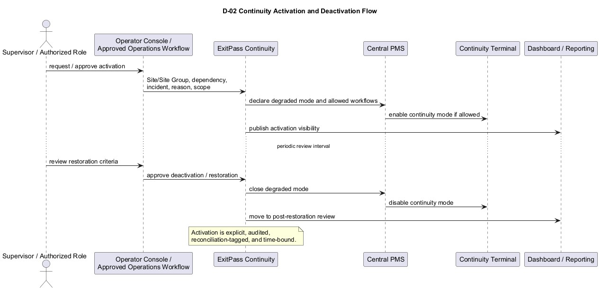
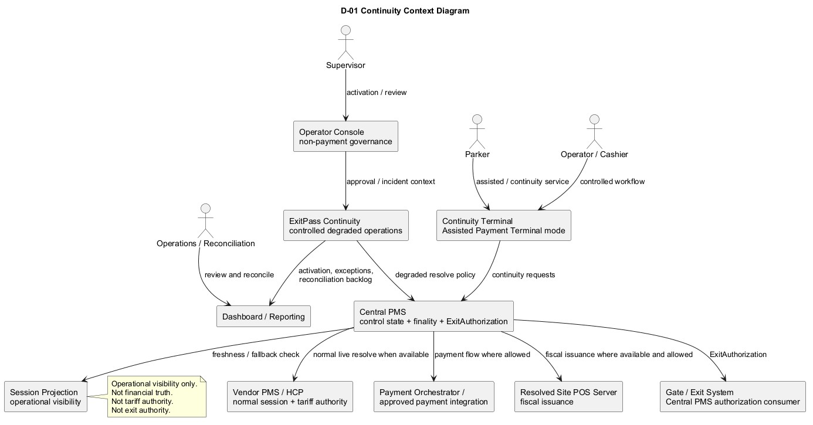
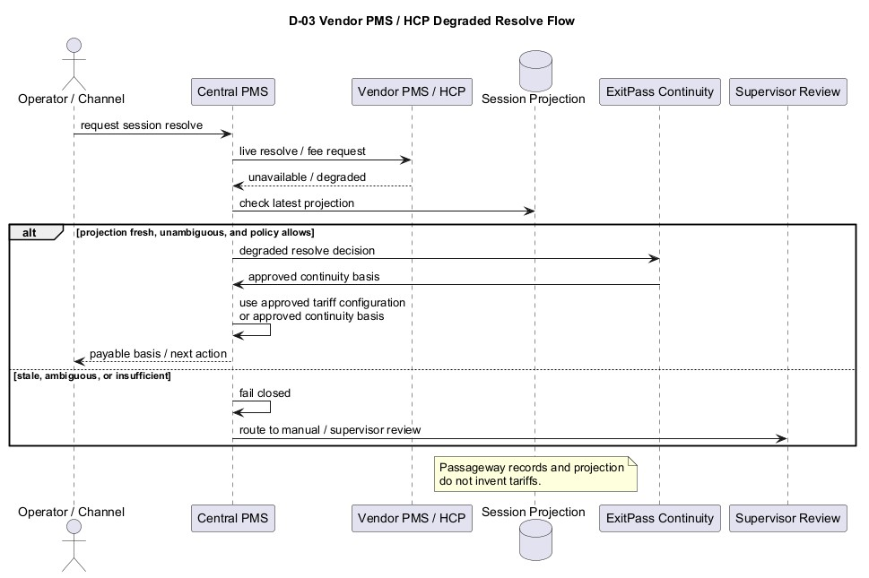
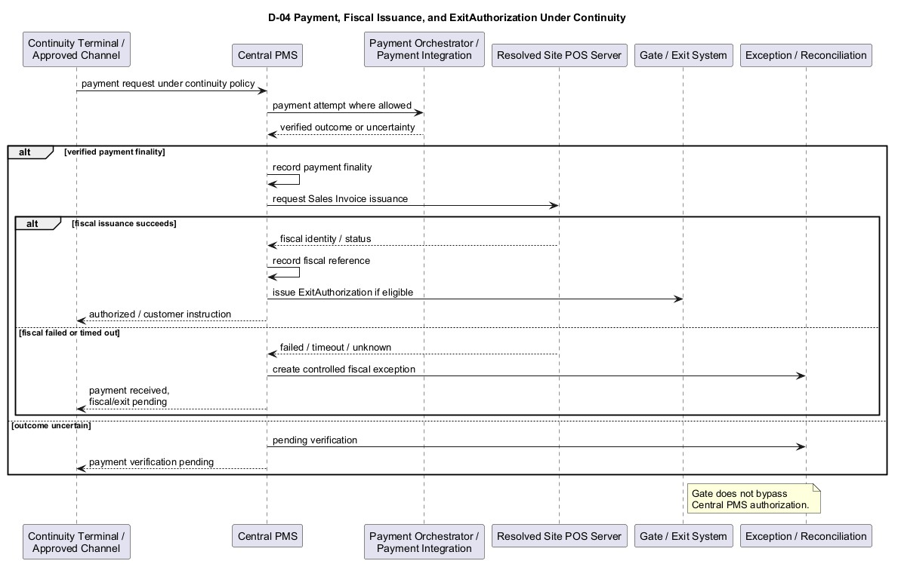
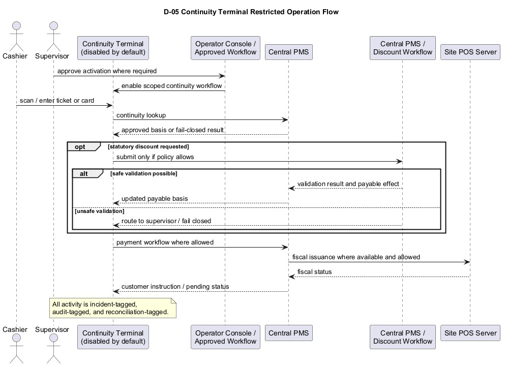
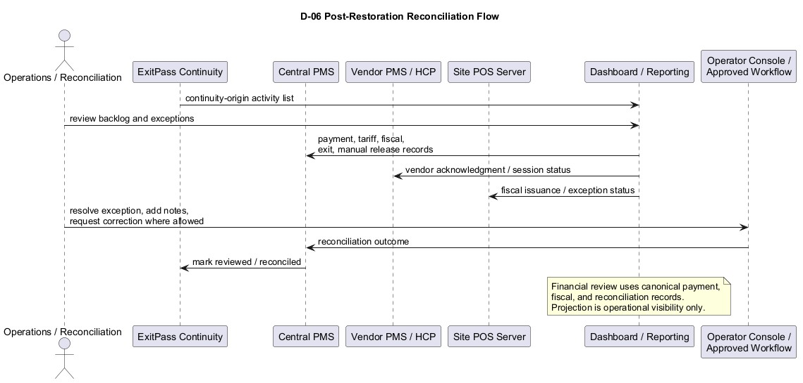

# ExitPass Continuity BRD v1.0

Version: v1.0
Status: Approved for v1.3 System Design baseline
Generated: 2026-07-01
Document type: Companion Business Requirements Document
Product scope: ExitPass Continuity capability

## 1. Document Control

### 1.1 Version History

| Version | Date | Author / owner | Summary |
| --- | --- | --- | --- |
| v1.0 | 2026-07-01 | ExitPass documentation stream | Initial companion BRD for ExitPass Continuity covering controlled degraded operations, activation/deactivation, projection-based resolve, Continuity Terminal use, manual/assisted release controls, fiscal exception handling, audit tagging, reconciliation tagging, and post-restoration review. |

### 1.2 Approvals

| Role | Name | Approval status | Date |
| --- | --- | --- | --- |
| Product owner | ExitPass documentation stream | Approved for v1.3 System Design baseline | 2026-07-01 |
| Parking operations owner | ExitPass documentation stream | Approved for v1.3 System Design baseline | 2026-07-01 |
| Finance / revenue assurance owner | ExitPass documentation stream | Approved for v1.3 System Design baseline | 2026-07-01 |
| Technical architecture owner | ExitPass documentation stream | Approved for v1.3 System Design baseline | 2026-07-01 |
| Compliance / audit owner | ExitPass documentation stream | Approved for v1.3 System Design baseline | 2026-07-01 |

Approval note: This document is approved as part of the ExitPass v1.3 BRD baseline for use in ExitPass System Design v1.3. Approval does not close downstream implementation, API, database, finance/accounting, BIR/accreditation, or technical design questions explicitly listed in the Open Questions section.

### 1.3 Document Ownership

This BRD is owned by the ExitPass product and documentation stream. It defines business requirements for ExitPass Continuity in the v1.3 companion BRD set.

This document is not a Continuity System Design, API Contract, Database Design, Engineering Pack, Operator Console BRD update, POS/Invoicing BRD, or Assisted Payment Terminal System Design.

### 1.4 Relationship to ExitPass BRD v1.3

ExitPass BRD v1.3 is the core authority and business baseline. This Continuity BRD expands only the controlled degraded-operation requirements.

This BRD preserves the v1.3 authority model:

- Vendor PMS / HCP remains authority for raw parking session lifecycle and normal tariff computation.
- Central PMS owns session projection, control state, degraded resolve decision under approved policy, payment finality, fiscal issuance reference recording, and ExitAuthorization.
- Payment Orchestrator or approved payment integration handles provider interaction.
- Resolved Site POS Server owns fiscal treatment and Sales Invoice issuance.
- Gate/exit execution consumes Central PMS authorization.

### 1.5 Relationship to Assisted Payment Terminal BRD

The Assisted Payment Terminal BRD defines terminal business requirements. This Continuity BRD defines when and how continuity behavior is allowed.

Continuity Terminal is a mode of the Assisted Payment Terminal app family. It is not a separate product family. Continuity Terminal is disabled by default and may be activated only under approved degraded/BCP controls.

## 2. Executive Summary

ExitPass Continuity is a formal platform capability for controlled degraded operations. It exists to preserve operational control during outages or degraded conditions while protecting the normal ExitPass authority model.

Continuity may cover Vendor PMS/HikCentral outage, connector outage or stale projection, network degradation, WebPay/APM degradation, POS Server fiscal issuance exception, payment provider uncertainty, vendor acknowledgment failure, gate/exit device issue, approved manual or assisted release, Continuity Terminal activation, and post-restoration reconciliation.

Continuity must be explicit, controlled, audited, reconciliation-tagged, and time-bound. It must not become a silent alternate operating mode.

## 3. Business Context

Parking operations depend on several external and internal dependencies: Vendor PMS/HCP, connector services, network links, WebPay, APMs, payment providers, POS Server, and gate/exit devices. Outages or degraded behavior can create customer queues, revenue risk, fiscal risk, and audit gaps.

ExitPass Continuity defines the business controls that allow the platform to keep operating only where safe, approved, and traceable.

## 4. Problem Statement

Without formal continuity requirements, degraded operations may be handled inconsistently. Risks include:

- Projection data being treated as financial truth.
- Passageway records being used to invent tariffs.
- Manual releases becoming normal operations.
- Payment uncertainty being treated as payment finality.
- POS Server fiscal exceptions being ignored before exit.
- Continuity Terminal becoming an uncontrolled alternate payment path.
- Reconciliation after restoration being incomplete.

## 5. Product Purpose

ExitPass Continuity shall:

- Define when degraded operation may be activated.
- Preserve the normal authority model during degradation.
- Allow controlled projection-based resolve where approved.
- Restrict degraded tariff handling to approved basis.
- Govern Continuity Terminal activation and use.
- Control fiscal issuance exceptions and manual release.
- Preserve clear customer/operator messaging.
- Require audit, reconciliation, and post-restoration review.

## 6. Product Boundary

ExitPass Continuity covers business rules for degraded operation across:

- Vendor PMS / HikCentral outage.
- Connector outage or stale projection.
- Network degradation.
- WebPay unavailable or degraded.
- APM unavailable or degraded.
- POS Server fiscal issuance failure or timeout.
- Payment provider timeout or uncertain outcome.
- Vendor payment acknowledgment failure.
- Gate/exit device issue.
- Continuity Terminal activation.
- Approved manual or assisted release.
- Post-restoration reconciliation.

This BRD does not define technical design, database objects, endpoint paths, DTOs, retry algorithms, queue implementation, device implementation, or POS Server counter mechanics.

## 7. Explicit Non-Authority Scope

ExitPass Continuity must not:

- Make projection data financial truth.
- Make passageway records tariff authority.
- Make the Continuity Terminal payment finality authority.
- Make POS Server exit authority.
- Make gates bypass Central PMS.
- Allow unmanaged offline discount approval.
- Allow unmanaged fiscal issuance.
- Silently bypass audit or reconciliation.
- Replace normal Vendor PMS/HCP authority in normal mode.

## 8. Stakeholders and Users

| Stakeholder / user | Interest |
| --- | --- |
| Parker | Clear messaging and fair handling during degraded conditions. |
| Operator / cashier | Controlled workflows for assisted or continuity operation. |
| Supervisor | Activation approval, exception decisions, and manual release governance. |
| Parking operations manager | Continuity visibility, staffing control, and incident handling. |
| Finance / revenue assurance | Payment, fiscal, and reconciliation integrity. |
| Compliance / audit | Evidence, approval, fiscal exception, and manual release traceability. |
| Technical support | Connector, channel, POS Server, payment, and gate dependency visibility. |
| Reconciliation team | Post-restoration review and closure of continuity-origin activity. |

## 9. Continuity Principles

ExitPass Continuity shall follow these principles:

1. Fail closed by default.
2. No silent fallback.
3. Explicit degraded-mode declaration or recognition.
4. Use live Vendor PMS/HCP in normal mode.
5. Use projection data only under approved degraded controls.
6. Projection data is operational visibility, not financial truth.
7. Degraded tariff must use approved ExitPass-maintained tariff configuration or last approved tariff configuration.
8. Passageway records alone must not be used to invent tariffs.
9. Continuity Terminal is disabled by default.
10. Continuity activation requires approval and audit where policy requires.
11. Manual release is last resort and must be supervisor-approved, incident-tagged, audit-tagged, and reconciliation-tagged.
12. Fiscal issuance failure after payment must not automatically reverse payment and must not automatically authorize exit.
13. Post-restoration reconciliation is mandatory for continuity-origin activity.
14. Continuity operations must preserve customer messaging clarity.

## 10. Continuity States

These are business-level state labels only. They do not define database enum names or implementation state machines.

| State | Business meaning |
| --- | --- |
| Normal | Dependencies are operating within accepted thresholds and normal authority model applies. |
| Degraded-watch | A dependency is degraded or at risk, but continuity workflows are not yet active. |
| Degraded-active | Approved degraded controls are active for a defined scope. |
| Continuity-terminal-active | Continuity Terminal mode is enabled for approved scope and workflows. |
| Manual-release-controlled | Manual/assisted release is allowed only under controlled approval and tagging. |
| Restoration-in-progress | Dependency is recovering and continuity activity is being wound down. |
| Post-restoration-review | Continuity-origin activity is under reconciliation and review. |
| Closed / reconciled | Continuity event is closed and required reconciliation is complete. |

## 11. Activation and Deactivation

Continuity activation is a controlled business event. Activation should include:

- Affected Site / Site Group.
- Affected Vendor PMS, connector, POS Server, channel, payment, network, or gate dependency.
- Incident or BCP reference.
- Activation reason.
- Activation scope.
- Activation time.
- Approving supervisor or authorized role where required.
- Allowed workflows during activation.
- Restricted workflows during activation.
- Expected duration or review interval.
- Audit and reconciliation tagging.
- Deactivation / restoration criteria.

Exact activation authority remains open.

Deactivation shall occur when restoration criteria are met or when approved authority ends the continuity event. Deactivation shall disable continuity-only workflows and move the event into post-restoration review where applicable.

PlantUML source: [D-02_Continuity_Activation_and_Deactivation_Flow.puml](diagrams/D-02_Continuity_Activation_and_Deactivation_Flow.puml)

## 12. Continuity Scenarios

### 12.1 Vendor PMS / HCP Unavailable

Normal live tariff calculation is unavailable. Central PMS may use the latest projection only under approved controls.

If projection is stale, ambiguous, or insufficient, ExitPass Continuity shall fail closed or route the case to approved continuity workflow. Degraded tariff must use approved tariff configuration. All activity must be audit and reconciliation tagged.

### 12.2 HCP Connector Stale or Unavailable

Connector health must be visible. Stale projection must not be treated as fresh session truth. Projection freshness threshold remains open.

The system must alert operations and restrict degraded use when connector data is stale or unavailable.

### 12.3 WebPay Unavailable or Degraded

Assisted Payment Terminal / Continuity Terminal may be activated where allowed. Payment and fiscal authority must remain with Central PMS and POS Server.

WebPay outage does not authorize bypassing payment or fiscal issuance controls.

### 12.4 APM Unavailable or Degraded

Cashier-Assisted Terminal or Continuity Terminal may be used depending on whether the Site is normally staffed or in BCP/degraded operation.

APM outage alone does not change payment finality or fiscal authority.

### 12.5 POS Server Fiscal Issuance Failure or Timeout

Payment finality is not automatically reversed. ExitAuthorization is not issued yet unless separately approved exception/manual release policy applies.

The case enters controlled fiscal issuance exception/retry workflow. Customer/operator message must clearly say payment was received but fiscal issuance or exit authorization is pending.

Manual release, if allowed, must be supervisor-approved, incident-tagged, audit-tagged, and reconciliation-tagged. Exact fiscal recovery process belongs in POS Server System Design and POS/Invoicing BRD.

### 12.6 Payment Provider Timeout or Uncertain Outcome

Payment finality must not be assumed. Payment Orchestrator or approved payment channel workflow must verify outcome.

If uncertain, customer/operator message must show pending verification. ExitAuthorization must not be issued until Central PMS confirms payment finality and fiscal prerequisites.

### 12.7 Vendor Payment Acknowledgment Failure

Central PMS payment finality remains the platform truth. Vendor acknowledgment failure must be queued, retried, or escalated according to later design.

Exit behavior depends on Central PMS authorization and Site policy. Failure must be audit and reconciliation tagged.

### 12.8 Gate or Exit Device Issue

Gate hardware issue does not alter payment or fiscal truth. Manual release, if required, must be controlled, supervisor-approved where policy requires, and reconciliation-tagged.

Gate execution must not bypass Central PMS authorization unless a formally approved manual emergency process applies.

### 12.9 Statutory Discount Handling Under Continuity

Cashier-Assisted Terminal can perform statutory discount validation capture in normal assisted payment mode. Continuity Terminal statutory discount handling is restricted.

If entitlement, policy basis, evidence requirement, projection freshness, or payable-basis recalculation cannot be safely validated, ExitPass Continuity shall fail closed or route to supervisor/manual review.

All continuity-mode discount activity must be incident-tagged, audit-tagged, reconciliation-tagged, and included in post-restoration review.

### 12.10 Manual / Assisted Release

Manual release is a last resort. Manual release must not silently become normal payment finality.

Manual release must be attributable to a human supervisor/operator and device/context where applicable. Manual release must be incident-tagged and reconciliation-tagged. Customer messaging must remain clear.

## 13. Relationship to Assisted Payment Terminal / Continuity Terminal

Continuity Terminal is a mode of the Assisted Payment Terminal app family. It is not a separate product family.

Continuity Terminal is disabled by default and may be activated only under approved degraded/BCP controls.

Continuity Terminal may support restricted payment, lookup, discount, fiscal, and release workflows only where continuity policy allows.

The Assisted Payment Terminal BRD defines terminal business requirements. This Continuity BRD defines when and how continuity behavior is allowed.

## 14. Relationship to Operator Console

Operator Console remains the non-payment governance and operations module.

Operator Console may support supervisor review, continuity activation approval, incident tagging, evidence review, audit review, reporting, and post-restoration review.

Operator Console must not collect payment, declare payment finality, or issue ExitAuthorization.

## 15. Relationship to POS/Invoicing and Site POS Server

POS Server remains fiscal issuance authority for the resolved Site. Continuity does not make terminals independent POS systems.

Fiscal issuance should still be routed through the resolved Site POS Server where available.

Offline fiscal issuance remains restricted or open until approved by BIR/accounting/POS Server design. Fiscal issuance exception handling must be controlled and auditable.

Exact POS Server counter, sequence, offline issuance, and recovery mechanics are deferred to POS/Invoicing BRD and POS Server System Design.

## 16. Relationship to Central PMS, Vendor PMS, Payment Orchestrator, and Gate/Exit

| Function | Owner |
| --- | --- |
| Raw parking session lifecycle in normal mode | Vendor PMS / HCP |
| Normal tariff computation | Vendor PMS / HCP |
| Session projection and control state | Central PMS |
| Degraded resolve decision | Central PMS under approved continuity policy |
| Degraded tariff basis | Central PMS using approved tariff configuration or approved continuity basis |
| Discount policy resolution | Central PMS / Discount workflow |
| Statutory validation record | Central PMS / Discount workflow |
| Continuity Terminal UI | Assisted Payment Terminal in Continuity Terminal mode |
| Payment provider interaction | Payment Orchestrator or approved payment channel integration |
| Payment finality | Central PMS |
| Fiscal treatment and Sales Invoice issuance | Resolved Site POS Server |
| Fiscal issuance reference recording | Central PMS |
| ExitAuthorization | Central PMS |
| Gate/exit execution | Gate/exit system consuming Central PMS authorization |
| Activation approval / supervisor review | Operator Console / approved operations workflow |
| Reconciliation and post-restoration review | Operations / Reconciliation workflow |

PlantUML source: [D-01_Continuity_Context_Diagram.puml](diagrams/D-01_Continuity_Context_Diagram.puml)

## 17. High-Level Business Process Overview

### 17.1 Degraded Resolve Process

1. A parker, channel, terminal, or operator requests session resolve.
2. Central PMS attempts normal live resolve through Vendor PMS/HCP where available.
3. If Vendor PMS/HCP is unavailable or degraded, Central PMS checks continuity policy and projection freshness.
4. If projection is fresh, unambiguous, and allowed, Central PMS may proceed under approved degraded controls.
5. Degraded tariff uses approved tariff configuration or approved continuity basis.
6. If data is stale, ambiguous, or insufficient, the process fails closed or routes to supervisor/manual review.

PlantUML source: [D-03_Vendor_PMS_HCP_Degraded_Resolve_Flow.puml](diagrams/D-03_Vendor_PMS_HCP_Degraded_Resolve_Flow.puml)

### 17.2 Continuity Payment-to-Exit Process

1. Continuity policy allows payment workflow for the affected scope.
2. Payment proceeds through Payment Orchestrator or approved payment channel integration.
3. Central PMS records payment finality only after verified outcome.
4. Central PMS requests Sales Invoice issuance from the resolved Site POS Server.
5. POS Server returns fiscal identity/status.
6. Central PMS records fiscal issuance reference.
7. Central PMS issues ExitAuthorization if eligible.
8. If fiscal issuance or payment status is pending, the customer/operator message must remain clear and exit must not be implied as authorized.

PlantUML source: [D-04_Payment_Fiscal_Issuance_and_ExitAuthorization_Under_Continuity.puml](diagrams/D-04_Payment_Fiscal_Issuance_and_ExitAuthorization_Under_Continuity.puml)

## 18. Functional Requirements

| ID | Requirement |
| --- | --- |
| CON-FR-001 | ExitPass Continuity shall support explicit continuity activation. |
| CON-FR-002 | ExitPass Continuity shall support explicit continuity deactivation. |
| CON-FR-003 | Activation shall define affected Site/Site Group scope. |
| CON-FR-004 | Activation shall identify affected dependency. |
| CON-FR-005 | Activation shall record incident or BCP reference. |
| CON-FR-006 | Activation shall record authorized activator or supervisor approval where required. |
| CON-FR-007 | Activation shall define allowed and restricted workflows. |
| CON-FR-008 | Continuity mode shall be visible to authorized operational users. |
| CON-FR-009 | Connector health visibility shall be available. |
| CON-FR-010 | Projection freshness visibility shall be available. |
| CON-FR-011 | Degraded resolve eligibility shall be evaluated before degraded use. |
| CON-FR-012 | Projection freshness threshold shall be enforced once defined. |
| CON-FR-013 | Degraded tariff source shall be approved tariff configuration or approved continuity basis. |
| CON-FR-014 | ExitPass Continuity shall fail closed when data is stale, ambiguous, or insufficient. |
| CON-FR-015 | Continuity Terminal activation shall be controlled and disabled by default. |
| CON-FR-016 | Continuity Terminal workflows shall be restricted to allowed continuity policy. |
| CON-FR-017 | Continuity-mode statutory discount handling shall be restricted. |
| CON-FR-018 | Payment finality shall remain with Central PMS. |
| CON-FR-019 | Fiscal issuance authority shall remain with resolved Site POS Server. |
| CON-FR-020 | Fiscal issuance exception handling shall be controlled and auditable. |
| CON-FR-021 | Vendor acknowledgment failure shall be queued, retried, or escalated according to later design. |
| CON-FR-022 | Gate/manual release control shall preserve Central PMS authorization authority except formally approved manual emergency process. |
| CON-FR-023 | Customer/operator messaging shall clearly distinguish pending, failed, approved, and authorized states. |
| CON-FR-024 | Continuity activity shall be audit-tagged. |
| CON-FR-025 | Continuity activity shall be reconciliation-tagged. |
| CON-FR-026 | Post-restoration review shall be required for continuity-origin activity. |
| CON-FR-027 | Management dashboard visibility shall include continuity state and backlog indicators. |
| CON-FR-028 | Financial reporting shall use canonical payment, fiscal, and reconciliation records. |

## 19. Vendor PMS / HCP Degraded Operation Requirements

| ID | Requirement |
| --- | --- |
| VDR-001 | Vendor PMS / HCP shall remain authority for normal session lifecycle and tariff computation. |
| VDR-002 | Vendor PMS / HCP outage shall not automatically permit payment or exit. |
| VDR-003 | Central PMS may use projection only under approved degraded controls. |
| VDR-004 | If Vendor PMS/HCP becomes available, the system shall transition toward restoration and post-restoration review. |
| VDR-005 | Vendor PMS / HCP acknowledgment failure shall be audit-tagged and reconciliation-tagged. |

## 20. Projection Freshness and Degraded Tariff Requirements

| ID | Requirement |
| --- | --- |
| PROJ-001 | Projection data shall be operational visibility, not financial truth. |
| PROJ-002 | Projection data shall not establish payment finality. |
| PROJ-003 | Projection data shall not authorize exit. |
| PROJ-004 | Projection freshness shall be visible to authorized users. |
| PROJ-005 | Stale, ambiguous, or insufficient projection shall fail closed or route to supervisor/manual review. |
| PROJ-006 | Degraded tariff shall use approved ExitPass-maintained tariff configuration or last approved tariff configuration. |
| PROJ-007 | Passageway records alone shall not be used to invent tariffs. |
| PROJ-008 | Exact projection freshness threshold remains open. |

## 21. Continuity Terminal Requirements

| ID | Requirement |
| --- | --- |
| CT-001 | Continuity Terminal is a mode of the Assisted Payment Terminal app family. |
| CT-002 | Continuity Terminal shall be disabled by default. |
| CT-003 | Continuity Terminal shall activate only under approved degraded/BCP controls. |
| CT-004 | Continuity Terminal activity shall carry incident, audit, and reconciliation tags. |
| CT-005 | Continuity Terminal may support lookup using available projection or approved continuity source only where policy allows. |
| CT-006 | Continuity Terminal may support payment collection only where policy allows. |
| CT-007 | Continuity Terminal may route fiscal issuance through POS Server where available and allowed. |
| CT-008 | Continuity Terminal shall not declare payment finality. |
| CT-009 | Continuity Terminal shall not issue ExitAuthorization. |

PlantUML source: [D-05_Continuity_Terminal_Restricted_Operation_Flow.puml](diagrams/D-05_Continuity_Terminal_Restricted_Operation_Flow.puml)

## 22. Statutory Discount Handling Under Continuity

Continuity Terminal statutory discount handling is restricted.

If entitlement, policy basis, evidence requirement, projection freshness, or payable-basis recalculation cannot be safely validated, ExitPass Continuity shall fail closed or route to supervisor/manual review.

All continuity-mode discount activity shall be incident-tagged, audit-tagged, reconciliation-tagged, and included in post-restoration review.

Central PMS / Discount workflow remains authority for policy resolution and statutory validation record.

## 23. Payment, Fiscal Issuance, and ExitAuthorization Under Continuity

| ID | Requirement |
| --- | --- |
| PFE-001 | Payment provider timeout or uncertain outcome shall not create payment finality. |
| PFE-002 | Payment Orchestrator or approved payment workflow shall verify payment outcome. |
| PFE-003 | Central PMS shall remain payment finality authority. |
| PFE-004 | POS Server shall remain fiscal issuance authority for the resolved Site. |
| PFE-005 | Fiscal issuance failure after payment shall not automatically reverse payment. |
| PFE-006 | Fiscal issuance failure shall not automatically authorize exit. |
| PFE-007 | Central PMS shall issue ExitAuthorization only when payment, fiscal, and other eligibility requirements are satisfied or a formally approved manual emergency process applies. |
| PFE-008 | Customer/operator message shall show pending verification, fiscal exception, or exit pending state clearly. |

## 24. Manual Release and Supervisor Escalation

Manual release is a last resort. Manual release must not silently become normal payment finality or normal exit authorization.

Manual release shall be:

- Supervisor-approved where policy requires.
- Attributable to a human supervisor/operator and device/context where applicable.
- Incident-tagged.
- Audit-tagged.
- Reconciliation-tagged.
- Clear in customer/operator messaging.

Gate execution must not bypass Central PMS authorization except under a formally approved manual emergency process.

## 25. Reconciliation and Post-Restoration Review

Post-restoration reconciliation is mandatory for continuity-origin activity.

Reconciliation shall review:

- Continuity activations and deactivations.
- Affected Site/Site Group and dependency.
- Projection-based resolves.
- Degraded tariff basis.
- Payments and uncertain payment outcomes.
- Fiscal issuance successes, failures, and pending cases.
- Manual releases.
- Vendor payment acknowledgments.
- Gate/exit events.
- Continuity-mode statutory discount handling.
- Customer/operator exception messages where material.

PlantUML source: [D-06_Post_Restoration_Reconciliation_Flow.puml](diagrams/D-06_Post_Restoration_Reconciliation_Flow.puml)

## 26. Security, RBAC, Device Trust, and Activation Authority

ExitPass Continuity shall enforce role-based controls for activation, deactivation, supervisor review, Continuity Terminal use, manual release, fiscal exception handling, and reconciliation closure.

Activation authority remains open and shall be defined in later policy/design work. Until finalized, activation shall be limited to approved roles or approved policy conditions.

Device trust for Continuity Terminal remains governed by Assisted Payment Terminal requirements and later System Design.

## 27. Audit, Evidence, and Reporting

Continuity audit shall include:

- Activation and deactivation records.
- Affected Site/Site Group.
- Affected dependency.
- Incident or BCP reference.
- Approval and supervisor identity where required.
- Projection freshness and degraded resolve basis.
- Degraded tariff basis.
- Continuity Terminal activity.
- Manual release activity.
- Fiscal issuance exceptions.
- Payment uncertainty.
- Vendor acknowledgment failure.
- Post-restoration review status.

Operational dashboards may show continuity activation, connector health, projection freshness, degraded mode state, pending fiscal exceptions, manual release counts, and reconciliation backlog.

Financial reports must use canonical payment, fiscal, and reconciliation records. Projection visibility is not financial truth.

## 28. Customer and Operator Messaging

Continuity operations must preserve clear customer and operator messaging.

Messaging shall distinguish:

- Payment pending verification.
- Payment received but fiscal issuance pending.
- Fiscal issuance failed or timed out.
- ExitAuthorization pending.
- Manual/supervisor review required.
- Continuity Terminal restricted operation.
- Degraded operation not available due to stale, ambiguous, or insufficient data.

The system shall not imply exit is authorized until Central PMS authorizes exit or a formally approved manual emergency process applies.

## 29. Non-Functional Requirements

| Area | Requirement |
| --- | --- |
| Availability | Continuity controls should be available to authorized users during degraded events where dependencies permit. |
| Reliability | Unknown payment, fiscal, projection, or exit states shall be handled conservatively. |
| Auditability | Continuity activity shall be reconstructable from activation through closure. |
| Observability | Connector health, projection freshness, continuity state, and exception backlog should be visible. |
| Security | Activation, manual release, and continuity workflows shall be role-protected. |
| Privacy | Evidence and personal data captured during continuity shall follow approved privacy controls. |
| Recoverability | Continuity-origin activity shall move into post-restoration review. |

## 30. Assumptions

| ID | Assumption |
| --- | --- |
| CON-A-001 | Vendor PMS/HCP is available for normal mode in ordinary operation. |
| CON-A-002 | Central PMS remains available enough to coordinate continuity decisions, payment finality, fiscal reference recording, and ExitAuthorization. |
| CON-A-003 | Operator Console or approved operations workflow supports activation and review. |
| CON-A-004 | Continuity Terminal requirements are defined in the Assisted Payment Terminal BRD. |
| CON-A-005 | POS Server fiscal exception details are governed by POS/Invoicing and POS Server documents. |

## 31. Constraints

| ID | Constraint |
| --- | --- |
| CON-C-001 | Continuity shall fail closed by default. |
| CON-C-002 | Continuity shall not silently activate. |
| CON-C-003 | Projection shall not become financial truth. |
| CON-C-004 | Passageway records alone shall not create tariffs. |
| CON-C-005 | Continuity Terminal shall be disabled by default. |
| CON-C-006 | Central PMS shall remain payment finality and ExitAuthorization authority. |
| CON-C-007 | POS Server shall remain fiscal issuance authority. |
| CON-C-008 | Post-restoration reconciliation is mandatory for continuity-origin activity. |

## 32. Risks and Mitigations

| Risk | Impact | Mitigation |
| --- | --- | --- |
| Silent fallback | Uncontrolled degraded operation. | Require explicit declaration/recognition, approval, audit, and time-bound scope. |
| Projection misuse | Incorrect tariff, payment, or exit decision. | Treat projection as operational visibility only and enforce freshness checks. |
| Manual release overuse | Revenue, fraud, and audit exposure. | Limit to last resort with supervisor approval and reconciliation tags. |
| Fiscal exception ignored | Paid-but-not-fiscally-issued exits. | Block normal ExitAuthorization and require controlled exception workflow. |
| Payment uncertainty treated as finality | Unpaid exits or disputes. | Require verified outcome before Central PMS finality. |
| Continuity Terminal overreach | Alternate uncontrolled payment path. | Keep disabled by default and restrict workflows by policy. |
| Incomplete restoration review | Unresolved financial/fiscal/operational gaps. | Require post-restoration review before closure. |

## 33. Open Questions

These questions do not reopen approved decisions.

| ID | Open question |
| --- | --- |
| CON-OQ-001 | What is the exact BCP / continuity activation authority? |
| CON-OQ-002 | What is the exact activation approval workflow? |
| CON-OQ-003 | What is the exact projection freshness threshold? |
| CON-OQ-004 | Who owns exact degraded tariff configuration? |
| CON-OQ-005 | What are exact degraded tariff rounding and grace rules? |
| CON-OQ-006 | What is the exact Continuity Terminal activation/deactivation workflow? |
| CON-OQ-007 | What is the exact offline payment policy, if any? |
| CON-OQ-008 | What is the exact offline fiscal issuance policy, if any? |
| CON-OQ-009 | What is the exact fiscal issuance exception release policy? |
| CON-OQ-010 | What is the exact manual release policy and emergency override boundary? |
| CON-OQ-011 | What is the exact vendor acknowledgment retry policy? |
| CON-OQ-012 | What is the exact reconciliation SLA after restoration? |
| CON-OQ-013 | What are exact dashboard fields and alert thresholds? |
| CON-OQ-014 | What is the exact evidence retention policy for continuity-mode exceptions? |
| CON-OQ-015 | What exact endpoint paths and DTOs are needed? Deferred to API Contract. |
| CON-OQ-016 | What exact database changes are needed? Deferred to Database Delta. |
| CON-OQ-017 | What exact implementation details are needed? Deferred to Continuity System Design. |

## 34. Acceptance Criteria

| ID | Acceptance criterion |
| --- | --- |
| CON-AC-001 | Continuity mode is disabled by default. |
| CON-AC-002 | Continuity activation requires approved authority or policy condition. |
| CON-AC-003 | Activation records Site/Site Group, affected dependency, incident/BCP reference, activation reason, approval, and allowed workflow scope. |
| CON-AC-004 | HCP/Vendor PMS outage does not automatically permit payment or exit. |
| CON-AC-005 | Projection data is used only under approved controls. |
| CON-AC-006 | Stale, ambiguous, or insufficient projection fails closed or routes to supervisor/manual review. |
| CON-AC-007 | Degraded tariff uses approved tariff configuration, not ad hoc passageway data. |
| CON-AC-008 | Continuity Terminal can be activated only under approved degraded/BCP controls. |
| CON-AC-009 | Continuity Terminal statutory discount handling is restricted. |
| CON-AC-010 | Payment finality remains with Central PMS. |
| CON-AC-011 | Payment provider timeout does not create payment finality. |
| CON-AC-012 | POS Server remains fiscal issuance authority. |
| CON-AC-013 | Fiscal issuance failure prevents normal ExitAuthorization issuance and triggers controlled exception workflow. |
| CON-AC-014 | Manual release is supervisor-approved where required, incident-tagged, audit-tagged, and reconciliation-tagged. |
| CON-AC-015 | Gate/exit execution does not bypass Central PMS authorization except under formally approved manual emergency process. |
| CON-AC-016 | Vendor acknowledgment failure is queued/retried/escalated and reconciliation-tagged. |
| CON-AC-017 | Post-restoration review is required for continuity-origin activity. |
| CON-AC-018 | Dashboards distinguish operational continuity/projection data from financial truth. |

## 35. Requirements Traceability Matrix

| Requirement area | Source / authority | BRD sections |
| --- | --- | --- |
| Continuity formal capability | ExitPass BRD v1.3; decision log | Sections 2, 5, 9 |
| Authority model preservation | ExitPass BRD v1.3 | Sections 7, 16, 23, 34 |
| Degraded resolve | ExitPass BRD v1.3; open questions | Sections 12, 17, 19, 20 |
| Projection controls | Planning impact map; ExitPass BRD v1.3 | Sections 9, 20, 27 |
| Continuity Terminal | Assisted Payment Terminal BRD | Sections 13, 21, 22 |
| Fiscal exceptions | POS/Invoicing and POS Server planning references | Sections 12, 15, 23 |
| Manual release controls | ExitPass BRD v1.3 | Sections 12, 24, 34 |
| Reconciliation | ExitPass BRD v1.3; Engineering Pack context | Sections 25, 27, 34 |
| Open technical details | Locked writing order | Section 33 |

## 36. Appendix A: Glossary

| Term | Definition |
| --- | --- |
| Continuity | ExitPass capability for controlled degraded operations. |
| Continuity Terminal | Assisted Payment Terminal mode used only under approved degraded/BCP controls. |
| Degraded-active | Business state where approved degraded controls are active for a defined scope. |
| Degraded tariff basis | Approved tariff configuration or approved continuity basis used when live Vendor PMS tariff is unavailable. |
| Manual release | Last-resort controlled release process requiring approval and reconciliation controls. |
| Projection | Operational session visibility maintained by Central PMS or connector feeds; not financial truth. |
| Post-restoration review | Review and reconciliation of continuity-origin activity after dependency restoration. |

## 37. Appendix B: Acronyms

| Acronym | Meaning |
| --- | --- |
| APM | AutoPay Machine |
| BCP | Business Continuity Plan |
| BIR | Bureau of Internal Revenue |
| BRD | Business Requirements Document |
| DTO | Data Transfer Object |
| HCP | HikCentral Professional |
| PMS | Parking Management System |
| POS | Point of Sale |
| RBAC | Role-Based Access Control |

## 38. Appendix C: Diagrams

| ID | Diagram | PlantUML source |
| --- | --- | --- |
| D-01 | [Continuity Context Diagram](diagrams/D-01_Continuity_Context_Diagram.jpg) | [D-01_Continuity_Context_Diagram.puml](diagrams/D-01_Continuity_Context_Diagram.puml) |
| D-02 | [Continuity Activation and Deactivation Flow](diagrams/D-02_Continuity_Activation_and_Deactivation_Flow.jpg) | [D-02_Continuity_Activation_and_Deactivation_Flow.puml](diagrams/D-02_Continuity_Activation_and_Deactivation_Flow.puml) |
| D-03 | [Vendor PMS / HCP Degraded Resolve Flow](diagrams/D-03_Vendor_PMS_HCP_Degraded_Resolve_Flow.jpg) | [D-03_Vendor_PMS_HCP_Degraded_Resolve_Flow.puml](diagrams/D-03_Vendor_PMS_HCP_Degraded_Resolve_Flow.puml) |
| D-04 | [Payment, Fiscal Issuance, and ExitAuthorization Under Continuity](diagrams/D-04_Payment_Fiscal_Issuance_and_ExitAuthorization_Under_Continuity.jpg) | [D-04_Payment_Fiscal_Issuance_and_ExitAuthorization_Under_Continuity.puml](diagrams/D-04_Payment_Fiscal_Issuance_and_ExitAuthorization_Under_Continuity.puml) |
| D-05 | [Continuity Terminal Restricted Operation Flow](diagrams/D-05_Continuity_Terminal_Restricted_Operation_Flow.jpg) | [D-05_Continuity_Terminal_Restricted_Operation_Flow.puml](diagrams/D-05_Continuity_Terminal_Restricted_Operation_Flow.puml) |
| D-06 | [Post-Restoration Reconciliation Flow](diagrams/D-06_Post_Restoration_Reconciliation_Flow.jpg) | [D-06_Post_Restoration_Reconciliation_Flow.puml](diagrams/D-06_Post_Restoration_Reconciliation_Flow.puml) |
