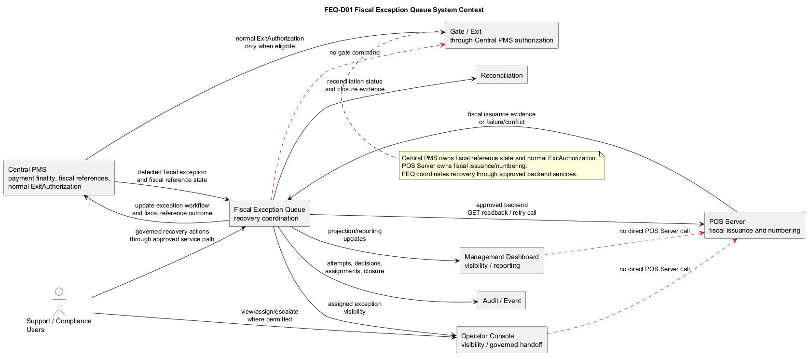
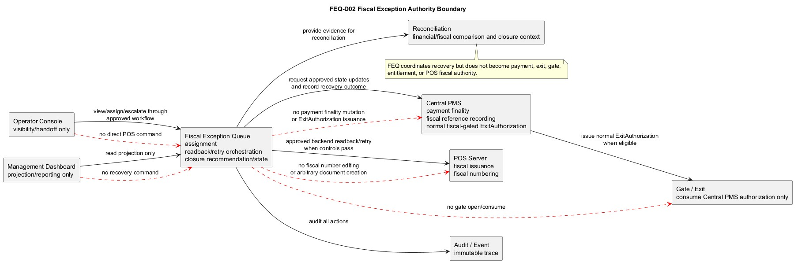
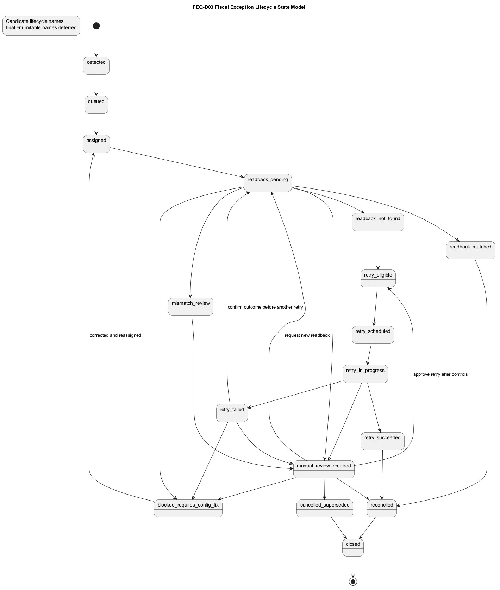
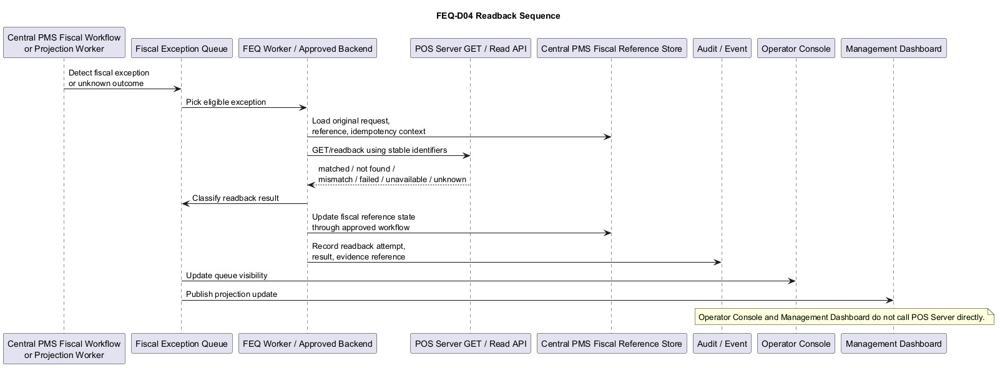
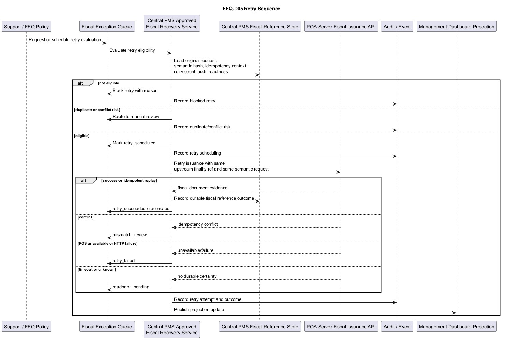
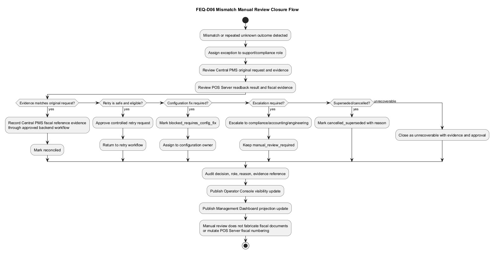
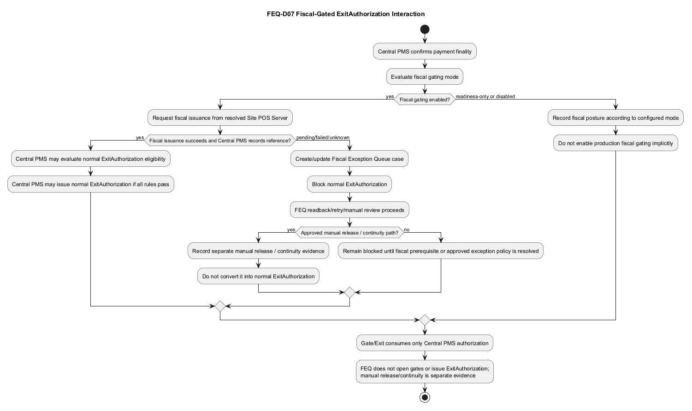

# ExitPass Fiscal Exception Queue / Readback / Retry Design v1.0

## 1. Document control

| Field | Value |
| --- | --- |
| Document | ExitPass Fiscal Exception Queue / Readback / Retry Design |
| Version | v1.0 |
| ExitPass baseline | v1.3 |
| Status | Ready for review |
| Branch | `docs/v1.3-fiscal-exception-queue-readback-retry-design` |
| Scope | Central PMS to POS Server fiscal issuance exception recovery design |
| Owner | ExitPass platform documentation stream |
| Last updated | 2026-07-03 |

## 2. Purpose

This design defines how ExitPass handles Central PMS to POS Server fiscal issuance failures, unknown outcomes, readback, retry, mismatch handling, exception assignment, recovery, closure, audit, and reporting.

The Fiscal Exception Queue is the dedicated recovery coordination design that the Operator Console and Management Dashboard intentionally deferred. Operator Console and Management Dashboard remain visibility/handoff surfaces. FEQ owns workflow mechanics for fiscal exception recovery through approved backend services while preserving Central PMS and POS Server authority boundaries.

## 3. Source baseline and inspected files

| Source | Usage |
| --- | --- |
| `docs/v1.3/ExitPass_BRD_v1.3.md` | v1.3 authority model, fiscal-before-exit posture, fail-closed rules, audit, degraded-mode, and dashboard/reporting requirements. |
| `docs/v1.3/ExitPass_System_Design_v1.3.md` | Central PMS, POS Server, Operator Console, dashboard, continuity, and authority-separation baseline. |
| `docs/v1.3/operator-console/ExitPass_Operator_Console_System_Design_SDD_v1.0.md` | Operator Console read-only fiscal visibility and handoff boundary. |
| `docs/v1.3/management-dashboard-reporting/ExitPass_Management_Dashboard_and_Reporting_System_Design_SDD_v1.0.md` | Dashboard read-only projection/reporting posture and explicit deferral of fiscal retry/readback/writeback mechanics. |
| `docs/v1.3/central-pms/engineering-pack/08-operator-console-queues-plan.md` | Candidate fiscal exception queue fields, actions, categories, and Operator Console handoff. |
| `docs/v1.3/central-pms/engineering-pack/09-dashboard-visibility-plan.md` | Read-only dashboard projection and fiscal backlog/reporting posture. |
| `docs/v1.3/central-pms/runbooks/ExitPass_Central_PMS_POS_Server_Controlled_UAT_Post_Run_Review_v1.0.md` | Controlled UAT closure, safety posture, and deferred retry/readback/queue/dashboard work. |
| `docs/v1.3/pos-server/ExitPass_POS_Server_System_Design_v1.0.md` | POS Server fiscal authority, failure/retry posture, and fiscal-before-exit sequence. |
| `docs/v1.3/pos-server-api/ExitPass_Central_PMS_to_POS_Server_Fiscal_Issuance_Integration_Contract_v1.0.md` | Central PMS to POS Server fiscal issuance integration rules, idempotency, readback, retry, and ExitAuthorization gating. |
| `docs/v1.3/pos-server-api/ExitPass_POS_Server_API_Contract_v1.0.md` | POS Server API authority boundary, runtime idempotency source, semantic request hash, error posture, GET readback support, and fiscal evidence fields. |
| `docs/v1.3/continuity/ExitPass_Continuity_System_Design_v1.0.md` | Manual release, continuity, fiscal exception, and post-restoration separation from normal ExitAuthorization. |

This design does not finalize database table names, enum names, endpoint paths, worker class names, queue names, retry intervals, or exact DTOs. Where persistence is required but not already confirmed, it is described as a future implementation requirement.

## 4. Scope and non-goals

### In scope

- Fiscal exception queue purpose and system boundary.
- Authority model for Central PMS, POS Server, FEQ, Operator Console, Management Dashboard, Audit/Event, Reconciliation, Gate/Exit, and support users.
- Fiscal exception lifecycle and candidate states.
- Fiscal exception categories.
- POS Server readback strategy through approved backend service paths.
- Safe retry strategy.
- Idempotency, semantic request hash, and duplicate protection.
- Unknown outcome recovery.
- Fiscal mismatch handling.
- Fiscal document evidence reconciliation.
- Manual review, assignment, escalation, and closure.
- Fiscal-gated ExitAuthorization interaction.
- Manual release and continuity separation.
- Operator Console and Management Dashboard handoffs.
- Audit, evidence, security, privacy, RBAC, export posture, observability, failure modes, roadmap, and acceptance criteria.

### Non-goals

- No source code changes.
- No database schema or migration changes.
- No runtime configuration changes.
- No POS Server runtime repository changes.
- No controlled UAT runbook or local UAT configuration work.
- No direct UI call to POS Server.
- No arbitrary manual fiscal document creation.
- No manual fiscal number editing.
- No payment finality mutation.
- No normal ExitAuthorization issuance by FEQ.
- No gate opening or gate authorization by FEQ.
- No entitlement, discount, manual release, continuity, or reconciliation authority transfer to FEQ.
- No production fiscal gating enablement.

## 5. System context

The Fiscal Exception Queue sits behind Central PMS as a controlled recovery coordination capability for fiscal issuance exceptions. It is not a standalone source-of-truth authority. It uses Central PMS fiscal reference records and approved POS Server readback/issuance APIs to determine whether a fiscal document already exists, whether retry is safe, whether manual review is required, and whether the fiscal exception can be reconciled or closed.

Central PMS remains the platform owner for payment finality, fiscal reference recording, and normal ExitAuthorization. POS Server remains the fiscal issuance and numbering authority. FEQ coordinates readback, retry eligibility, assignment, escalation, and closure state through approved backend workflows. Operator Console and Management Dashboard consume visibility and handoff signals only unless a later approved action path explicitly grants limited workflow action.

## 6. Diagrams

### FEQ-D01 Fiscal Exception Queue System Context

PlantUML source: [FEQ-D01_Fiscal_Exception_Queue_System_Context.puml](diagrams/FEQ-D01_Fiscal_Exception_Queue_System_Context.puml)

### FEQ-D02 Fiscal Exception Authority Boundary

PlantUML source: [FEQ-D02_Fiscal_Exception_Authority_Boundary.puml](diagrams/FEQ-D02_Fiscal_Exception_Authority_Boundary.puml)

### FEQ-D03 Fiscal Exception Lifecycle State Model

PlantUML source: [FEQ-D03_Fiscal_Exception_Lifecycle_State_Model.puml](diagrams/FEQ-D03_Fiscal_Exception_Lifecycle_State_Model.puml)

### FEQ-D04 Readback Sequence

PlantUML source: [FEQ-D04_Readback_Sequence.puml](diagrams/FEQ-D04_Readback_Sequence.puml)

### FEQ-D05 Retry Sequence

PlantUML source: [FEQ-D05_Retry_Sequence.puml](diagrams/FEQ-D05_Retry_Sequence.puml)

### FEQ-D06 Mismatch Manual Review Closure Flow

PlantUML source: [FEQ-D06_Mismatch_Manual_Review_Closure_Flow.puml](diagrams/FEQ-D06_Mismatch_Manual_Review_Closure_Flow.puml)

### FEQ-D07 Fiscal Gated ExitAuthorization Interaction

PlantUML source: [FEQ-D07_Fiscal_Gated_ExitAuthorization_Interaction.puml](diagrams/FEQ-D07_Fiscal_Gated_ExitAuthorization_Interaction.puml)

## 7. Fiscal Exception Queue responsibility model

| Responsibility | FEQ owns | FEQ does not own |
| --- | --- | --- |
| Exception detection intake | Accepts fiscal exception signals from Central PMS fiscal workflow, projection/monitoring workers, and reconciliation workflows. | Does not create payment finality or invent fiscal facts. |
| Queue coordination | Tracks assignment, state, priority, SLA, retry/readback posture, escalation, and closure recommendation/state. | Does not become POS Server fiscal authority. |
| Readback orchestration | Runs approved backend readback against POS Server GET/read APIs using stable original request identifiers. | Does not allow Operator Console or Dashboard to call POS Server directly. |
| Retry orchestration | Evaluates eligibility and invokes approved backend retry only when idempotency and safety controls pass. | Does not retry blindly or bypass semantic request hash conflicts. |
| Manual review | Routes mismatch, unknown, config, and exhausted retry cases to permitted roles. | Does not let users edit fiscal numbers or fabricate documents. |
| Reconciliation support | Provides evidence and state for fiscal/document/reconciliation closure. | Does not close financial reconciliation outside approved workflow authority. |
| Visibility projection | Publishes queue status to Operator Console and Management Dashboard read models. | Does not turn those surfaces into recovery authorities. |
| Audit and evidence | Records all attempts, decisions, reasons, assignments, and evidence references. | Does not retain unmanaged raw payloads or sensitive evidence outside policy. |

## 8. Authority boundary matrix

See FEQ-D02 for the visual authority boundary.

| Domain | Authority owner | FEQ allowed | FEQ prohibited |
| --- | --- | --- | --- |
| Payment finality | Central PMS | Read payment finality context needed to recover fiscal exceptions. | Mutate payment finality or mark payment as paid. |
| Fiscal issuance and numbering | POS Server | Call approved fiscal readback/retry backend path when controls pass. | Edit fiscal numbers, create arbitrary fiscal documents, or mutate POS Server records directly. |
| Fiscal reference recording | Central PMS | Request/update fiscal reference state through approved Central PMS workflow. | Bypass Central PMS state machine or fake recorded evidence. |
| Normal ExitAuthorization | Central PMS | Report whether fiscal prerequisite is blocking normal authorization. | Issue, consume, revoke, or bypass ExitAuthorization. |
| Gate/exit execution | Gate Integration consuming Central PMS authorization | Show blocked/eligible context. | Open gates or trigger gate behavior. |
| Operator workflow | Operator Console | Provide assignment and review handoff. | Turn Operator Console into direct POS Server or fiscal authority. |
| Reporting/projection | Management Dashboard | Publish read-only backlog, SLA, outcome, and closure metrics. | Turn Dashboard into retry/readback/writeback authority. |
| Reconciliation | Reconciliation workflow | Provide fiscal evidence and closure state. | Close financial/fiscal reconciliation outside approved workflow. |
| Manual release/continuity | Approved continuity/manual release governance | Link separate evidence where policy allows. | Convert manual release into normal ExitAuthorization. |

## 9. User roles, RBAC, assignment, and segregation of duties

| Role | FEQ access | Segregation rule |
| --- | --- | --- |
| Support operator | View assigned exceptions, add notes, request readback where policy permits. | Cannot approve retry, close mismatch, or edit fiscal evidence. |
| Support supervisor | Assign/reassign exceptions, approve escalation, request controlled retry where allowed. | Cannot edit POS Server documents or fiscal numbers. |
| Engineering/config owner | Review mapping/configuration failures and mark config correction complete. | Cannot close compliance-sensitive mismatch without reviewer signoff. |
| POS Server owner | Review POS Server evidence, readback behavior, fiscal identity/sequence/config issues. | Cannot declare Central PMS payment finality or issue ExitAuthorization. |
| Central PMS owner | Review fiscal reference state and Central PMS recording issues. | Cannot mutate POS Server numbering. |
| Compliance/accounting reviewer | Review fiscal evidence mismatch, duplicate/conflict, manual release association, closure evidence. | Cannot execute technical retry unless separately permitted by policy. |
| Reconciliation user | View closure evidence and reconciliation linkage. | Cannot alter fiscal reference or POS Server document facts from dashboard/reporting surfaces. |
| Auditor | Read-only audit/evidence review. | Cannot recover, retry, or close cases. |

RBAC requirements:

- Every FEQ action requires authenticated user or service identity.
- Service-initiated readback/retry requires service account authorization and audit trail.
- Manual approval actions require role, Site/Site Group scope, reason code, and evidence reference.
- Sensitive fiscal, payment, customer, and evidence details are redacted by default.
- Dual-control may be required for mismatch closure, unrecoverable closure, supersession, or production fiscal-number-impacting cases.

## 10. Runtime components

| Component | Responsibility |
| --- | --- |
| FEQ intake | Receives exception signals from Central PMS fiscal workflow, reconciliation checks, or monitoring/projection workers. |
| FEQ state manager | Tracks lifecycle state, assignment, priority, SLA, retry count, readback result, closure reason, and evidence references. |
| Readback worker | Calls approved POS Server GET/read APIs through backend service identity; never through UI clients. |
| Retry scheduler | Schedules and executes eligible retries through Central PMS-approved recovery service. |
| Eligibility evaluator | Verifies original request availability, semantic request hash stability, idempotency context, readback result, configuration state, retry limit, and audit readiness. |
| Manual review module | Supports assignment, reason codes, escalation, reviewer decision, and closure evidence. |
| Fiscal reference updater | Updates Central PMS fiscal reference state through approved workflow/state machine. |
| Audit/evidence writer | Records attempts, decisions, evidence references, hashes, and sensitive-data posture. |
| Projection publisher | Updates Operator Console visibility and Management Dashboard reporting read models. |
| Reconciliation handoff | Provides evidence and status for reconciliation workflow without taking over reconciliation authority. |

## 11. API/service interaction model

| Interaction | Required behavior |
| --- | --- |
| Central PMS to FEQ | Creates/updates queue cases from fiscal issuance failure, timeout, unknown outcome, commit/recording failure, mismatch, config failure, or gated-exit block. |
| FEQ to POS Server readback | Uses approved backend service path and POS Server GET/read APIs only; no UI direct access. |
| FEQ to POS Server retry | Uses approved Central PMS fiscal recovery service path only after eligibility passes. |
| FEQ to Central PMS fiscal reference | Updates fiscal reference state/evidence through approved Central PMS workflow and state machine. |
| FEQ to Audit/Event | Records all intake, assignment, readback, retry, decision, escalation, closure, and export/report events. |
| FEQ to Reconciliation | Provides state and evidence references for fiscal and settlement reconciliation. |
| FEQ to Operator Console | Provides scoped queue visibility, assignment, notes, and governed handoff. |
| FEQ to Management Dashboard | Publishes read-only projections: backlog, age, state, SLA, category, outcome, and closure metrics. |

## 12. Fiscal exception detection model

Fiscal exception detection may be triggered by:

- Central PMS fiscal issuance workflow receiving POS Server failure.
- Central PMS detecting timeout or unknown outcome.
- Central PMS failing to persist returned POS Server fiscal evidence after POS Server may have committed.
- Central PMS detecting idempotency conflict, semantic hash mismatch, mapping failure, or configuration failure.
- A projection or reconciliation worker detecting fiscal reference/document mismatch.
- A fiscal-gated ExitAuthorization path detecting fiscal prerequisite not satisfied.
- A manual release/continuity workflow referencing fiscal failure evidence.
- Audit/evidence persistence failure that prevents trustworthy fiscal recovery.

Detection must create or update one queue case per stable fiscal issuance identity/idempotency context where possible. Duplicate queue cases must be collapsed or linked, not treated as independent retry opportunities.

## 13. Fiscal exception categories and lifecycle

### Exception categories

| Category | Meaning | Initial posture |
| --- | --- | --- |
| POS Server unavailable | Backend cannot reach POS Server. | Queue and retry readback after service recovery. |
| POS Server timeout | Request outcome is uncertain. | Readback before retry. |
| POS Server HTTP failure | POS Server returned non-success failure. | Classify by error posture; readback if outcome could be uncertain. |
| Accepted but Central PMS recording failed | POS Server may have created a document but Central PMS did not record fiscal reference. | Readback first; record/reconcile if matched. |
| Unknown outcome | Network/service/persistence ambiguity. | Readback first. |
| Duplicate/idempotency conflict | Same idempotency scope/key conflicts with different semantic request hash. | Fail closed; manual review. |
| Semantic request hash mismatch | Original request and attempted retry differ. | Block retry; manual review. |
| Fiscal document created but not recorded | POS Server has evidence but Central PMS lacks reference. | Record through approved Central PMS workflow if matched. |
| Recorded but readback mismatch | Central PMS and POS Server evidence disagree. | Manual review. |
| Fiscal number missing | POS Server evidence incomplete. | Block success; investigate/readback. |
| Fiscal number duplicate/conflict | Numbering conflict or duplicate evidence. | Manual review and compliance escalation. |
| Fiscal sequence/configuration missing | POS Server fiscal sequence/policy/config not available/effective. | Block retry until config correction. |
| Fiscal identity/configuration missing | Fiscal identity/policy resolution failure. | Block retry until config correction. |
| POS Server validation failure | Request invalid/unsupported/unsafe. | Correct request or close as unrecoverable; no blind retry. |
| Central PMS mapping failure | Central PMS cannot map request facts to POS Server-required identifiers. | Correct mapping before retry. |
| Fiscal-gated exit blocked | Normal ExitAuthorization withheld due to fiscal prerequisite. | FEQ recovery or separately approved exception path. |
| Manual release requested after fiscal failure | Continuity/manual-release path references fiscal exception. | Link evidence; do not convert into normal ExitAuthorization. |
| Retry exhausted | Retry limit/SLA exhausted. | Manual review/escalation. |
| Audit/evidence write failure | Recovery cannot be trusted because audit/evidence persistence failed. | Block retry/closure until audit is available or exception policy applies. |

### Lifecycle

See FEQ-D03 for candidate lifecycle states. Final enum/table names are deferred.

The lifecycle should support:

- detection and queuing,
- assignment,
- readback pending/result classification,
- retry eligibility/scheduling/execution,
- mismatch/manual review,
- blocked config correction,
- reconciliation,
- closure,
- cancellation/supersession.

## 14. Readback design

See FEQ-D04 for the readback sequence.

Readback is the first recovery tool for unknown outcomes.

Readback rules:

- Use stable identifiers from the original fiscal request/response and POS Server read APIs.
- Prefer upstream finality/idempotency identity, fiscal document identity when known, Site POS Server scope, fiscal document type, and original semantic request context.
- Do not mutate POS Server.
- Do not infer payment finality, exit eligibility, manual release approval, or gate authority from readback.
- Classify result as `matched`, `not_found`, `mismatch`, `failed`, `unavailable`, or `unknown`.
- Audit every attempt with requester/service identity, time, identifiers used, result, evidence reference, and next state.
- Update Central PMS fiscal reference state only through approved backend workflow.

Readback outcomes:

| Outcome | Meaning | Next action |
| --- | --- | --- |
| Matched | POS Server has fiscal document evidence matching original request. | Record/reconcile Central PMS fiscal reference through approved workflow. |
| Not found | POS Server does not have matching document evidence. | Evaluate retry eligibility. |
| Mismatch | POS Server evidence exists but does not match Central PMS request/reference. | Manual review. |
| Failed | Readback call failed but outcome may be retryable. | Schedule later readback or service recovery review. |
| Unavailable | POS Server unavailable. | Keep queued; do not retry issuance until readback/availability posture is safe. |
| Unknown | Readback result cannot be classified. | Manual review or later readback; no blind retry. |

## 15. Retry design

See FEQ-D05 for the retry sequence.

Retry is narrow, controlled, idempotent, auditable, and eligibility-based.

Retry is allowed only when:

- Original request is available and complete.
- Original semantic request hash is stable or can be recomputed deterministically.
- Original idempotency source/key behavior is understood.
- Readback found no matching POS Server fiscal document.
- Same upstream finality reference and same semantic request body will be used.
- Fiscal identity, sequence policy, sequence state, fiscal document type, and mapping are valid.
- Audit/Event persistence is available.
- Retry count, SLA, and policy allow retry.
- Role/service authorization permits retry.

Retry is blocked when:

- Readback finds a matching issued document.
- Mismatch requires manual review.
- Semantic request hash differs.
- Idempotency conflict exists.
- Fiscal sequence/configuration is missing, inactive, ambiguous, or unsafe.
- Audit cannot be written.
- Retry limit is exceeded.
- User or service authorization does not permit retry.
- A new upstream finality reference is proposed solely to bypass a conflict.

Retry success must:

- record POS Server fiscal evidence durably in Central PMS,
- update fiscal reference state through the approved workflow,
- publish Operator Console and Management Dashboard visibility updates,
- write audit/evidence records,
- allow Central PMS to evaluate normal fiscal-gated ExitAuthorization only if the configured mode and all eligibility rules allow it.

## 16. Idempotency, semantic request hash, and duplicate protection

The POS Server API contract states that current runtime idempotency is derived from request-body data, including the upstream finality reference, Site POS Server identity, fiscal document type identity, and server-computed semantic request hash.

FEQ duplicate-protection rules:

- Same fiscal issuance attempt must reuse the same upstream finality reference and same semantic request facts.
- Same key and same semantic request hash may be treated as idempotent replay if POS Server confirms persisted evidence.
- Same key and different semantic request hash is a conflict and must fail closed.
- FEQ must not create a new upstream finality reference to bypass a conflict.
- FEQ must not retry with changed line, tender, tax, totals, Site, Site POS Server, fiscal document type, business day, or payable-basis facts.
- Retry workers must compare stored original request context with retry payload before any POS Server call.
- Duplicate queue cases must link to the existing fiscal exception identity instead of creating independent retry tracks.

## 17. Unknown outcome handling

Unknown outcome occurs when Central PMS cannot determine whether POS Server created the fiscal document.

Unknown outcome policy:

- Do not immediately retry issuance.
- Run readback first using stable identifiers.
- If readback matches, record/reconcile evidence instead of retrying.
- If readback is not found and all retry controls pass, retry may be scheduled.
- If readback is mismatch, unavailable, failed repeatedly, or unknown, route to manual review.
- If unknown outcome occurs during fiscal-gated ExitAuthorization, normal ExitAuthorization remains blocked unless a separately approved exception/manual-release policy applies.
- Every unknown outcome must be auditable and visible in Operator Console and Management Dashboard projections.

## 18. Fiscal mismatch and manual review handling

See FEQ-D06 for mismatch/manual review closure.

Mismatch examples:

- POS Server fiscal document exists but Site/Site POS Server context differs.
- Fiscal document number differs from Central PMS recorded evidence.
- Fiscal document type differs.
- Amount, line, tender, tax, total, business day, or upstream finality reference differs.
- Central PMS recorded evidence cannot be confirmed by POS Server readback.
- POS Server reports incomplete fiscal numbering evidence.

Manual review rules:

- Assign to support/compliance/engineering/POS Server owner based on category.
- Require role, scope, reason code, decision, evidence references, and audit entry.
- No UI user may edit fiscal numbers or manually create fiscal documents.
- If POS Server evidence matches after review, Central PMS records/reconciles through approved backend workflow.
- If request was invalid, correct the source request/mapping/configuration before retry.
- If unrecoverable, close with compliance/accounting approval where required.
- Supersession/cancellation must preserve original evidence and reason.

## 19. Closure and reconciliation model

Closure states are workflow outcomes, not fiscal authority claims.

Closure may occur when:

- POS Server evidence is matched and Central PMS fiscal reference is recorded.
- Retry succeeds and Central PMS records evidence.
- Mismatch is reconciled through approved evidence review.
- Configuration issue is corrected and case is superseded/retried.
- Case is closed as unrecoverable with approval.
- Manual release/continuity evidence is linked separately for operational closure without becoming normal ExitAuthorization.

Closure requirements:

- Closure reason and approver are required.
- Evidence references and hashes are preferred over raw payloads.
- Audit/Event records closure.
- Dashboard projection shows closure outcome and age.
- Reconciliation workflow receives fiscal evidence or unrecoverable closure context.
- Closed cases remain queryable by authorized audit/compliance roles.

## 20. Fiscal-gated ExitAuthorization interaction

See FEQ-D07 for fiscal-gated ExitAuthorization interaction.

When fiscal gating is enabled by a separately approved production configuration:

- Central PMS confirms payment finality first.
- Central PMS requests fiscal issuance through the resolved Site POS Server.
- Central PMS records fiscal reference evidence if issuance succeeds.
- Central PMS may issue normal ExitAuthorization only after fiscal prerequisite and all other eligibility rules are satisfied.
- If fiscal issuance is pending, failed, unknown, mismatched, or not recorded, normal ExitAuthorization is blocked.
- FEQ recovery proceeds through readback/retry/manual review.

When fiscal gating is disabled or readiness-only:

- FEQ may still track fiscal exceptions for visibility/reconciliation.
- The design does not enable production fiscal gating implicitly.
- Current production fiscal gating remains disabled unless explicitly scoped.

Manual release and continuity:

- Manual release is not normal ExitAuthorization.
- Continuity/manual release evidence remains separate.
- FEQ may link manual release requests to fiscal exception cases for audit and reconciliation.
- FEQ does not approve manual release or open gates.

## 21. Operator Console handoff

Operator Console may display FEQ context and support governed handoff:

- assigned exception list,
- Site/Site Group scoped exception detail,
- fiscal reference status,
- readback/retry status,
- error category,
- age/SLA,
- manual review status,
- evidence reference,
- manual release association where applicable,
- escalation and notes where permitted.

Operator Console must not:

- call POS Server directly,
- issue fiscal documents,
- trigger arbitrary retry outside approved FEQ workflow,
- issue ExitAuthorization,
- open gates,
- edit fiscal numbers,
- fabricate fiscal evidence.

## 22. Management Dashboard projection and reporting handoff

Management Dashboard consumes FEQ projections only:

- fiscal exception backlog,
- pending/failed/unknown counts,
- idempotency conflict count,
- readback outcome trends,
- retry success/failure trends,
- retry exhausted count,
- mismatch/manual review count,
- average age by category,
- closure time,
- manual release association count,
- reconciliation status.

Dashboard must remain visibility/reporting only and must not trigger readback, retry, writeback, closure, manual release, ExitAuthorization, or gate execution.

## 23. Audit, traceability, and evidence handling

FEQ audit and evidence requirements:

- Log exception intake with source, category, fiscal identity context, request identity, and correlation identifiers.
- Log assignment, reassignment, escalation, and SLA changes.
- Log readback attempts with identifiers used, result, raw-sensitive-data posture, and evidence reference.
- Log retry eligibility decision, retry request identity, semantic hash comparison, retry count, and result.
- Log manual review decisions, reason codes, approver, and evidence references.
- Log closure decision, closure reason, reconciliation handoff, and supersession/cancellation relationship.
- Preserve traceability from payment finality through fiscal request, POS Server evidence, Central PMS fiscal reference, FEQ action, ExitAuthorization block/allow decision, manual release association, and reconciliation status.
- Use evidence references/hashes instead of raw payloads where possible.
- Sensitive evidence access must be RBAC-scoped and auditable.

## 24. Security and privacy model

- FEQ access requires authenticated identity and role/scope authorization.
- Service workers use service identity and least privilege.
- Readback/retry workers cannot be invoked directly by public clients.
- Operator Console and Dashboard access remains scoped and read-only unless later approved.
- Sensitive payment, customer, entitlement, and provider details are minimized and redacted.
- No raw provider payloads, secrets, credentials, tokens, unmanaged customer personal data, or uncontrolled image/file blobs should be stored in FEQ records.
- Export/report access is controlled by RBAC and audited.
- Production fiscal-number-impacting closure or mismatch resolution may require dual-control approval.

## 25. Observability and operational metrics

FEQ metrics should include:

- queue depth by category/state/Site/Site Group,
- oldest open exception age,
- readback attempts and outcome distribution,
- retry attempts, success rate, failure rate, and retry exhausted count,
- unknown outcome count,
- idempotency conflict count,
- mismatch count,
- config-blocked count,
- manual review backlog,
- closure time,
- audit write failures,
- POS Server availability/readback latency,
- fiscal-gated ExitAuthorization blocked count,
- manual release association count,
- reconciliation handoff status.

## 26. Failure modes and messaging

| Failure mode | FEQ behavior | Operator/dashboard message |
| --- | --- | --- |
| POS Server unavailable | Keep queued; schedule readback after recovery; block blind retry. | `POS Server unavailable. Fiscal recovery pending service recovery.` |
| POS Server timeout | Mark unknown; readback first. | `Fiscal outcome unknown. Readback required before retry.` |
| HTTP failure | Classify error posture; retry only if eligible. | `Fiscal issuance failed. Recovery controls required.` |
| Recording failure after POS success | Readback and reconcile evidence. | `Fiscal evidence may exist. Readback pending.` |
| Idempotency conflict | Fail closed and manual review. | `Fiscal idempotency conflict. Manual review required.` |
| Semantic hash mismatch | Block retry. | `Retry request differs from original fiscal facts.` |
| Missing fiscal config | Block retry until configuration corrected. | `Fiscal configuration missing or inactive.` |
| Readback matched | Record/reconcile through Central PMS. | `Fiscal evidence matched. Recording/reconciliation pending or complete.` |
| Readback not found | Evaluate retry eligibility. | `No matching fiscal document found. Retry eligibility pending.` |
| Readback mismatch | Manual review. | `Fiscal evidence mismatch. Manual review required.` |
| Retry exhausted | Escalate. | `Retry limit reached. Escalation required.` |
| Audit unavailable | Block retry/closure unless exception policy permits. | `Audit unavailable. Recovery action disabled.` |
| Fiscal-gated exit blocked | Keep normal ExitAuthorization blocked. | `Fiscal prerequisite unresolved. Normal exit authorization blocked.` |
| Manual release requested | Link separate evidence. | `Manual release request is separate from normal ExitAuthorization.` |

## 27. Configuration and feature flags

| Configuration area | Purpose | Default posture |
| --- | --- | --- |
| FEQ enabled | Enables queue intake and visibility. | Disabled until RBAC, audit, and persistence are ready. |
| Readback worker enabled | Enables POS Server GET/readback worker. | Disabled by default; enable by environment/policy. |
| Retry scheduler enabled | Enables controlled retry scheduler. | Disabled by default; requires eligibility controls. |
| Max retry count | Caps retry attempts. | Conservative value; exact number deferred. |
| Retry backoff policy | Controls retry timing. | Deferred to implementation slice. |
| Unknown outcome readback required | Forces readback before retry. | Enabled. |
| Audit required for recovery action | Blocks recovery when audit unavailable. | Enabled. |
| Manual review dual-control | Requires second approver for sensitive closure. | Enabled for production fiscal impact. |
| Fiscal-gating mode | Controls whether fiscal prerequisite blocks normal ExitAuthorization. | Current production disabled unless explicitly scoped. |
| Dashboard projection enabled | Publishes read-only FEQ metrics. | Disabled until read model exists. |
| Operator Console handoff enabled | Allows scoped visibility/assignment handoff. | Disabled until workflow permissions exist. |

## 28. Open decisions

| ID | Decision | Status |
| --- | --- | --- |
| FEQ-OQ-001 | Exact FEQ persistence model and table/column names. | Open |
| FEQ-OQ-002 | Exact queue state enum names. | Open |
| FEQ-OQ-003 | Exact API endpoints and DTOs for FEQ intake, readback, retry, assignment, and closure. | Open |
| FEQ-OQ-004 | Exact POS Server readback identifier strategy by runtime endpoint. | Open |
| FEQ-OQ-005 | Retry count, backoff, SLA thresholds, and retry exhaustion policy. | Open |
| FEQ-OQ-006 | Dual-control policy for production fiscal-number-impacting cases. | Open |
| FEQ-OQ-007 | Exact Operator Console action permissions for assignment, request readback, and request retry. | Open |
| FEQ-OQ-008 | Exact Management Dashboard projection schema and refresh cadence. | Open |
| FEQ-OQ-009 | Exact reconciliation closure integration and ownership. | Open |
| FEQ-OQ-010 | Fiscal-gated ExitAuthorization production enablement policy. | Open |
| FEQ-OQ-011 | Manual release association and closure policy. | Open |

## 29. Implementation roadmap

| Slice | Outcome |
| --- | --- |
| 1. FEQ persistence design | Define queue case, lifecycle, evidence reference, attempt, assignment, and closure persistence without bypassing Central PMS fiscal reference state. |
| 2. FEQ intake | Create cases from Central PMS fiscal issuance failure/unknown/config/mismatch events. |
| 3. Readback worker | Implement approved POS Server GET/readback worker and classification. |
| 4. Retry eligibility evaluator | Implement original request, semantic hash, idempotency, config, audit, and retry limit checks. |
| 5. Retry scheduler | Implement controlled retry with same upstream finality reference and same semantic request facts. |
| 6. Manual review and assignment | Implement RBAC, assignment, reason codes, escalation, and closure recommendation/state. |
| 7. Fiscal reference reconciliation | Update Central PMS fiscal reference state through approved workflow when readback/retry succeeds. |
| 8. Operator Console integration | Expose scoped queue visibility and governed handoff. |
| 9. Dashboard projection | Expose read-only backlog/SLA/outcome reporting. |
| 10. Reconciliation integration | Link FEQ closure evidence to reconciliation workflow. |
| 11. Fiscal-gated ExitAuthorization integration | Use FEQ state only as input to Central PMS gating decisions when future enforcement is approved. |

## 30. Acceptance criteria

| ID | Acceptance criterion |
| --- | --- |
| FEQ-AC-001 | FEQ preserves Central PMS ownership of payment finality, fiscal reference recording, and normal ExitAuthorization. |
| FEQ-AC-002 | FEQ preserves POS Server fiscal issuance and numbering authority. |
| FEQ-AC-003 | Operator Console and Management Dashboard do not call POS Server directly. |
| FEQ-AC-004 | Unknown outcomes require readback before retry. |
| FEQ-AC-005 | Retry uses same upstream finality reference and same semantic request facts. |
| FEQ-AC-006 | Retry is blocked when readback matches an existing document. |
| FEQ-AC-007 | Retry is blocked on semantic request hash mismatch or idempotency conflict. |
| FEQ-AC-008 | No UI user can edit fiscal numbers or manually create fiscal documents. |
| FEQ-AC-009 | Mismatch cases route to manual review and are audited. |
| FEQ-AC-010 | Central PMS records/reconciles fiscal evidence through approved workflow only. |
| FEQ-AC-011 | FEQ does not issue ExitAuthorization or open gates. |
| FEQ-AC-012 | Manual release remains separate evidence and is not normal ExitAuthorization. |
| FEQ-AC-013 | Audit/Event records readback, retry, assignment, escalation, closure, and evidence access. |
| FEQ-AC-014 | Dashboard receives read-only FEQ projection updates. |
| FEQ-AC-015 | Operator Console receives scoped visibility/handoff only. |

## 31. Traceability matrix

| Requirement / design driver | SDD coverage |
| --- | --- |
| Fiscal exception queue purpose and boundary | Sections 2, 4, 5, 7 |
| Central PMS/POS Server authority preservation | Sections 5, 8, 20, 30 |
| Operator Console visibility/handoff | Sections 21, 30 |
| Management Dashboard projection/reporting handoff | Sections 22, 30 |
| Exception lifecycle and categories | Sections 13, 26 |
| Readback strategy | Section 14 |
| Retry strategy | Section 15 |
| Idempotency and duplicate protection | Section 16 |
| Unknown outcome recovery | Section 17 |
| Mismatch and manual review | Section 18 |
| Closure and reconciliation | Section 19 |
| Fiscal-gated ExitAuthorization | Section 20 |
| Manual release and continuity separation | Sections 20, 26 |
| Audit/evidence/security/privacy | Sections 23, 24 |
| Observability/reporting | Sections 22, 25 |
| Implementation roadmap | Section 29 |
| Diagrams | Section 6 |

## 32. Review checklist

| Check | Status |
| --- | --- |
| FEQ is exception recovery coordinator only. | ready_for_review |
| Central PMS authority is preserved. | ready_for_review |
| POS Server fiscal authority is preserved. | ready_for_review |
| Operator Console remains visibility/handoff only. | ready_for_review |
| Management Dashboard remains visibility/reporting only. | ready_for_review |
| Readback is required before retry for unknown outcomes. | ready_for_review |
| Retry is eligibility-based, idempotent, and audited. | ready_for_review |
| Mismatch routes to manual review. | ready_for_review |
| Manual fiscal document creation and fiscal number editing are prohibited. | ready_for_review |
| FEQ does not issue normal ExitAuthorization or open gates. | ready_for_review |
| Manual release remains separate from normal ExitAuthorization. | ready_for_review |
| Audit, evidence, privacy, and RBAC controls are included. | ready_for_review |
| All required PlantUML diagrams are linked and embedded as JPEGs. | ready_for_review |
