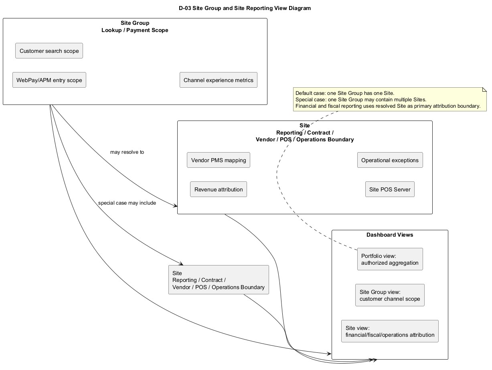
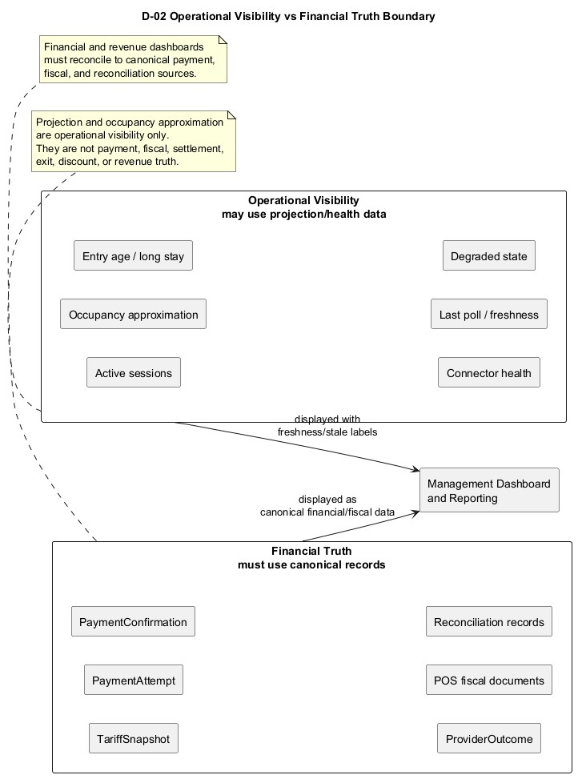
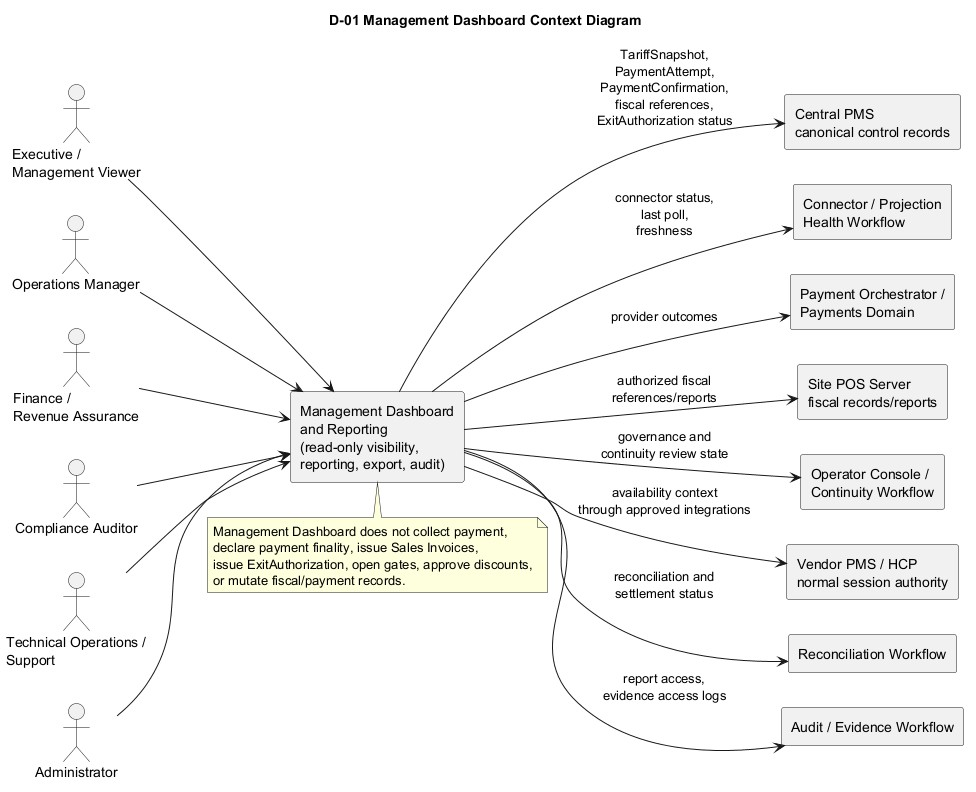
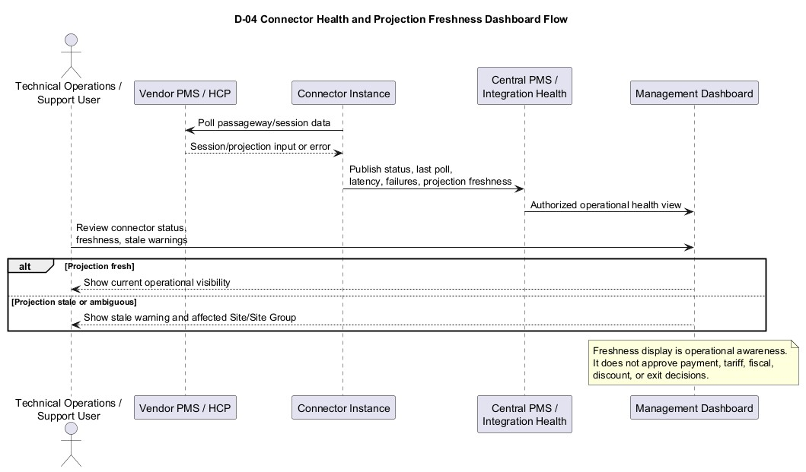
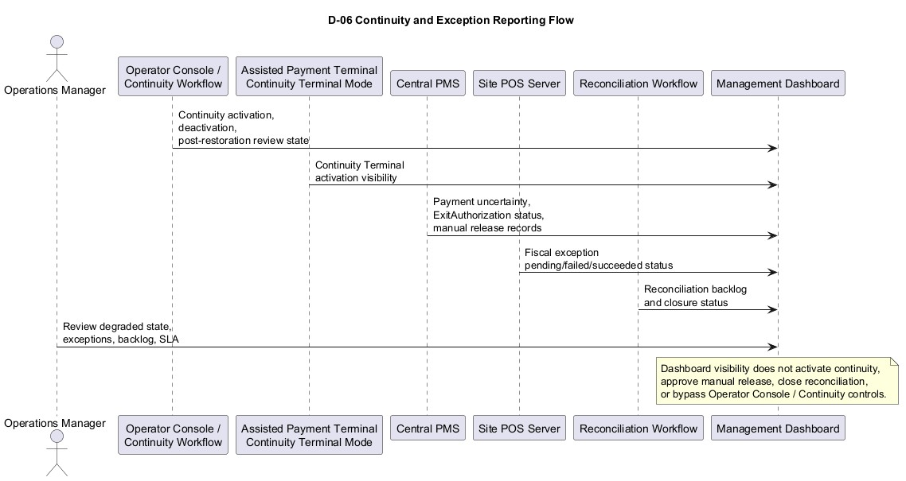
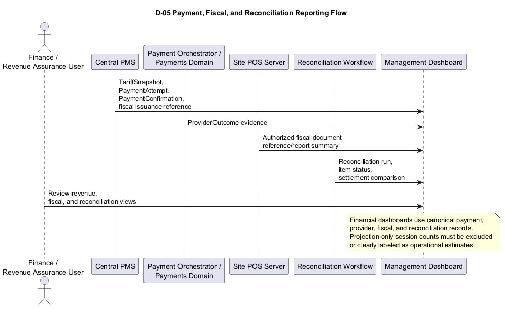

# ExitPass Management Dashboard and Reporting BRD v1.0

Version: v1.0  
Status: Draft  
Date: 2026-07-01  
Document type: Companion Business Requirements Document  
Product scope: ExitPass Management Dashboard and Reporting

## 1. Document Control

### 1.1 Version History

| Version | Date | Author / Owner | Summary |
| --- | --- | --- | --- |
| v1.0 | 2026-07-01 | ExitPass documentation stream | Initial companion BRD for ExitPass management dashboards, reporting, operational monitoring, financial/reconciliation visibility, export controls, audit access, and management reporting aligned with ExitPass BRD v1.3. |

### 1.2 Approvals

| Role | Name | Status | Date |
| --- | --- | --- | --- |
| Product Owner | TBD | Pending | TBD |
| Operations Owner | TBD | Pending | TBD |
| Finance / Revenue Assurance Owner | TBD | Pending | TBD |
| Compliance / Audit Owner | TBD | Pending | TBD |
| Technical Owner | TBD | Pending | TBD |

### 1.3 Document Ownership

This BRD is owned by the ExitPass product and documentation stream. It defines business requirements for Management Dashboard and Reporting and preserves the ExitPass v1.3 authority model.

This document is not a Management Dashboard System Design, API Contract, Database Design, dashboard wireframe pack, BI implementation specification, POS Server design, Operator Console BRD, Continuity System Design, or reporting database schema.

### 1.4 Relationship to ExitPass BRD v1.3

ExitPass BRD v1.3 is the core authority and business baseline. This companion BRD expands the dashboard and reporting scope that the core BRD intentionally keeps concise.

The most important rule carried from the core BRD is:

Operational visibility is not financial truth.

### 1.5 Relationship to Operator Console BRD

Operator Console remains the internal operator/supervisor governance console. It may show operational reports for site workflow. Broader executive, financial, revenue, occupancy, portfolio, cross-site, and management dashboards belong in this Management Dashboard and Reporting BRD.

### 1.6 Relationship to Continuity BRD

Continuity BRD defines controlled degraded operations, activation/deactivation, manual release governance, fiscal exception handling, and post-restoration review. Management Dashboard and Reporting provides visibility into continuity state and exception backlog, but it does not activate continuity, approve manual release, or close reconciliation unless a later approved policy explicitly assigns workflow actions.

### 1.7 Relationship to POS/Invoicing and POS Server

POS Server owns fiscal issuance and fiscal reports such as Sales Invoice, X-read, Z-read, BIR Sales Summary, Electronic Journal, POSLog, reprint controls, void/refund/cancel/return fiscal controls, fiscal retention, and fiscal exports.

Management Dashboard may consume authorized fiscal references or summarized fiscal report outputs. It does not replace POS Server fiscal records or reports and shall not issue Sales Invoices, mutate fiscal records, or generate BIR-authoritative fiscal reports unless later approved in POS Server design.

## 2. Executive Summary

Management Dashboard and Reporting is a companion business domain for ExitPass management visibility, operational monitoring, reporting, audit support, reconciliation support, and executive visibility.

The module shall provide role-based dashboards and reports for operational health, Site/Site Group performance, connector status, projection freshness, continuity state, payment and revenue monitoring, fiscal issuance status, reconciliation status, statutory discount and coupon reporting, exception review, audit reporting, and controlled exports.

The module shall not become a payment authority, fiscal authority, exit authority, discount authority, gate-control tool, or replacement for canonical payment, fiscal, or reconciliation records.

## 3. Business Context

ExitPass v1.3 introduces clearer boundaries for Site Group, Site, connector projection, POS/Invoicing, Continuity, Assisted Payment Terminal, and Operator Console. These boundaries create a need for a dedicated management reporting domain that can aggregate visibility without weakening authority rules.

Dashboards must help operations monitor live conditions while finance and compliance users rely on canonical records. A single view may combine operational and financial facts only if each metric is clearly labeled by source, freshness, and authority level.

## 4. Problem Statement

Without a dedicated Management Dashboard and Reporting BRD, reporting requirements may sprawl across the core BRD, Operator Console, POS Server, Continuity, and engineering documents. This creates risk that projection data, occupancy estimates, or operational health feeds are incorrectly treated as confirmed revenue, fiscal truth, payment finality, or exit authority.

The v1.0 dashboard BRD solves this by defining reporting domains, authority boundaries, role expectations, source-of-truth labeling, export controls, and audit requirements at the business level.

## 5. Product Purpose

The Management Dashboard shall provide:

- Management visibility across Sites, Site Groups, and portfolio views where authorized.
- Operational monitoring for active sessions, active vehicles, connector health, projection freshness, degraded states, and exception backlog.
- Financial and revenue reporting based on canonical payment, provider, fiscal, and reconciliation records.
- Compliance and audit reports for statutory discounts, evidence access, operator/supervisor activity, manual release, continuity, fiscal exceptions, and exports.
- Executive summaries that label whether metrics are operational estimates, canonical financial records, fiscal records, or reconciliation results.

## 6. Product Boundary

Management Dashboard and Reporting is:

- A companion business domain for dashboards, reports, monitoring views, exports, and reporting audit.
- Role-based and scope-aware by Site Group, Site, and portfolio where authorized.
- A consumer of approved operational, financial, fiscal, audit, and reconciliation records.
- A source of visibility, not a source of payment, fiscal, tariff, discount, or exit authority.

Management Dashboard and Reporting is not:

- Operator Console.
- WebPay.
- Assisted Payment Terminal.
- POS Server.
- Payment Orchestrator.
- Central PMS.
- Vendor PMS/HCP connector.
- A payment authority.
- A fiscal authority.
- An exit authorization authority.
- A replacement for canonical payment, fiscal, or reconciliation records.

## 7. Explicit Non-Authority Scope

Management Dashboard must not:

- Create payment finality.
- Issue ExitAuthorization.
- Open gates.
- Issue Sales Invoices.
- Mutate fiscal documents.
- Approve statutory discounts.
- Apply coupons.
- Alter payable basis.
- Treat projection as financial truth.
- Treat occupancy approximation as revenue truth.
- Bypass Central PMS, POS Server, Payment Orchestrator, Operator Console, Continuity, or reconciliation workflows.

## 8. Stakeholders and Users

| Stakeholder / User | Business Interest |
| --- | --- |
| Executive / Management Viewer | Aggregated portfolio, Site, revenue assurance, operational health, and exception visibility. |
| Operations Manager | Operational dashboards, continuity state, exception backlog, connector health, and Site performance. |
| Site Manager | Site-level active sessions, exceptions, revenue/fiscal attribution, and operational status. |
| Site Supervisor | Site-scoped operational reports, manual release counts, fiscal exception context, and continuity visibility. |
| Finance / Revenue Assurance User | Payment, fiscal, settlement, reconciliation, discounts, coupons, exceptions, and revenue assurance views. |
| Compliance Auditor | Audit, evidence access, statutory discount, manual release, continuity, export, and supervisor override reports. |
| Technical Operations / Support User | Connector health, projection freshness, poll latency, service health, and incident context. |
| Administrator | Role, scope, export permission, and reporting access governance. |
| Read-only Client / Lessor Viewer | Approved limited Site or Site Group management views where contractual access allows. |

## 9. Dashboard and Reporting User Roles

### 9.1 Executive / Management Viewer

The Executive / Management Viewer shall access aggregated management views, portfolio summaries, exception summaries, and high-level financial/operational indicators according to assigned scope.

### 9.2 Operations Manager

The Operations Manager shall access operational dashboards, exception queues, continuity state, connector health, projection freshness, and Site/Site Group operating status.

### 9.3 Site Manager

The Site Manager shall access assigned Site and Site Group dashboards, Site-level reporting, Site exceptions, operational health, and Site-attributed financial/fiscal summaries where authorized.

### 9.4 Site Supervisor

The Site Supervisor shall access site workflow reports, manual release counts, continuity visibility, fiscal exception review summaries, and operational status for assigned Sites.

### 9.5 Finance / Revenue Assurance User

Finance users shall access payment, fiscal, settlement, reconciliation, revenue, statutory discount, coupon, exception exposure, and export reports according to authorization.

### 9.6 Compliance Auditor

Compliance users shall access audit, evidence access, statutory discount, export, manual release, continuity, fiscal exception, and supervisor activity reports subject to privacy controls.

### 9.7 Technical Operations / Support User

Technical operations users shall access connector health, projection freshness, poll latency, failed poll count, Vendor PMS/HCP availability, vendor acknowledgment backlog, and incident context without payment or fiscal authority.

### 9.8 Administrator

The Administrator shall manage reporting access, scope assignments, export permission, and dashboard configuration where approved. Final implementation details are deferred to later design.

### 9.9 Read-only Client / Lessor Viewer

Read-only client or lessor users may receive limited dashboard access for assigned contractual scope. Sensitive evidence, audit, and financial details require explicit permission.

## 10. Reporting Domains

### 10.1 Operational Visibility

Operational visibility dashboards may use projection and health data. Examples include active sessions, active vehicles, occupancy approximation, entry time aging, long-stay sessions, stale sessions, sessions not seen in latest poll, connector health, last successful poll time, poll latency, projection freshness, Vendor PMS/HCP availability, Site/Site Group operational status, degraded-watch and degraded-active indicators, Continuity Terminal activation visibility, fiscal exception backlog, manual release counts, and incident backlog.

Operational visibility data shall show freshness, staleness, and source labels.

### 10.2 Financial and Revenue Reporting

Financial and revenue dashboards shall use canonical payment, provider, fiscal, and reconciliation records. Examples include gross amount by Site, net amount paid, payment confirmations, payment attempts by status, provider outcomes by status, payment rail performance, Sales Invoice count and totals, fiscal issuance pending/failed/succeeded, reconciliation status, settlement comparison, void/refund/cancel/return summary where available from POS Server, statutory discount amount and count, coupon amount and count, and fiscal exception exposure.

### 10.3 Compliance and Audit Reporting

Compliance and audit reports shall use controlled audit, evidence, fiscal, workflow, and access records. Examples include statutory discount validation report, evidence access report, operator activity report, supervisor override report, manual release report, continuity activation report, post-restoration review report, fiscal exception audit report, connector health incident report, and reprint/access/export report where applicable.

### 10.4 Management and Executive Summaries

Management and executive summaries may aggregate operational, financial, fiscal, and reconciliation metrics, but each metric shall identify its source category and freshness. Examples include Site performance summary, Site Group performance summary, portfolio summary, cashierless usage summary, payment channel mix, exception backlog, continuity incident summary, revenue assurance summary, and SLA/health summary.

## 11. Site Group and Site Reporting Model

Site Group means customer lookup/payment scope. Site means reporting, contract, Vendor PMS mapping, POS Server, and operational boundary.

Dashboard/reporting must support both views where needed.

Site Group views answer:

- Which customer lookup/payment scope is being used?
- How many sessions/payments are flowing through a shared payment scope?
- What is the WebPay/APM scope-level experience?

Site views answer:

- Which business/reporting/vendor/POS context owns the session?
- Which Site gets revenue/fiscal attribution?
- Which Vendor PMS mapping applies?
- Which Site POS Server issued the Sales Invoice?
- Which Site has exceptions, outages, or reconciliation backlog?

For financial and fiscal reporting, the resolved Site is the primary attribution boundary. For customer channel reporting, Site Group may be the primary view.

PlantUML source: [D-03_Site_Group_and_Site_Reporting_View_Diagram.puml](diagrams/D-03_Site_Group_and_Site_Reporting_View_Diagram.puml)

## 12. Operational Projection and Freshness Model

Projection records, connector polling records, active-session views, and occupancy approximation are operational visibility only.

They must not be used as:

- Payment finality.
- Fiscal truth.
- Confirmed revenue.
- Settlement truth.
- Sales Invoice truth.
- Exit authorization truth.
- Statutory discount final approval.
- Coupon final application.

Projection-based reports shall show freshness or staleness indicators. If projection is stale, ambiguous, or insufficient, dashboards shall display warnings. Financial dashboards shall exclude or separately label projection-only data.

PlantUML source: [D-02_Operational_Visibility_vs_Financial_Truth_Boundary_Diagram.puml](diagrams/D-02_Operational_Visibility_vs_Financial_Truth_Boundary_Diagram.puml)

## 13. Financial Truth and Reconciliation Model

Financial and revenue reporting shall be based on canonical records:

- TariffSnapshot.
- PaymentAttempt.
- PaymentConfirmation.
- ProviderOutcome.
- POS fiscal document / Sales Invoice references.
- Fiscal issuance reference.
- Reconciliation records.
- Settlement comparison records where available.
- Manual release records.
- Continuity-origin records.

Projection-only session counts may be shown beside financial data only if clearly labeled as operational estimates or visibility data.

## 14. Relationship to Operator Console

Operator Console remains the internal operator/supervisor governance console. Management Dashboard and Reporting provides broader management, financial, operational, compliance, and portfolio visibility.

Operator Console may show operational reports for site workflow. Broader executive, financial, revenue, occupancy, portfolio, and cross-site dashboards belong in this BRD.

Management Dashboard shall not replace Operator Console supervisor workflows, continuity approval workflows, statutory discount review workflows, or manual release governance workflows.

## 15. Relationship to Continuity

Management Dashboard shall provide visibility into continuity state, degraded-watch, degraded-active, Continuity Terminal activation, manual release counts, fiscal exception backlog, payment uncertainty, vendor acknowledgment backlog, post-restoration review status, and reconciliation backlog.

Management Dashboard must not activate continuity, approve manual release, or close reconciliation unless later policy explicitly assigns workflow actions. Those governance workflows belong to Operator Console, Continuity, or Reconciliation workflows.

## 16. Relationship to POS/Invoicing and Site POS Server

POS Server remains the fiscal issuance authority for the resolved Site.

Management Dashboard may consume summarized fiscal references or report outputs where authorized, but it does not replace POS Server fiscal records or reports.

Fiscal dashboards must reconcile to POS Server-issued fiscal documents and Central PMS fiscal issuance references.

Management Dashboard must not issue Sales Invoices, mutate fiscal records, or generate BIR-authoritative fiscal reports unless later approved in POS Server design.

## 17. Relationship to Central PMS, Payment Orchestrator, Vendor PMS, and Gate/Exit

| Function | Owner |
| --- | --- |
| Dashboard and reporting UI | Management Dashboard and Reporting |
| Operational projection visibility | Management Dashboard using Central PMS / connector projection data |
| Connector health visibility | Management Dashboard using Central PMS / integration health workflow |
| Parking session authority in normal mode | Vendor PMS / HCP |
| Session projection and control state | Central PMS |
| TariffSnapshot | Central PMS |
| PaymentAttempt | Central PMS |
| PaymentConfirmation and payment finality | Central PMS |
| Provider outcome evidence | Payment Orchestrator / payments domain |
| Fiscal treatment and Sales Invoice issuance | Resolved Site POS Server |
| Fiscal issuance reference recording | Central PMS |
| ExitAuthorization | Central PMS |
| Gate/exit execution | Gate/exit system consuming Central PMS authorization |
| Continuity activation and operational governance | Operator Console / Continuity workflow |
| Continuity Terminal workflow | Assisted Payment Terminal in Continuity Terminal mode |
| Reconciliation and post-restoration review | Operations / Reconciliation workflow |
| Audit evidence | Audit / Event / approved audit workflow |

PlantUML source: [D-01_Management_Dashboard_Context_Diagram.puml](diagrams/D-01_Management_Dashboard_Context_Diagram.puml)

## 18. High-Level Dashboard and Reporting Process Overview

### 18.1 Operational Dashboard Process

The user opens an authorized operational dashboard, selects Site Group, Site, or portfolio scope, reviews active-session and connector health indicators, and sees freshness or stale warnings for projection-based data.

### 18.2 Financial Dashboard Process

The finance user opens a financial dashboard, selects authorized Site or portfolio scope, reviews canonical payment, provider, fiscal, and reconciliation records, and exports approved reports where allowed.

### 18.3 Compliance and Audit Report Process

The compliance user opens an authorized report, filters by date, Site, Site Group, user, event type, exception, evidence access, or workflow state, and exports or reviews results subject to privacy and audit controls.

### 18.4 Continuity and Exception Reporting Process

The operations manager reviews degraded state, Continuity Terminal activation visibility, manual release counts, fiscal exceptions, payment uncertainty, vendor acknowledgment backlog, and post-restoration review status.

## 19. Functional Requirements

| ID | Requirement |
| --- | --- |
| MDR-FR-001 | The Management Dashboard shall enforce role-based dashboard access. |
| MDR-FR-002 | The Management Dashboard shall support Site Group scoped views. |
| MDR-FR-003 | The Management Dashboard shall support Site scoped views. |
| MDR-FR-004 | The Management Dashboard shall support cross-site and portfolio views where authorized. |
| MDR-FR-005 | The Management Dashboard shall provide operational active session visibility. |
| MDR-FR-006 | The Management Dashboard shall provide active vehicle visibility where projection data supports it. |
| MDR-FR-007 | The Management Dashboard shall provide occupancy approximation with freshness labeling. |
| MDR-FR-008 | The Management Dashboard shall provide session age and long-stay visibility. |
| MDR-FR-009 | The Management Dashboard shall display connector health status. |
| MDR-FR-010 | The Management Dashboard shall display projection freshness and stale warnings. |
| MDR-FR-011 | The Management Dashboard shall display Vendor PMS / HCP availability where available. |
| MDR-FR-012 | The Management Dashboard shall display last poll time and poll latency. |
| MDR-FR-013 | The Management Dashboard shall display degraded-watch and degraded-active visibility. |
| MDR-FR-014 | The Management Dashboard shall display Continuity Terminal activation visibility. |
| MDR-FR-015 | The Management Dashboard shall display manual release counts and review status. |
| MDR-FR-016 | The Management Dashboard shall display fiscal exception backlog. |
| MDR-FR-017 | The Management Dashboard shall provide payment attempt status dashboards. |
| MDR-FR-018 | The Management Dashboard shall provide payment confirmation dashboards. |
| MDR-FR-019 | The Management Dashboard shall provide provider outcome dashboards. |
| MDR-FR-020 | The Management Dashboard shall provide payment rail performance dashboards. |
| MDR-FR-021 | The Management Dashboard shall provide payment uncertainty reporting. |
| MDR-FR-022 | The Management Dashboard shall provide Sales Invoice issuance status summary. |
| MDR-FR-023 | The Management Dashboard shall provide fiscal issuance pending, failed, and succeeded reporting. |
| MDR-FR-024 | The Management Dashboard shall provide BIR/fiscal report reference visibility where authorized. |
| MDR-FR-025 | The Management Dashboard shall provide reconciliation run status. |
| MDR-FR-026 | The Management Dashboard shall provide reconciliation item status. |
| MDR-FR-027 | The Management Dashboard shall provide settlement comparison status where available. |
| MDR-FR-028 | The Management Dashboard shall provide statutory discount reporting. |
| MDR-FR-029 | The Management Dashboard shall provide coupon reporting. |
| MDR-FR-030 | The Management Dashboard shall provide evidence access reporting. |
| MDR-FR-031 | The Management Dashboard shall provide operator and supervisor activity reporting. |
| MDR-FR-032 | The Management Dashboard shall enforce export controls. |
| MDR-FR-033 | The Management Dashboard shall support report filters. |
| MDR-FR-034 | The Management Dashboard shall show data freshness indicators. |
| MDR-FR-035 | The Management Dashboard shall show source-of-truth labels. |
| MDR-FR-036 | The Management Dashboard shall audit report access and exports. |
| MDR-FR-037 | The Management Dashboard shall enforce privacy and evidence access restrictions. |
| MDR-FR-038 | The Management Dashboard shall not declare payment finality. |
| MDR-FR-039 | The Management Dashboard shall not issue ExitAuthorization. |
| MDR-FR-040 | The Management Dashboard shall not open gates. |
| MDR-FR-041 | The Management Dashboard shall not issue Sales Invoices. |
| MDR-FR-042 | The Management Dashboard shall not mutate fiscal documents, payable basis, statutory discount decisions, or coupon application. |

## 20. Operational Dashboard Requirements

The Management Dashboard shall provide operational visibility dashboards for authorized users.

Operational dashboards may include:

- Active sessions.
- Active vehicles.
- Occupancy approximation.
- Entry time aging.
- Long-stay sessions.
- Stale sessions.
- Sessions not seen in latest poll.
- Site/Site Group operational status.
- Incident backlog.
- Manual release counts.
- Fiscal exception backlog.

Operational dashboards shall label projection-based metrics as operational visibility and shall show freshness or stale indicators.

## 21. Connector Health and Projection Freshness Requirements

The Management Dashboard may show connector status, HCP/Vendor PMS availability, last successful poll time, projection freshness, poll latency, failed poll count, sessions projected, sessions stale, vendor acknowledgment backlog, and parking lot mapping health where available.

Projection information is not financial truth. Stale, ambiguous, or insufficient projection shall be displayed clearly and shall not be treated as approval for payment, tariff, discount, fiscal issuance, or exit.

PlantUML source: [D-04_Connector_Health_and_Projection_Freshness_Dashboard_Flow.puml](diagrams/D-04_Connector_Health_and_Projection_Freshness_Dashboard_Flow.puml)

## 22. Continuity and Degraded Mode Reporting Requirements

The Management Dashboard shall provide visibility into:

- Normal, degraded-watch, and degraded-active status.
- Continuity Terminal activation visibility.
- Manual release counts.
- Fiscal exception backlog.
- Payment uncertainty.
- Vendor acknowledgment backlog.
- Post-restoration review state.
- Reconciliation backlog.
- Affected Site / Site Group.
- Affected dependency.
- Incident or BCP reference where authorized.

Management Dashboard shall not activate continuity, approve manual release, or close reconciliation unless later policy explicitly assigns workflow actions.

PlantUML source: [D-06_Continuity_and_Exception_Reporting_Flow.puml](diagrams/D-06_Continuity_and_Exception_Reporting_Flow.puml)

## 23. Payment and Revenue Dashboard Requirements

Payment and revenue dashboards shall use canonical payment records and provider outcome evidence.

The Management Dashboard shall support:

- Gross amount by Site.
- Net amount paid.
- Payment attempts by status.
- Payment confirmations.
- Provider outcomes by status.
- Payment rail performance.
- Payment uncertainty reporting.
- Payment channel mix.
- Revenue assurance summary.

The dashboard shall not allow users to mark a payment as paid, reverse payment, refund payment, or declare payment finality.

## 24. Fiscal Issuance and POS Reporting Requirements

Fiscal dashboards shall reconcile to POS Server-issued fiscal documents and Central PMS fiscal issuance references.

The Management Dashboard shall support:

- Sales Invoice issuance count and totals where authorized.
- Fiscal issuance pending, failed, and succeeded summary.
- Fiscal reference visibility.
- Fiscal exception exposure.
- Void/refund/cancel/return summary where available from POS Server.
- BIR/fiscal report reference visibility where authorized.

The dashboard shall not issue Sales Invoices, mutate fiscal records, or generate BIR-authoritative reports unless later approved in POS Server design.

## 25. Reconciliation and Settlement Reporting Requirements

The Management Dashboard shall support reconciliation and settlement reporting using approved reconciliation records and settlement comparison sources.

Reports may include:

- Reconciliation run status.
- Reconciliation item status.
- Settlement comparison status.
- Unmatched payment items.
- Unmatched fiscal items.
- Vendor acknowledgment backlog.
- Continuity-origin reconciliation items.
- Manual release reconciliation items.
- Fiscal exception reconciliation status.

PlantUML source: [D-05_Payment_Fiscal_and_Reconciliation_Reporting_Flow.puml](diagrams/D-05_Payment_Fiscal_and_Reconciliation_Reporting_Flow.puml)

## 26. Statutory Discount and Coupon Reporting Requirements

The Management Dashboard shall support statutory discount and coupon reporting using approved validation, payable-basis, payment, fiscal, and audit records.

Reports may include:

- Statutory discount count and amount.
- Statutory discount status by approved, rejected, failed, expired, pending review, or exception where available.
- Coupon count and amount.
- Coupon status where available.
- Discount/coupon reporting by Site, Site Group, payment channel, date range, and user role where authorized.

Management Dashboard shall not approve statutory discounts, apply coupons, alter payable basis, or bypass Central PMS / Discount workflow.

## 27. Manual Release and Exception Reporting Requirements

The Management Dashboard shall support manual release and exception reporting.

Reports may include:

- Manual release count.
- Manual release reason category.
- Supervisor approval status.
- Incident tag.
- Audit tag.
- Reconciliation tag.
- Fiscal issuance exception count and status.
- Payment uncertainty count and status.
- Vendor acknowledgment backlog.
- Gate/exit issue reports.

Manual release reports shall not silently convert manual release into payment finality, fiscal truth, or normal ExitAuthorization.

## 28. Compliance, Audit, and Evidence Reporting Requirements

Compliance reports shall use controlled audit, evidence, fiscal, and workflow records.

Reports may include:

- Statutory discount validation report.
- Evidence access report.
- Operator activity report.
- Supervisor override report.
- Manual release report.
- Continuity activation report.
- Post-restoration review report.
- Fiscal exception audit report.
- Connector health incident report.
- Reprint/access/export report where applicable.

Evidence access reports shall protect sensitive evidence details. Sensitive evidence and personally identifiable information shall require elevated permissions and privacy controls.

## 29. Export, Filtering, and Data Access Requirements

The Management Dashboard shall support report filtering by authorized dimensions, including:

- Date/time range.
- Site Group.
- Site.
- Vendor PMS / connector where authorized.
- POS Server where authorized.
- Payment channel.
- Payment rail.
- Fiscal status.
- Reconciliation status.
- Continuity state.
- Exception type.
- User/operator/supervisor where authorized.
- Export status.

Report export shall be controlled by role and scope. Export activity shall be audited. Exported reports shall include source, generation time, filter criteria, and data freshness labels where applicable.

## 30. Security, RBAC, Privacy, and Segregation of Duties

The Management Dashboard shall enforce RBAC and scope-based access by Site Group, Site, and portfolio where authorized.

High-level access expectations:

- Executives see aggregated management views.
- Operations users see operational dashboards and exception queues.
- Finance users see payment, fiscal, reconciliation, and settlement reports.
- Compliance users see audit/evidence/reporting views subject to privacy controls.
- Technical support users see connector health, projection freshness, service health, and incident context.
- Site users are scoped to assigned Site/Site Group.
- Cross-site users require explicit permission.
- Sensitive evidence and audit data require elevated permission.

Segregation of duties shall prevent reporting users from using dashboards to perform payment, fiscal, exit, discount, coupon, or gate-control actions.

## 31. Data Freshness, Data Quality, and Labeling Requirements

The Management Dashboard shall label metrics by source and freshness.

Minimum label categories should include:

- Operational estimate.
- Projection-based visibility.
- Canonical financial record.
- Fiscal record.
- Reconciliation result.
- Audit record.
- Unknown or delayed status.

Projection-based reports shall show freshness or stale indicators. Financial and operational data sources shall be labeled. Management summaries shall clearly identify whether each metric is operational estimate, canonical financial record, fiscal record, or reconciliation result.

## 32. Non-Functional Requirements

| Category | Requirement |
| --- | --- |
| Availability | Dashboards should be available during approved management and operations hours subject to backend, network, reporting, and data-source availability. |
| Performance | Dashboard refresh and report generation should meet later-defined business latency targets by report type. |
| Scalability | Reporting shall support multiple Site Groups, Sites, payment channels, POS Servers, connector instances, and user scopes. |
| Reliability | Reports shall avoid mixing operational estimates with financial truth without clear labels. |
| Auditability | Report access, export, sensitive data access, and administrative changes shall be auditable. |
| Privacy | Personally identifiable and sensitive evidence-related data shall be minimized, masked, restricted, and audited where required. |
| Traceability | Financial reports shall support traceability to canonical payment, fiscal, and reconciliation records. |
| Freshness | Operational views shall display last update, projection freshness, or stale warning where applicable. |

## 33. Assumptions

| ID | Assumption |
| --- | --- |
| MDR-A-001 | Central PMS provides approved canonical payment, tariff, fiscal reference, ExitAuthorization, projection, and control state records for reporting consumption. |
| MDR-A-002 | POS Server provides authorized fiscal references or summarized report outputs for management visibility where allowed. |
| MDR-A-003 | Payment Orchestrator / payments domain provides provider outcome evidence for authorized reporting. |
| MDR-A-004 | Reconciliation workflow or records will exist for payment/fiscal/settlement comparison reporting. |
| MDR-A-005 | Operator Console and Continuity workflows provide governance and continuity state for visibility. |
| MDR-A-006 | Exact reporting data architecture is deferred to later technical design. |

## 34. Constraints

| ID | Constraint |
| --- | --- |
| MDR-C-001 | Management Dashboard shall not create payment finality. |
| MDR-C-002 | Management Dashboard shall not issue ExitAuthorization. |
| MDR-C-003 | Management Dashboard shall not open gates. |
| MDR-C-004 | Management Dashboard shall not issue Sales Invoices. |
| MDR-C-005 | Management Dashboard shall not mutate fiscal documents. |
| MDR-C-006 | Management Dashboard shall not approve statutory discounts, apply coupons, or alter payable basis. |
| MDR-C-007 | Projection data shall not be treated as financial truth. |
| MDR-C-008 | Financial reporting shall use canonical payment, fiscal, and reconciliation records. |
| MDR-C-009 | Detailed endpoint paths, DTOs, tables, reporting stores, and BI implementation are out of scope for this BRD. |

## 35. Risks and Mitigations

| Risk | Impact | Mitigation |
| --- | --- | --- |
| Projection treated as revenue truth | Incorrect revenue, settlement, and dispute handling. | Label projection as operational visibility and exclude or separate it from financial dashboards. |
| Site Group and Site confusion | Incorrect channel, revenue, fiscal, or operational attribution. | Provide both views and use resolved Site for financial/fiscal attribution. |
| Dashboard used as authority workflow | Unauthorized payment, fiscal, exit, discount, or gate actions. | Preserve explicit non-authority scope and enforce segregation of duties. |
| Fiscal reports diverge from POS Server | Compliance and reconciliation risk. | Reconcile fiscal dashboards to POS Server fiscal documents and Central PMS fiscal references. |
| Sensitive evidence exposed through reporting | Privacy and compliance risk. | Restrict, redact, and audit sensitive evidence access. |
| Cross-site access overexposed | Contractual and privacy risk. | Require explicit role and scope permissions. |
| Export controls too weak | Uncontrolled data leakage. | Require audited export permissions, filters, and retention controls. |

## 36. Open Questions

| ID | Open Question |
| --- | --- |
| MDR-OQ-001 | What is the exact v1.0 dashboard/report delivery scope? |
| MDR-OQ-002 | What is the exact dashboard role matrix? |
| MDR-OQ-003 | What is the exact Site Group vs Site default view behavior? |
| MDR-OQ-004 | What is the exact occupancy approximation formula and label wording? |
| MDR-OQ-005 | What is the exact projection freshness threshold and stale warning rule set? |
| MDR-OQ-006 | What are the exact connector health alert thresholds? |
| MDR-OQ-007 | What is the exact dashboard refresh interval per view? |
| MDR-OQ-008 | What are the exact financial dashboard source tables and aggregation rules? |
| MDR-OQ-009 | What is the exact fiscal dashboard integration with POS Server reports? |
| MDR-OQ-010 | What BIR/fiscal report visibility is allowed in management dashboards? |
| MDR-OQ-011 | What are the exact reconciliation SLA and status labels? |
| MDR-OQ-012 | What are the exact export formats and approval controls? |
| MDR-OQ-013 | What are the exact evidence access report redaction rules? |
| MDR-OQ-014 | What is the exact retention period for exported reports? |
| MDR-OQ-015 | What are the exact privacy controls for personally identifiable or sensitive evidence-related reporting? |
| MDR-OQ-016 | What BI/reporting technology or embedded dashboard approach will be used? |
| MDR-OQ-017 | What endpoint paths and DTOs are required? Deferred to API Contract. |
| MDR-OQ-018 | What database, data mart, or reporting store changes are required? Deferred to Database Delta or reporting System Design. |
| MDR-OQ-019 | What implementation details are required? Deferred to Management Dashboard System Design if created later. |

## 37. Acceptance Criteria

| ID | Acceptance Criterion |
| --- | --- |
| MDR-AC-001 | Dashboard distinguishes operational projection visibility from financial truth. |
| MDR-AC-002 | Operational dashboard can show active sessions, active vehicles, occupancy approximation, and projection freshness. |
| MDR-AC-003 | Projection-based views show freshness or stale indicators. |
| MDR-AC-004 | Stale projection is not presented as confirmed financial or exit truth. |
| MDR-AC-005 | Financial dashboard uses canonical payment, fiscal, and reconciliation records. |
| MDR-AC-006 | Site Group view supports customer lookup/payment-scope reporting. |
| MDR-AC-007 | Site view supports reporting, contract, Vendor PMS mapping, POS Server, and operational attribution. |
| MDR-AC-008 | Fiscal dashboards reconcile to POS Server fiscal documents or Central PMS fiscal issuance references. |
| MDR-AC-009 | Dashboard does not issue Sales Invoices. |
| MDR-AC-010 | Dashboard does not declare payment finality. |
| MDR-AC-011 | Dashboard does not issue ExitAuthorization. |
| MDR-AC-012 | Dashboard does not open gates. |
| MDR-AC-013 | Continuity dashboard shows degraded state, Continuity Terminal activation, manual release counts, fiscal exception backlog, and post-restoration review state where authorized. |
| MDR-AC-014 | Connector health dashboard shows last successful poll, freshness, status, and alert indicators. |
| MDR-AC-015 | Reports are filtered by authorized Site/Site Group scope. |
| MDR-AC-016 | Sensitive reports require elevated permissions. |
| MDR-AC-017 | Report export is audited. |
| MDR-AC-018 | Evidence access reports protect sensitive evidence details. |
| MDR-AC-019 | Financial and operational data sources are labeled. |
| MDR-AC-020 | Management summary clearly identifies whether metrics are operational estimate, canonical financial record, fiscal record, or reconciliation result. |

## 38. Requirements Traceability Matrix

| Business Need | Source / Driver | Covered By |
| --- | --- | --- |
| Separate reporting companion scope | ExitPass BRD v1.3; documentation outline | Sections 1, 2, 6 |
| Operational visibility not financial truth | ExitPass BRD v1.3; decision log | Sections 10, 12, 20, 31, 37 |
| Site Group vs Site reporting | ExitPass BRD v1.3 | Section 11 |
| Connector health and projection freshness | ExitPass BRD v1.3; Continuity BRD | Sections 12, 21 |
| Financial/revenue reporting | ExitPass BRD v1.3 | Sections 13, 23, 25 |
| POS/fiscal reporting boundary | ExitPass BRD v1.3; POS planning | Sections 16, 24 |
| Continuity reporting | Continuity BRD v1.0 | Sections 15, 22, 27 |
| Operator Console boundary | Operator Console BRD v1.1 | Section 14 |
| Audit/evidence/export controls | Operator Console BRD v1.1; compliance posture | Sections 28, 29, 30 |
| Acceptance coverage | Task requirements | Section 37 |

## 39. Appendix A: Glossary

| Term | Definition |
| --- | --- |
| Management Dashboard and Reporting | ExitPass companion domain for dashboards, reports, monitoring views, audit support, reconciliation support, and management visibility. |
| Operational visibility | Non-financial dashboard view based on projection, connector health, or operational status data. |
| Financial truth | Canonical payment, provider, fiscal, and reconciliation records used for revenue reporting. |
| Projection | Central PMS operational projection of Vendor PMS/HCP session data. |
| Site Group | Customer lookup/payment scope. |
| Site | Reporting, contract, Vendor PMS mapping, POS Server, and operational boundary. |
| POS Server | Site-level fiscal issuance authority. |
| Fiscal issuance reference | Central PMS record linking payment/session context to POS Server-issued fiscal document identity/status. |
| Reconciliation record | Approved record used to compare payment, provider, fiscal, settlement, vendor acknowledgment, and exception outcomes. |
| Continuity-origin record | Record created or tagged during approved degraded or BCP operation. |

## 40. Appendix B: Acronyms

| Acronym | Meaning |
| --- | --- |
| APM | AutoPay Machine |
| BCP | Business Continuity Plan |
| BIR | Bureau of Internal Revenue |
| BRD | Business Requirements Document |
| DTO | Data Transfer Object |
| HCP | HikCentral Professional |
| MDR | Management Dashboard and Reporting |
| PMS | Parking Management System |
| POS | Point of Sale |
| PWD | Person with Disability |
| RBAC | Role-Based Access Control |
| SLA | Service-Level Agreement |

## 41. Appendix C: Diagrams

| Diagram ID | Diagram | PlantUML Source |
| --- | --- | --- |
| D-01 | [Management Dashboard Context Diagram](diagrams/D-01_Management_Dashboard_Context_Diagram.jpg) | [D-01_Management_Dashboard_Context_Diagram.puml](diagrams/D-01_Management_Dashboard_Context_Diagram.puml) |
| D-02 | [Operational Visibility vs Financial Truth Boundary Diagram](diagrams/D-02_Operational_Visibility_vs_Financial_Truth_Boundary_Diagram.jpg) | [D-02_Operational_Visibility_vs_Financial_Truth_Boundary_Diagram.puml](diagrams/D-02_Operational_Visibility_vs_Financial_Truth_Boundary_Diagram.puml) |
| D-03 | [Site Group and Site Reporting View Diagram](diagrams/D-03_Site_Group_and_Site_Reporting_View_Diagram.jpg) | [D-03_Site_Group_and_Site_Reporting_View_Diagram.puml](diagrams/D-03_Site_Group_and_Site_Reporting_View_Diagram.puml) |
| D-04 | [Connector Health and Projection Freshness Dashboard Flow](diagrams/D-04_Connector_Health_and_Projection_Freshness_Dashboard_Flow.jpg) | [D-04_Connector_Health_and_Projection_Freshness_Dashboard_Flow.puml](diagrams/D-04_Connector_Health_and_Projection_Freshness_Dashboard_Flow.puml) |
| D-05 | [Payment, Fiscal, and Reconciliation Reporting Flow](diagrams/D-05_Payment_Fiscal_and_Reconciliation_Reporting_Flow.jpg) | [D-05_Payment_Fiscal_and_Reconciliation_Reporting_Flow.puml](diagrams/D-05_Payment_Fiscal_and_Reconciliation_Reporting_Flow.puml) |
| D-06 | [Continuity and Exception Reporting Flow](diagrams/D-06_Continuity_and_Exception_Reporting_Flow.jpg) | [D-06_Continuity_and_Exception_Reporting_Flow.puml](diagrams/D-06_Continuity_and_Exception_Reporting_Flow.puml) |
