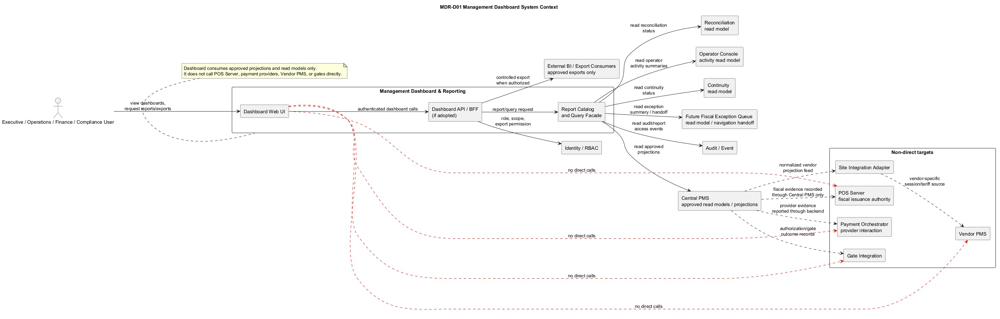
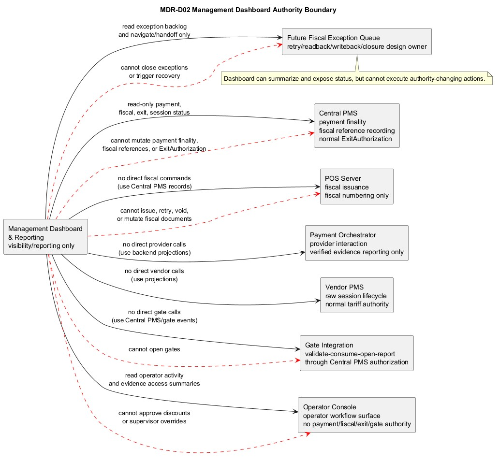
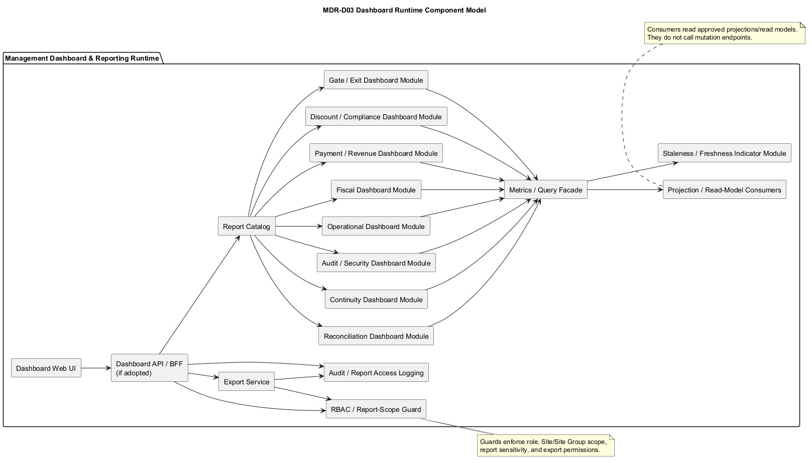
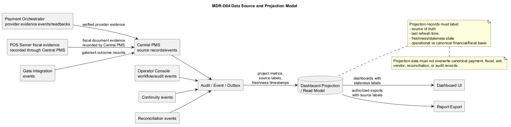
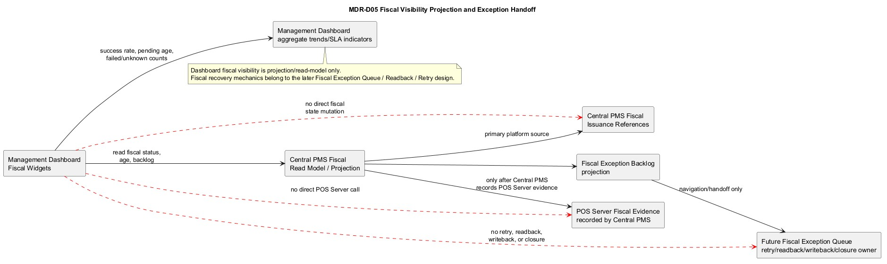
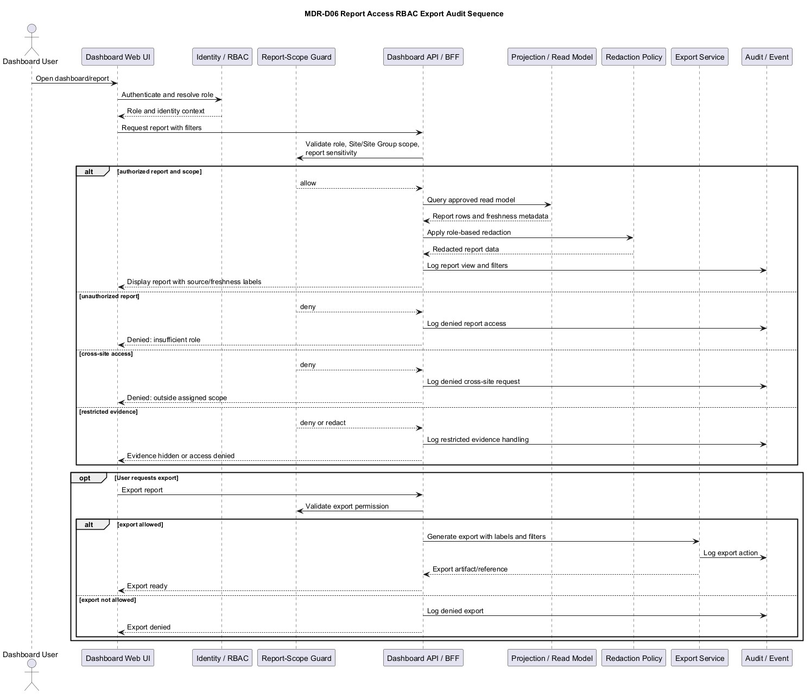
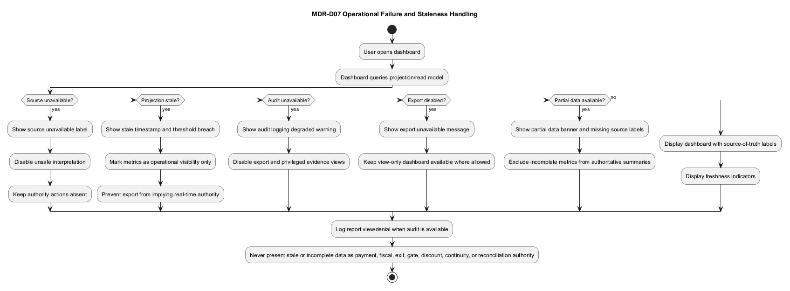

# ExitPass Management Dashboard and Reporting System Design SDD v1.0

## 1. Document control

| Field | Value |
| --- | --- |
| Document | ExitPass Management Dashboard and Reporting System Design SDD |
| Version | v1.0 |
| ExitPass baseline | v1.3 |
| Status | Ready for review |
| Branch | `docs/v1.3-management-dashboard-reporting-system-design` |
| Scope | Visibility, analytics, reporting, compliance, and operational oversight design |
| Owner | ExitPass platform documentation stream |
| Last updated | 2026-07-03 |

## 2. Purpose

The Management Dashboard and Reporting capability is an internal visibility, analytics, reporting, compliance, and operational oversight surface for ExitPass v1.3.

It gives authorized management, operations, finance, compliance, audit, and support users controlled views over operational health, revenue posture, fiscal status, statutory discount activity, gate/exit status, vendor connector health, continuity posture, reconciliation status, audit events, evidence access, and reporting exports.

It is not a payment authority, fiscal issuance authority, exit authority, gate authority, discount approval authority, continuity authority, reconciliation authority, or manual release authority.

The design goal is to define the dashboard boundary and read-model posture so implementation teams can build v1.3 dashboards without reinterpreting projections as source-of-truth records or adding authority-changing actions to the reporting surface.

## 3. Source baseline and inspected files

| Source | Usage |
| --- | --- |
| `docs/v1.3/ExitPass_BRD_v1.3.md` | v1.3 authority model, Site/Site Group semantics, projection-based visibility, fiscal-before-exit posture, dashboard/reporting requirements, audit and degraded-mode requirements. |
| `docs/v1.3/ExitPass_System_Design_v1.3.md` | System-level authority boundaries, Central PMS responsibility, projection posture, reporting handoff. |
| `docs/v1.3/operator-console/ExitPass_Operator_Console_System_Design_SDD_v1.0.md` | Operator Console boundary and handoff to Management Dashboard and future Fiscal Exception Queue. |
| `docs/v1.3/operator-console/reviews/ExitPass_Operator_Console_System_Design_SDD_Review_v1.0.md` | Review confirmation for non-payment, non-fiscal, non-exit, and non-gate Operator Console boundary. |
| `docs/v1.3/operator-console/diagrams/*` | Existing Operator Console context, authority, runtime, workflow, fiscal visibility, and evidence/audit diagram conventions. |
| `docs/v1.3/management-dashboard-reporting/ExitPass_Management_Dashboard_and_Reporting_BRD_v1.0.md` | Management Dashboard product requirements, domains, source/freshness labels, export controls, and non-authority constraints. |
| `docs/v1.3/management-dashboard-reporting/diagrams/*` | Existing Management Dashboard BRD diagram convention and rendered JPEG pattern. |
| `docs/v1.3/central-pms/engineering-pack/09-dashboard-visibility-plan.md` | Central PMS fiscal visibility projection posture and dashboard non-authority boundary. |
| `docs/v1.3/central-pms/engineering-pack/08-operator-console-queues-plan.md` | Future fiscal exception queue visibility and action boundaries. |
| `docs/v1.3/central-pms/runbooks/ExitPass_Central_PMS_POS_Server_Controlled_UAT_Post_Run_Review_v1.0.md` | Controlled UAT result, safety posture, and deferred dashboard/fiscal exception projection work. |
| `docs/v1.3/vendor-pms-connector/ExitPass_Vendor_PMS_Connector_System_Design_v1.0.md` | Vendor connector normalization, health, projection, and degraded handoff context. |
| `docs/v1.3/hikcentral-connector/ExitPass_HikCentral_Connector_Profile_v1.0.md` | HikCentral connector profile context for vendor/PMS health visibility. |
| `docs/v1.3/assisted-payment-terminal/ExitPass_Assisted_Payment_Terminal_System_Design_v1.0.md` | Assisted terminal and statutory discount capture boundary. |
| `docs/v1.3/continuity/ExitPass_Continuity_System_Design_v1.0.md` | Continuity, manual release, degraded mode, reconciliation, and post-restoration reporting context. |
| `docs/v1.3/pos-server/ExitPass_POS_Server_System_Design_v1.0.md` | POS Server fiscal authority and fiscal output/reporting posture. |
| `docs/v1.3/pos-server-api/ExitPass_Central_PMS_to_POS_Server_Fiscal_Issuance_Integration_Contract_v1.0.md` | Central PMS to POS Server fiscal issuance evidence boundary. |

This SDD does not introduce or verify concrete database table or column names. Where a reporting persistence object is needed but not confirmed, it is described as a future design requirement.

## 4. Scope and non-goals

### In scope

- Dashboard and reporting system boundary.
- Visibility-only authority model.
- Relationship to Central PMS, Operator Console, Site Integration Adapter, Vendor PMS, Payment Orchestrator, POS Server, Gate Integration, Audit/Event, Reconciliation, Continuity, Identity/RBAC, and the future Fiscal Exception Queue.
- Runtime component model.
- Data source, projection, and freshness model.
- Report catalog and dashboard domains.
- Fiscal visibility projection posture.
- RBAC, report scoping, evidence redaction, export controls, and audit logging.
- Failure modes, stale data handling, and user messaging.
- API and data contract expectations without inventing unverified database fields.
- Implementation roadmap and acceptance criteria.

### Non-goals

- No payment collection.
- No payment confirmation, refund, reversal, void, or paid-state marking.
- No direct provider interaction.
- No POS Server fiscal issuance, retry, readback, writeback, reprint, void, or fiscal document mutation.
- No normal ExitAuthorization issuance.
- No gate opening or gate consumption.
- No statutory discount approval, rejection, or override execution from the dashboard.
- No continuity activation, deactivation, or manual release execution.
- No reconciliation exception closure from the dashboard.
- No fiscal retry/readback/writeback mechanics in this SDD.
- No source code changes.
- No database schema or migration design except future requirements stated without final column names.
- No controlled UAT runtime work.

## 5. System context

The Management Dashboard and Reporting capability sits inside the internal ExitPass trust boundary and consumes approved backend read models, projections, and report sources.

The dashboard does not call POS Server, payment providers, Vendor PMS, or gate systems directly. It receives payment, session, fiscal, exit, continuity, reconciliation, and audit visibility through Central PMS-backed read models, Audit/Event projections, approved reconciliation sources, Operator Console activity summaries, and future Fiscal Exception Queue projections.

Authority remains outside the dashboard:

| Domain | Source of authority | Dashboard posture |
| --- | --- | --- |
| Payment finality | Central PMS | Read-only status/reporting. |
| Provider interaction | Payment Orchestrator | Read provider evidence only through approved backend projection. |
| Raw parking session lifecycle and tariff | Vendor PMS through Site Integration Adapter | Read normalized projections with freshness labels. |
| Fiscal issuance and numbering | POS Server | Read Central PMS-recorded fiscal reference/evidence only. |
| Fiscal reference recording | Central PMS | Read-only status and trend reporting. |
| Normal ExitAuthorization | Central PMS | Read-only status/reporting. |
| Gate validation/consume/open/report | Gate Integration through Central PMS authorization | Read gate outcome and health projections only. |
| Statutory discount workflow | Central PMS / approved discount workflow and Operator Console workflow surfaces | Report activity and compliance only. |
| Continuity/manual release | Approved continuity governance workflows | Report status and counts only. |
| Reconciliation | Approved reconciliation workflow | Report status and backlog only. |
| Audit/evidence | Audit/Event and evidence governance | Scoped report and access logging only. |

## 6. Diagrams

### MDR-D01 Management Dashboard System Context

PlantUML source: [MDR-D01_Management_Dashboard_System_Context.puml](diagrams/MDR-D01_Management_Dashboard_System_Context.puml)

### MDR-D02 Management Dashboard Authority Boundary

PlantUML source: [MDR-D02_Management_Dashboard_Authority_Boundary.puml](diagrams/MDR-D02_Management_Dashboard_Authority_Boundary.puml)

### MDR-D03 Dashboard Runtime Component Model

PlantUML source: [MDR-D03_Dashboard_Runtime_Component_Model.puml](diagrams/MDR-D03_Dashboard_Runtime_Component_Model.puml)

### MDR-D04 Data Source and Projection Model

PlantUML source: [MDR-D04_Data_Source_and_Projection_Model.puml](diagrams/MDR-D04_Data_Source_and_Projection_Model.puml)

### MDR-D05 Fiscal Visibility Projection and Exception Handoff

PlantUML source: [MDR-D05_Fiscal_Visibility_Projection_and_Exception_Handoff.puml](diagrams/MDR-D05_Fiscal_Visibility_Projection_and_Exception_Handoff.puml)

### MDR-D06 Report Access RBAC Export Audit Sequence

PlantUML source: [MDR-D06_Report_Access_RBAC_Export_Audit_Sequence.puml](diagrams/MDR-D06_Report_Access_RBAC_Export_Audit_Sequence.puml)

### MDR-D07 Operational Failure and Staleness Handling

PlantUML source: [MDR-D07_Operational_Failure_and_Staleness_Handling.puml](diagrams/MDR-D07_Operational_Failure_and_Staleness_Handling.puml)

## 7. Management Dashboard responsibility model

The dashboard owns visibility and reporting composition, not source-of-truth command execution.

| Responsibility | Dashboard behavior | Boundary |
| --- | --- | --- |
| Operational visibility | Shows site health, session volume, lookup outcomes, connector health, gate/exit health, and stale projections. | Must label operational projections as non-financial and non-authoritative. |
| Financial and revenue visibility | Shows payment attempts, confirmed payments, provider outcome lag, revenue posture, settlement status, and reconciliation status from canonical sources. | Cannot mark a payment paid or alter payment finality. |
| Fiscal visibility | Shows fiscal reference status, POS Server call/evidence status if recorded by Central PMS, document number where safe, exception backlog, and SLA indicators. | Cannot trigger fiscal issuance, retry, readback, writeback, or fiscal document mutation. |
| Statutory discount compliance | Shows Senior Citizen/PWD validation counts, outcomes, duplicate/fraud signals, override rates, and evidence compliance. | Cannot approve, reject, or override entitlement decisions. |
| Operator Console activity visibility | Shows lookup volume, device trust failures, shift/site denies, supervisor overrides, and evidence access/export events. | Cannot execute Operator Console workflow actions. |
| Continuity visibility | Shows continuity activation status, manual release counts, post-restoration review status, and degraded-mode reports. | Cannot activate continuity or approve manual release. |
| Reconciliation visibility | Shows reconciliation run status, matched/mismatched/exception/resolved counts, backlog, and settlement posture. | Cannot close reconciliation exceptions. |
| Audit/evidence reporting | Shows privileged report views, exports, evidence access, denied access attempts, RBAC violations, and security indicators. | Must redact sensitive details by default and audit access/export. |

## 8. Authority boundary matrix

See MDR-D02 for the visual boundary model.

| Capability | Authority owner | Dashboard allowed | Dashboard prohibited |
| --- | --- | --- | --- |
| Payment finality | Central PMS | Display status, lag, volume, and revenue reports. | Collect payment, confirm payment, reverse/refund/void payment, or mark paid. |
| Provider interaction | Payment Orchestrator | Display provider health, outcome lag, and evidence status through approved read models. | Call provider APIs or interpret provider evidence as platform finality. |
| Raw session lifecycle and tariff | Vendor PMS through Site Integration Adapter | Display normalized session, tariff availability, connector health, and projection freshness. | Call Vendor PMS directly or recalculate authoritative tariff. |
| Fiscal issuance and numbering | POS Server | Display Central PMS-recorded fiscal evidence and document references when authorized. | Issue fiscal documents, retry/readback/writeback, mutate POS Server documents, or create BIR-authoritative output. |
| Fiscal reference recording | Central PMS | Display state, backlog, age, and trends. | Edit fiscal reference state. |
| ExitAuthorization | Central PMS | Display issued, blocked, expired, consumed, and exception indicators. | Issue, extend, consume, revoke, or reinterpret ExitAuthorization. |
| Gate execution | Gate Integration through Central PMS authorization | Display gate health/outcome metrics. | Open gates or bypass Central PMS authorization. |
| Statutory discount workflow | Central PMS / approved discount workflow / Operator Console | Display counts, compliance, evidence status, and fraud signals. | Approve, reject, or override discounts. |
| Continuity and manual release | Approved continuity governance workflow | Display activation, degraded status, manual release counts, and post-restoration outcomes. | Activate continuity or approve manual release. |
| Reconciliation | Approved reconciliation workflow | Display run status and exception backlog. | Close, suppress, or resolve reconciliation exceptions. |
| Audit/evidence | Audit/Event and evidence governance | Display scoped reports and export when authorized. | Expose raw sensitive evidence without permission or bypass audit logging. |

## 9. User roles, RBAC, report scope, and export permissions

| Role | Default report scope | Typical access | Export posture |
| --- | --- | --- | --- |
| Executive / portfolio user | Assigned Site Groups or portfolio scope. | Aggregated operational, revenue, fiscal, exception, continuity, and reconciliation summaries. | Aggregated export by permission only. |
| Operations manager | Assigned Site Groups/Sites. | Operational health, site performance, lookup trends, gate/exit visibility, continuity status, open exceptions. | Scoped export by permission only. |
| Site manager | Assigned Site only unless elevated. | Site-level operational, payment, discount, gate, fiscal, and exception visibility. | Site-scoped export only if permitted. |
| Finance / revenue assurance | Approved financial scope. | Payment, provider, revenue, fiscal, settlement, and reconciliation reports. | Financial export with strong audit and source labels. |
| Compliance / audit user | Approved audit/compliance scope. | Evidence access, statutory discount compliance, fiscal status, audit, export, and denied-access reports. | Redacted export by default; sensitive export requires elevated permission. |
| Technical operations / support | Assigned technical scope. | Connector health, projection freshness, service health, fiscal status posture, incidents, and staleness. | Technical export by permission only. |
| Administrator | Configuration and access governance scope. | RBAC/report-scope administration visibility and audit reports. | Export governed by segregation of duties. |
| Read-only client / lessor user | Contracted reporting scope. | Approved aggregated or site-limited commercial reports. | Export only if contract and RBAC allow. |

RBAC rules:

- Every dashboard request is authenticated through ExitPass identity services.
- Every report is evaluated against role, Site/Site Group scope, report sensitivity, and export permission.
- Cross-site and cross-portfolio access is denied unless explicitly assigned.
- Sensitive evidence, personally identifiable context, statutory discount evidence, and audit details are redacted by default.
- Export requires explicit permission and audit logging.
- Segregation of duties prevents dashboard users from executing payment, fiscal, exit, gate, discount, continuity, or reconciliation authority actions.

## 10. Runtime components

See MDR-D03 for the runtime component model.

| Component | Responsibility |
| --- | --- |
| Dashboard Web UI | Internal web surface for dashboards, reports, filters, drilldowns, freshness labels, and export requests. |
| Dashboard API/BFF | Optional backend-for-frontend that composes report queries, enforces RBAC, applies redaction, and records audit events. |
| RBAC/report-scope guard | Validates user role, Site/Site Group scope, report sensitivity, export permission, and evidence access. |
| Metrics/query facade | Normalizes dashboard queries over approved projections/read models. |
| Report catalog | Defines report domains, required source labels, freshness expectations, filters, and export availability. |
| Operational dashboard module | Site/Site Group health, session lookup, vendor connector, gate, and operational exception views. |
| Fiscal dashboard module | Fiscal reference status, fiscal document evidence visibility, exception backlog, and SLA indicators. |
| Payment/revenue dashboard module | Payment attempts, confirmed payments, provider outcomes, finality lag, revenue posture, and settlement readiness. |
| Discount/compliance dashboard module | Senior Citizen/PWD validation, override, duplicate/fraud, and evidence compliance reporting. |
| Gate/exit dashboard module | ExitAuthorization status and gate/exit outcome visibility. |
| Reconciliation dashboard module | Reconciliation run, settlement comparison, matched/mismatched/exception/resolved status visibility. |
| Continuity dashboard module | Continuity activation, degraded operations, manual release visibility, and post-restoration review posture. |
| Export service | Generates authorized exports with filters, source labels, generation time, redaction posture, and audit events. |
| Audit/report access logging | Records dashboard view, denied access, export, privileged evidence, and sensitive report access events. |
| Projection/read-model consumers | Read-only consumers of approved reporting projections. |
| Freshness/staleness indicator module | Displays last update, source lag, stale thresholds, and partial data indicators. |

## 11. API/service interaction model

Management Dashboard APIs must be read-oriented and projection-oriented.

| Interaction | Expected model | Boundary |
| --- | --- | --- |
| Identity/RBAC | Resolve user, roles, report scopes, export permission, and evidence access. | No anonymous dashboard access. |
| Central PMS read models | Query payment, session, payable basis, fiscal reference, ExitAuthorization, and source-of-truth labels. | No Central PMS mutation endpoints. |
| Audit/Event | Query and emit report view/export/denial events. | Report access must be auditable. |
| Reconciliation read model | Query reconciliation run status and exception summaries. | No closure or correction actions. |
| Operator Console activity read model | Query lookup, device trust, shift/site denial, supervisor override, evidence access, and workflow summaries. | No Operator Console command execution. |
| Future Fiscal Exception Queue read model | Query fiscal exception backlog and navigation handoff. | No retry/readback/writeback/closure. |
| Export service | Generate authorized report output. | Export must include source, generated-at time, filters, freshness labels, and redaction status. |

The dashboard must not call POS Server, payment providers, Vendor PMS, or Gate Integration directly.

## 12. Data source, projection, and freshness model

See MDR-D04 for the projection flow.

Dashboard data is classified by source basis:

| Source basis | Use | Required label |
| --- | --- | --- |
| Operational projection | Site health, connector health, lookup counts, occupancy approximation, vendor projection freshness, queue age. | `operational_projection` with last refresh and stale indicator. |
| Canonical payment record | Payment attempts, confirmed payments, finality lag, revenue posture. | `canonical_payment_record`. |
| Provider evidence projection | Provider outcome lag, success/failure/expired/cancelled status, provider health. | `provider_evidence_projection` with source and freshness. |
| Fiscal evidence recorded by Central PMS | Fiscal reference state, document number where safe, POS Server evidence status. | `central_pms_recorded_fiscal_evidence`. |
| Reconciliation result | Settlement comparison, matched/mismatched/exception/resolved status. | `reconciliation_result`. |
| Audit/evidence record | Evidence access, export, denied access, role and scope violations. | `audit_evidence_record`. |
| Continuity/degraded operation record | Continuity activation, manual release status, post-restoration review. | `continuity_record`. |

Freshness rules:

- Every projection-backed dashboard widget shows source and last refreshed time.
- Stale, unavailable, partial, or unknown data is labeled visibly.
- Financial and revenue reports must not use operational projections as financial truth.
- Fiscal dashboards must distinguish Central PMS fiscal reference state from POS Server evidence recorded through Central PMS.
- Partial data must be excluded from authoritative summaries or clearly labeled as partial.
- Exported reports include generation time, source labels, filters, freshness status, and redaction status.

## 13. Dashboard domains and report catalog

### Executive operations overview

| Report/widget | Purpose | Source posture |
| --- | --- | --- |
| Site/Site Group health | Portfolio view of operational status, connector health, gate/exit health, and stale projections. | Operational projection with freshness labels. |
| Payment throughput | Count and trend of payment attempts and confirmed payments. | Canonical payment records and provider evidence projections. |
| Exit authorization throughput | Issued, blocked, expired, and consumed ExitAuthorization counts. | Central PMS read model. |
| Unresolved exceptions | Open operational, fiscal, payment, vendor, gate, continuity, and reconciliation exceptions. | Approved exception projections. |
| Fiscal exception backlog | Pending/failed/unknown fiscal status count and age. | Central PMS fiscal projection and future queue projection. |
| Stale projection warnings | Source lag and stale indicators by Site/Site Group. | Projection freshness module. |

### Site/Site Group performance

- Sessions resolved.
- Lookups found, not found, ambiguous, inactive, or unavailable.
- Tariff quote availability.
- Vendor connector health.
- Gate/exit health.
- Projection freshness and stale warnings.
- Site Group reporting for portfolio governance and Site reporting for fiscal/operational attribution.

### Session and lookup performance

- Lookup volume by site, device class, channel, and time window where authorized.
- Found/not found/ambiguous/expired/inactive rates.
- Backend unavailable and vendor unavailable indicators.
- No heuristic matching or source-of-truth mutation.

### Payment and revenue visibility

- Payment attempts by status.
- Confirmed payments.
- Failed, expired, cancelled, and unknown payments.
- Provider outcome lag.
- Payment finality lag.
- Settlement and reconciliation posture.
- Read-only only; no payment actions.

### Payment provider health

- Provider availability and error rates from approved provider evidence/reporting sources.
- Outcome delivery lag and callback/readback issue trends.
- Provider-specific details redacted where required.
- Payment Orchestrator remains provider interaction owner.

### Fiscal issuance and fiscal exception visibility

- Fiscal issuance status trends.
- Successful fiscal document creation counts.
- Pending, failed, conflict, and unknown fiscal issuance counts.
- Fiscal document number visibility only when Central PMS has recorded it safely and role permits display.
- POS Server call status only if Central PMS projection exposes it.
- Fiscal exception backlog and age.
- Handoff to future Fiscal Exception Queue for recovery design.
- Read-only only; no retry, readback, writeback, or fiscal document mutation.

### ExitAuthorization and gate/exit visibility

- Issued, blocked, expired, consumed, failed, and unknown ExitAuthorization counts.
- Gate validation, consume, open, and report outcome indicators where available through approved projections.
- Gate health and unavailable indicators.
- Manual release is reported separately and is not normal ExitAuthorization.
- No gate actions from the dashboard.

### Vendor PMS / connector health

- Vendor PMS availability.
- Connector poll status and last successful poll time.
- Projection freshness.
- Failed poll count and error categories.
- Vendor acknowledgment backlog.
- Site mapping health.
- Site Integration Adapter remains vendor normalization owner.

### Statutory discount validation and compliance

- Senior Citizen/PWD validation counts.
- Approved, rejected, pending review, duplicate, failed, and expired validation outcomes.
- Override rates.
- Duplicate and fraud signal trends.
- Evidence capture policy compliance.
- Redacted reporting by default.
- No entitlement approval from the dashboard.

### Operator Console activity

- Operator lookup volume.
- Device trust failures.
- Shift and site assignment denials.
- Supervisor override activity.
- Evidence access and export events.
- Open operational cases.
- Handoff to Operator Console for workflow execution where permitted.

### Continuity and manual release visibility

- Continuity activation visibility if available.
- Degraded-mode duration, scope, and reason labels.
- Manual release counts/status.
- Post-restoration review and reconciliation indicators.
- Manual release is not normal ExitAuthorization.
- No continuity activation or manual release approval from the dashboard.

### Reconciliation and settlement visibility

- Reconciliation run status.
- Matched, mismatched, exception, and resolved counts.
- Settlement comparison status.
- Payment/fiscal/provider/vendor acknowledgment exception backlog.
- No reconciliation closure from the dashboard unless a later approved design assigns that authority elsewhere.

### Audit/security/evidence access visibility

- Privileged report views.
- Exports.
- Evidence access.
- Denied access attempts.
- Device trust failures.
- RBAC violations.
- Sensitive report redaction.
- Audit trail integrity and missing-audit indicators.

## 14. Fiscal visibility projection design

See MDR-D05 for the fiscal projection and exception handoff model.

The dashboard fiscal design is projection/read-model only:

- Central PMS fiscal reference state is the primary dashboard source.
- POS Server fiscal document ID/number/status is displayed only after Central PMS has recorded the evidence.
- Dashboard widgets may show fiscal issuance success rate, pending age, failure categories, unknown outcome count, exception backlog, SLA indicators, and trends.
- Fiscal status labels must identify whether the value is recorded evidence, projection, pending, failed, unknown, conflict, or stale.
- Dashboard does not call POS Server.
- Dashboard does not initiate fiscal issuance.
- Dashboard does not retry fiscal issuance.
- Dashboard does not perform readback or writeback.
- Dashboard does not close fiscal exceptions.
- Future Fiscal Exception Queue / Readback / Retry design owns retry, readback, writeback, recovery, and closure workflows.

## 15. Security, privacy, redaction, and export controls

- All dashboard users authenticate through ExitPass identity services.
- All report requests are authorized by role, Site/Site Group scope, report sensitivity, evidence sensitivity, and export permission.
- Default reports are redacted for plate, ticket, personal, statutory discount, provider, and evidence-sensitive fields unless role and policy explicitly allow display.
- Evidence references and hashes are preferred over raw evidence.
- Sensitive evidence is not exported unless explicitly allowed by compliance policy and RBAC.
- Exported reports include requester, generated-at timestamp, filters, scope, source labels, freshness labels, redaction status, and export reference.
- Export and privileged evidence views are audited.
- Cross-site report access is denied unless scope explicitly grants it.
- Aggregated reports must prevent accidental disclosure of sensitive evidence or personally identifiable context.

## 16. Audit, traceability, and evidence handling

Dashboard audit requirements:

- Log report view events with user, role, scope, report ID, filters, source basis, freshness state, and result size where policy allows.
- Log denied report, denied cross-site, denied evidence, and denied export attempts.
- Log export requests, export approvals, export failures, and export artifact references.
- Log privileged evidence reference access.
- Preserve traceability from dashboard summary to canonical record or projection source without exposing raw sensitive payloads by default.
- Mark evidence-based reports as redacted or unredacted.
- Retention is policy-driven and must align with audit, compliance, and evidence governance requirements.

## 17. Observability and operational health

Dashboard observability should include:

- Report query latency.
- Projection lag and stale source counts.
- Read-model ingestion status.
- Export generation success/failure.
- Audit write success/failure.
- Denied access trends.
- High-cardinality or expensive report usage.
- Data source unavailable indicators.
- Partial data and stale report warnings.

Operational dashboards should be able to hand off aggregate visibility to platform observability without granting mutation authority.

## 18. Failure modes, data staleness, and user messaging

See MDR-D07 for the failure and staleness handling model.

| Failure mode | Dashboard behavior | User message |
| --- | --- | --- |
| Invalid role | Deny report access and audit the denial. | `You are not authorized to view this report.` |
| Cross-site access | Deny request and audit scope violation. | `This report is outside your assigned scope.` |
| Restricted evidence | Redact or deny based on role and policy. | `Restricted evidence is hidden by policy.` |
| Source unavailable | Show unavailable label and suppress unsafe interpretation. | `Source unavailable. Data cannot be treated as current.` |
| Projection stale | Show stale timestamp and threshold breach. | `Projection is stale. Use for visibility only.` |
| Partial data | Show partial data banner and source gaps. | `Partial data only. Some sources are unavailable.` |
| Audit unavailable | Disable export and privileged evidence views where policy requires. | `Audit logging is unavailable. Restricted actions are disabled.` |
| Export disabled | Keep view-only dashboard where allowed. | `Export is temporarily unavailable.` |
| Financial source unavailable | Suppress financial truth summaries. | `Canonical financial source unavailable.` |
| Fiscal status unavailable | Show unavailable and do not infer success. | `Fiscal status is unavailable. Do not infer fiscal completion.` |
| Fiscal exception queue unavailable | Show stale/backlog unavailable and preserve read-only posture. | `Fiscal exception details are unavailable.` |
| Reconciliation unavailable | Show reconciliation unavailable and do not infer settlement posture. | `Reconciliation status is unavailable.` |
| Continuity source unavailable | Show continuity unknown and avoid normal-operation inference. | `Continuity status is unavailable.` |

## 19. Configuration and feature flags

Future implementation should define configuration without changing authority boundaries:

| Configuration area | Purpose | Default posture |
| --- | --- | --- |
| Dashboard enabled | Enables Management Dashboard UI/API. | Disabled until RBAC, audit, and read models exist. |
| Report catalog enabled | Enables approved report definitions. | Only approved reports visible. |
| Export enabled | Enables export generation. | Disabled unless role/scope/export audit is implemented. |
| Sensitive evidence reporting enabled | Enables restricted evidence reports. | Disabled by default. |
| Fiscal dashboard enabled | Enables fiscal visibility widgets. | Read-only only. |
| Fiscal exception handoff link enabled | Enables navigation to future queue. | Disabled until queue design exists. |
| Freshness thresholds | Defines stale/partial labels by source. | Conservative thresholds; stale is visible. |
| Cross-site reporting enabled | Enables portfolio/Site Group reports. | Disabled unless explicit scope exists. |
| External BI export enabled | Enables approved external export consumers. | Disabled unless approved governance and audit exist. |

## 20. Open decisions

| ID | Decision | Status |
| --- | --- | --- |
| MDR-SDD-OQ-001 | Exact dashboard delivery technology and whether a BFF is adopted. | Open |
| MDR-SDD-OQ-002 | Exact report catalog for v1.3 implementation phase 1. | Open |
| MDR-SDD-OQ-003 | Exact role matrix and Site/Site Group scope rules. | Open |
| MDR-SDD-OQ-004 | Exact projection store, data mart, or read-model implementation. | Open |
| MDR-SDD-OQ-005 | Freshness thresholds and stale warning rules by domain. | Open |
| MDR-SDD-OQ-006 | Export artifact retention and storage governance. | Open |
| MDR-SDD-OQ-007 | Exact redaction rules for evidence and statutory discount reporting. | Open |
| MDR-SDD-OQ-008 | Exact fiscal exception queue read model and handoff route. | Deferred to Fiscal Exception Queue / Readback / Retry design |
| MDR-SDD-OQ-009 | Exact reconciliation source and allowed drilldown levels. | Open |
| MDR-SDD-OQ-010 | Exact external BI/export integration governance. | Open |

## 21. Implementation roadmap

| Phase | Outcome |
| --- | --- |
| Phase 0 - Design approval | Approve visibility-only boundary, report domains, projection posture, diagrams, and open decisions. |
| Phase 1 - Read model inventory | Identify existing Central PMS, Audit/Event, Operator Console, fiscal, payment, connector, continuity, and reconciliation read models without inventing schema. |
| Phase 2 - Report catalog and RBAC | Define report IDs, required roles, scopes, redaction posture, export permission, source labels, and freshness labels. |
| Phase 3 - Dashboard shell and guarded queries | Implement Dashboard UI/API/BFF shell, RBAC/report-scope guard, read-only query facade, and audit logging. |
| Phase 4 - Core operational dashboards | Implement executive overview, Site/Site Group, session lookup, connector health, gate/exit, and projection freshness dashboards. |
| Phase 5 - Financial/fiscal/compliance dashboards | Implement payment/revenue, fiscal visibility, statutory discount compliance, evidence access, and audit/security dashboards. |
| Phase 6 - Reconciliation/continuity dashboards | Implement reconciliation, settlement, continuity, manual release, and post-restoration reporting views. |
| Phase 7 - Export controls | Implement approved exports with redaction, freshness labels, filter traceability, retention controls, and audit events. |
| Phase 8 - Fiscal exception handoff | Wire read-only fiscal exception backlog and navigation to the future Fiscal Exception Queue design once approved. |

## 22. Acceptance criteria

| ID | Acceptance criterion |
| --- | --- |
| MDR-SDD-AC-001 | Dashboard distinguishes operational projection visibility from financial truth. |
| MDR-SDD-AC-002 | Dashboard consumes approved projections/read models only. |
| MDR-SDD-AC-003 | Dashboard does not call POS Server, payment providers, Vendor PMS, or gates directly. |
| MDR-SDD-AC-004 | Dashboard does not collect payment, confirm payment, mark paid, refund, reverse, or void. |
| MDR-SDD-AC-005 | Dashboard does not issue ExitAuthorization or open gates. |
| MDR-SDD-AC-006 | Dashboard does not approve discounts or supervisor overrides. |
| MDR-SDD-AC-007 | Dashboard does not trigger fiscal issuance, retry, readback, writeback, or fiscal exception closure. |
| MDR-SDD-AC-008 | Dashboard does not activate continuity, approve manual release, or close reconciliation exceptions. |
| MDR-SDD-AC-009 | Every widget/report displays source basis and freshness/staleness where applicable. |
| MDR-SDD-AC-010 | Financial/revenue reports use canonical payment/fiscal/reconciliation sources, not operational projections. |
| MDR-SDD-AC-011 | Fiscal visibility uses Central PMS-recorded fiscal reference/evidence as the dashboard source. |
| MDR-SDD-AC-012 | RBAC enforces role, Site/Site Group scope, report sensitivity, and export permissions. |
| MDR-SDD-AC-013 | Sensitive evidence and personal context are redacted by default. |
| MDR-SDD-AC-014 | Report views, denials, evidence access, and exports are audited. |
| MDR-SDD-AC-015 | Stale, unavailable, or partial data is visibly labeled and not treated as real-time authority. |

## 23. Traceability matrix

| Requirement / design driver | SDD coverage |
| --- | --- |
| ExitPass v1.3 projection-based operational visibility | Sections 5, 12, 13, 18 |
| Management Dashboard companion BRD scope | Sections 2, 4, 7, 13 |
| Visibility-only authority model | Sections 5, 7, 8, 22 |
| Site/Site Group reporting | Sections 9, 13 |
| Payment and revenue visibility | Sections 8, 12, 13 |
| Fiscal issuance and fiscal exception visibility | Sections 8, 13, 14 |
| Fiscal retry/readback/writeback deferral | Sections 4, 11, 14, 20 |
| ExitAuthorization and gate visibility | Sections 8, 13 |
| Statutory discount and compliance reporting | Sections 7, 13, 15 |
| Operator Console handoff | Sections 5, 11, 13 |
| Continuity and manual release visibility | Sections 8, 13, 18 |
| Reconciliation and settlement visibility | Sections 8, 13 |
| Audit/evidence/export governance | Sections 15, 16, 22 |
| Freshness/staleness/source labels | Sections 12, 18 |
| Diagram coverage | Section 6 |

## 24. Review checklist

| Check | Status |
| --- | --- |
| Dashboard is visibility/reporting only. | ready_for_review |
| No payment authority is assigned to dashboard. | ready_for_review |
| No fiscal issuance/retry/readback/writeback authority is assigned to dashboard. | ready_for_review |
| No exit/gate authority is assigned to dashboard. | ready_for_review |
| No discount approval authority is assigned to dashboard. | ready_for_review |
| No continuity or manual release authority is assigned to dashboard. | ready_for_review |
| No reconciliation closure authority is assigned to dashboard. | ready_for_review |
| Read models/projections, source labels, and freshness labels are required. | ready_for_review |
| RBAC, report scope, redaction, export controls, and audit logging are required. | ready_for_review |
| Fiscal Exception Queue handoff is deferred and read-only in this SDD. | ready_for_review |
| Operator Console handoff is clear. | ready_for_review |
| All required PlantUML diagrams are linked and embedded as JPEGs. | ready_for_review |
