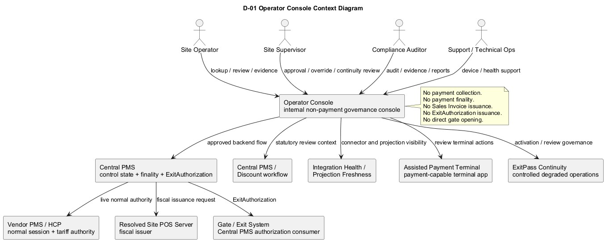
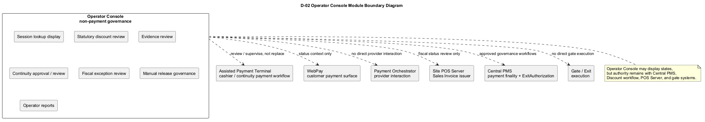
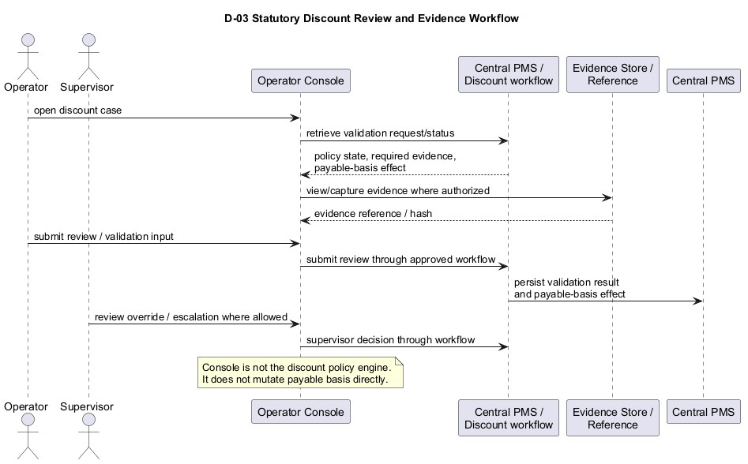
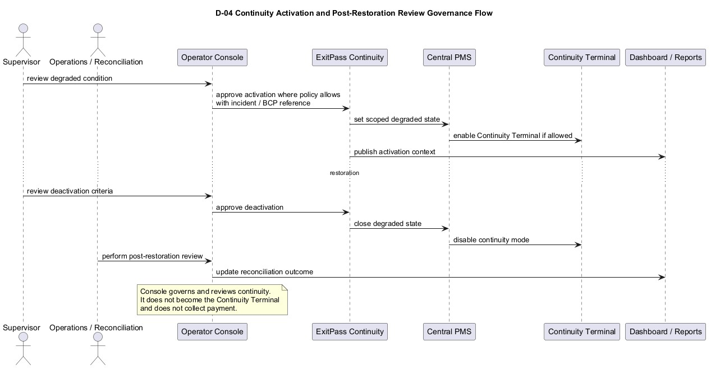
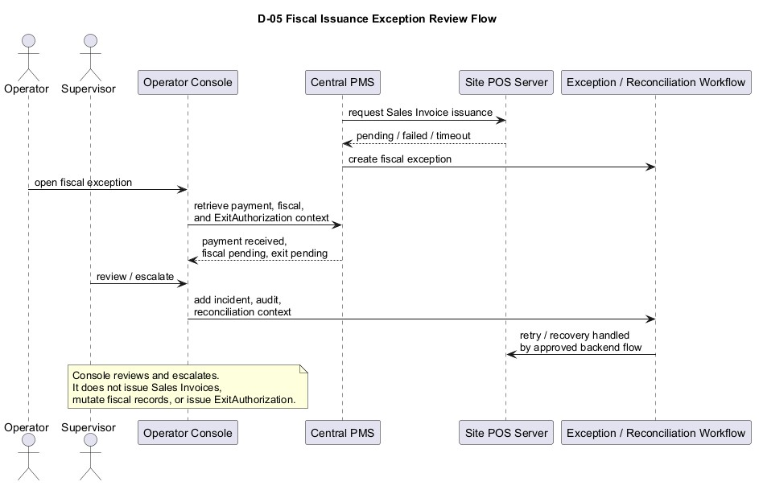
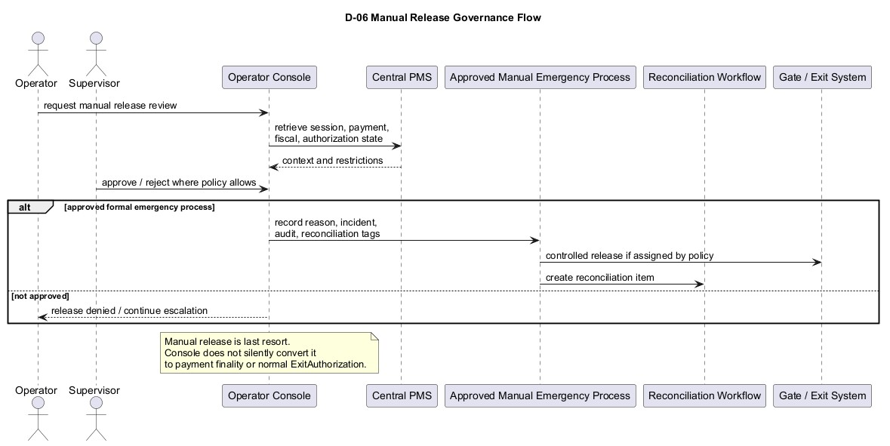

# ExitPass Operator Console BRD v1.1

Version: v1.1, v1.3-aligned update  
Status: Draft for review  
Generated: 2026-07-01  
Document type: Companion Business Requirements Document update  
Product scope: ExitPass Operator Console

## 1. Document Control

### 1.1 Version History

| Version | Date | Author / owner | Summary |
| --- | --- | --- | --- |
| v1.0 | Baseline | ExitPass documentation baseline | Defined Operator Console as an internal web application for parking site personnel and a controlled non-payment interface for session lookup, statutory discount validation, evidence capture, audit/reporting, device registration, shift validation, and site assignment. |
| v1.1 | 2026-07-01 | ExitPass documentation stream | v1.3-aligned update preserving the non-payment boundary while aligning Operator Console with ExitPass BRD v1.3, Assisted Payment Terminal BRD v1.0, and Continuity BRD v1.0. Adds module separation, statutory discount review authority split, continuity governance, connector/projection visibility, fiscal exception review, and manual release governance. |

### 1.2 Approvals

| Role | Name | Approval status | Date |
| --- | --- | --- | --- |
| Product owner | TBD | Pending review | TBD |
| Parking operations owner | TBD | Pending review | TBD |
| Compliance / audit owner | TBD | Pending review | TBD |
| Technical architecture owner | TBD | Pending review | TBD |
| Finance / revenue assurance owner | TBD | Pending review | TBD |

### 1.3 Document Ownership

This BRD is owned by the ExitPass product and documentation stream. It updates the Operator Console companion BRD for v1.3 alignment.

This document is not an Operator Console System Design, API Contract, Database Design, POS Server design, Continuity System Design, POS/Invoicing BRD, Management Dashboard and Reporting BRD, or implementation specification.

### 1.4 Relationship to ExitPass BRD v1.3

ExitPass BRD v1.3 is the core authority and business baseline. This Operator Console BRD update expands only Operator Console requirements and shall preserve the v1.3 authority model.

### 1.5 Relationship to Operator Console BRD v1.0

This v1.1 update preserves the v1.0 product position: Operator Console is an internal web application for parking site personnel and a controlled non-payment interface.

The v1.0 boundary remains in force: Operator Console does not accept, process, collect, confirm, reverse, refund, or facilitate payments.

### 1.6 Relationship to Assisted Payment Terminal BRD

Assisted Payment Terminal is a separate terminal app family for cashier/continuity payment workflows. Operator Console may review or supervise Assisted Payment Terminal actions where role and policy allow, but it does not become the terminal.

### 1.7 Relationship to Continuity BRD

Continuity BRD defines controlled degraded operations. Operator Console may support continuity activation approval, deactivation review, incident tagging, evidence review, audit review, reporting, and post-restoration review. It does not become the Continuity Terminal.

## 2. Executive Summary

Operator Console is a formal ExitPass platform module. It is an internal web app / PWA-oriented operations and governance console for operators, supervisors, auditors, administrators, and support users.

The Console remains non-payment. It may display payment status, fiscal issuance status, ExitAuthorization status, continuity state, connector health, and projection freshness for authorized operational context. It shall not collect payment, declare payment finality, issue Sales Invoices, issue ExitAuthorization, open gates directly, or bypass Central PMS, Discount workflow, POS Server, or continuity controls.

## 3. Business Context

ExitPass v1.3 separates customer payment surfaces, cashier/continuity terminal workflows, fiscal issuance, Central PMS authority, and governance tools. Operator Console provides the governance and operational review surface for site personnel while preserving strict non-payment boundaries.

The v1.1 update aligns Operator Console with:

- Assisted Payment Terminal as the separate payment-capable terminal app family.
- ExitPass Continuity as the controlled degraded-operation capability.
- Site POS Server as fiscal issuer.
- Central PMS / Discount workflow as statutory discount policy authority.
- Central PMS as payment finality and ExitAuthorization authority.

## 4. Problem Statement

Without a v1.3-aligned Operator Console BRD update, the Console could be misunderstood as a payment tool, cashier terminal, fiscal issuer, gate-control app, or local discount policy engine.

The v1.1 update prevents authority leakage while adding required governance capabilities for continuity, evidence review, connector health, projection freshness, fiscal exceptions, and manual release controls.

## 5. Product Purpose

The Operator Console shall provide a controlled internal governance and operations interface for:

- Session lookup and read-only session context.
- Statutory discount validation and review workflows.
- Evidence capture and evidence review under privacy controls.
- Supervisor review and override where policy allows.
- Continuity activation review and post-restoration review.
- Connector health and projection freshness visibility.
- Fiscal issuance exception review.
- Manual release governance.
- Device registration, trust, and Site assignment.
- Shift-based authorization.
- Audit, logging, and operator/supervisor reporting.

## 6. Product Boundary

Operator Console is:

- An internal web app / PWA-oriented operations and governance console.
- Non-payment.
- Operator-facing and supervisor-facing.
- A review, governance, evidence, shift/device, audit, reporting, escalation, and continuity review surface.
- Separate from Assisted Payment Terminal.
- Separate from WebPay.
- Separate from POS Server.
- Separate from Payment Orchestrator.

## 7. Explicit Non-Payment and Non-Authority Scope

Operator Console is not:

- A payment collection app.
- A cashier payment terminal.
- A POS terminal.
- A fiscal issuer.
- An ExitAuthorization issuer.
- A gate-control execution app.
- A Payment Orchestrator.
- A replacement for Assisted Payment Terminal.
- A replacement for Central PMS authority.

Operator Console must not:

- Collect payments.
- Declare payment finality.
- Manually mark payments as paid.
- Issue or consume ExitAuthorization.
- Open gates directly.
- Issue Sales Invoices.
- Mutate fiscal documents.
- Become a terminal-local discount policy engine.
- Bypass Central PMS / Discount workflow.
- Bypass POS Server.
- Bypass continuity controls.

## 8. Stakeholders and Users

| Stakeholder / user | Interest |
| --- | --- |
| Site Operator | Session lookup, statutory discount workflow support, evidence capture where allowed, and operational exception handling. |
| Site Supervisor | Review, override, continuity activation, manual release governance, and escalation decisions. |
| Compliance Auditor | Evidence review, audit trail, statutory discount traceability, and exception review. |
| Administrator | User, role, device, Site/Site Group, and configuration governance where allowed. |
| Support / Technical Operations | Connector health, projection freshness, device trust support, and incident support. |
| Finance / Revenue Assurance | Read-only payment/fiscal/exit context and reconciliation support. |

## 9. User Roles

### 9.1 Site Operator

The Site Operator shall perform allowed session lookup, evidence capture, statutory discount workflow actions, and exception routing within assigned Site/Site Group and active shift context.

### 9.2 Site Supervisor

The Site Supervisor shall review operator actions, approve or reject overrides where policy allows, review continuity activation and manual release requests, and support post-incident review.

### 9.3 Compliance Auditor

The Compliance Auditor shall review audit trails, evidence access, statutory discount decisions, manual release records, and continuity-origin activity according to assigned permissions.

### 9.4 Administrator

The Administrator shall manage approved user, role, device, Site/Site Group, and policy configuration functions where in scope.

### 9.5 Support / Technical Operations

Support / Technical Operations may review device trust, connector health, projection freshness, and operational incident context without payment authority.

## 10. Platform Capabilities

The Operator Console shall support:

- Operator authentication and RBAC.
- Device trust / registered device access.
- Assigned Site / Site Group context.
- Active shift validation.
- Ticket/card/plate lookup where allowed.
- Read-only session details.
- Read-only payment, fiscal issuance, and ExitAuthorization status.
- Statutory discount validation/review.
- Evidence capture/review.
- Supervisor review and override.
- Continuity activation approval and post-restoration review.
- Connector health and projection freshness visibility.
- Fiscal issuance exception review.
- Manual release approval/governance.
- Audit logging.
- Operator/supervisor scoped reporting and export.

## 11. Relationship to Assisted Payment Terminal

Operator Console and Assisted Payment Terminal are separate modules/apps.

Assisted Payment Terminal handles cashier/continuity payment workflows. Operator Console handles governance, review, supervision, evidence review, escalation, audit, reporting, and operations control.

Operator Console may review or supervise Assisted Payment Terminal actions. It shall not become the terminal, collect payments, or execute terminal-local workflows.

## 12. Relationship to Continuity

Operator Console may support:

- Continuity activation approval where policy requires.
- Continuity deactivation review.
- Affected Site/Site Group visibility.
- Affected dependency visibility.
- Incident/BCP reference entry or review.
- Allowed/restricted workflow display.
- Continuity Terminal activation review.
- Manual release governance.
- Post-restoration review support.

Operator Console shall not become the Continuity Terminal, collect payment during continuity, declare payment finality during continuity, or issue ExitAuthorization during continuity.

## 13. Relationship to POS/Invoicing and Site POS Server

Operator Console may display and support review/escalation of fiscal issuance exceptions, including Sales Invoice issuance pending, timeout, failed, fiscal reference missing, payment received but fiscal issuance pending, and payment received but exit authorization not yet available.

Operator Console shall not issue Sales Invoices, mutate fiscal records, or override POS Server fiscal authority.

## 14. Relationship to Central PMS, Vendor PMS, Payment Orchestrator, and Gate/Exit

| Function | Owner |
| --- | --- |
| Operator governance UI | Operator Console |
| Session lookup display / operator context | Operator Console using Central PMS-approved backend flow |
| Statutory discount review / supervisor review | Operator Console with Central PMS / Discount workflow |
| Cashier-facing payment workflow | Assisted Payment Terminal |
| Continuity Terminal UI | Assisted Payment Terminal in Continuity Terminal mode |
| Parking session authority in normal mode | Vendor PMS / HCP |
| Session projection and control state | Central PMS |
| Connector health / projection freshness source | Central PMS / integration health workflow |
| Discount policy resolution | Central PMS / Discount workflow |
| Statutory validation record | Central PMS / Discount workflow |
| Payable-basis recalculation / TariffSnapshot | Central PMS with Vendor PMS or approved degraded-mode tariff basis |
| Payment provider interaction | Payment Orchestrator or approved payment channel integration |
| Payment finality | Central PMS |
| Fiscal treatment and Sales Invoice issuance | Resolved Site POS Server |
| Fiscal issuance reference recording | Central PMS |
| ExitAuthorization | Central PMS |
| Gate/exit execution | Gate/exit system consuming Central PMS authorization |
| Continuity activation approval / supervisor review | Operator Console / approved operations workflow |
| Reconciliation and post-restoration review | Operations / Reconciliation workflow |

PlantUML source: [D-01_Operator_Console_Context_Diagram.puml](diagrams/D-01_Operator_Console_Context_Diagram.puml)

PlantUML source: [D-02_Operator_Console_Module_Boundary_Diagram.puml](diagrams/D-02_Operator_Console_Module_Boundary_Diagram.puml)

## 15. High-Level Business Process Overview

### 15.1 Session Lookup and Review

The operator authenticates, works from a registered/trusted device where required, has an active shift, and operates only within assigned Site/Site Group context. The Console retrieves session context through Central PMS-approved backend flow and displays allowed details.

### 15.2 Statutory Discount Review

The operator or supervisor opens a statutory discount case, reviews allowed structured details and evidence references, submits review through Central PMS / Discount workflow, and receives validation status and payable-basis effect from the backend workflow.

### 15.3 Continuity Governance

The supervisor reviews degraded conditions, approves continuity activation where policy allows, reviews affected Site/Site Group and dependency, records incident/BCP reference, reviews allowed workflows, and supports deactivation and post-restoration review.

### 15.4 Fiscal Exception Review

The operator or supervisor reviews fiscal issuance exception context, including payment received but fiscal issuance or exit authorization pending, and routes the case through approved exception/reconciliation workflow.

### 15.5 Manual Release Governance

The supervisor reviews manual release requests, captures required reason and tags, and records approval/rejection. Operator Console does not silently convert manual release into normal payment finality or normal ExitAuthorization.

## 16. Functional Requirements

| ID | Requirement |
| --- | --- |
| OC-FR-001 | The Operator Console shall require operator authentication. |
| OC-FR-002 | The Operator Console shall enforce RBAC. |
| OC-FR-003 | The Operator Console shall support registered device access and device trust controls where required. |
| OC-FR-004 | The Operator Console shall support browser key binding, mTLS, or approved device trust controls at the business level where required. |
| OC-FR-005 | The Operator Console shall enforce assigned Site/Site Group context. |
| OC-FR-006 | The Operator Console shall enforce active shift validation where required. |
| OC-FR-007 | The Operator Console shall support ticket/card/plate lookup where allowed. |
| OC-FR-008 | The Operator Console shall display read-only session details. |
| OC-FR-009 | The Operator Console shall display payment status as read-only context. |
| OC-FR-010 | The Operator Console shall display fiscal issuance status as read-only context. |
| OC-FR-011 | The Operator Console shall display ExitAuthorization status as read-only context. |
| OC-FR-012 | The Operator Console shall support statutory discount validation and review workflows according to role and policy. |
| OC-FR-013 | The Operator Console shall support evidence capture/review where role and policy allow. |
| OC-FR-014 | The Operator Console shall display privacy notices where required. |
| OC-FR-015 | The Operator Console shall support supervisor review and override where policy allows. |
| OC-FR-016 | The Operator Console shall support continuity activation approval where policy requires. |
| OC-FR-017 | The Operator Console shall support continuity deactivation review. |
| OC-FR-018 | The Operator Console shall support incident/BCP reference entry or review. |
| OC-FR-019 | The Operator Console shall support Continuity Terminal activation review. |
| OC-FR-020 | The Operator Console shall display connector health visibility. |
| OC-FR-021 | The Operator Console shall display projection freshness visibility. |
| OC-FR-022 | The Operator Console shall display stale projection alerts. |
| OC-FR-023 | The Operator Console shall support fiscal issuance exception review. |
| OC-FR-024 | The Operator Console shall support manual release approval/governance where policy allows. |
| OC-FR-025 | The Operator Console shall support post-restoration review. |
| OC-FR-026 | The Operator Console shall audit log operator, supervisor, evidence, continuity, fiscal exception, and manual release actions. |
| OC-FR-027 | The Operator Console shall support reporting/export at operator/supervisor scope. |
| OC-FR-028 | The Operator Console shall support exception handling workflows. |
| OC-FR-029 | The Operator Console shall not collect payments. |
| OC-FR-030 | The Operator Console shall not declare payment finality. |
| OC-FR-031 | The Operator Console shall not issue Sales Invoices. |
| OC-FR-032 | The Operator Console shall not issue ExitAuthorization. |
| OC-FR-033 | The Operator Console shall not directly open gates. It may support governance, approval, reason capture, incident tagging, audit tagging, reconciliation tagging, and review of a separately approved manual emergency release process. Gate or physical release execution remains outside the Operator Console unless a future approved System Design explicitly changes this boundary. |

## 17. Session Lookup and Read-Only Session Context

The Operator Console shall support lookup by ticket, card, plate, or other approved identifier where allowed by Site policy and user role.

The Console shall display read-only session context, including Site/Site Group, session status, projection freshness indicators where relevant, payment status, fiscal status, ExitAuthorization status, and exception markers where authorized.

The Console shall not use lookup to initiate payment or exit authority.

## 18. Statutory Discount Validation and Review

Operator Console shall support statutory discount validation and review workflows according to role and policy.

Operator Console may support:

- Operator-initiated statutory discount validation where policy allows.
- Supervisor review of pending, rejected, failed, or exception statutory discount requests.
- Review of statutory discount requests captured by Assisted Payment Terminal.
- Evidence review where role and privacy policy allow.
- Override or escalation where policy allows.
- Audit and reporting of statutory discount activity.

Operator Console must not:

- Own statutory discount policy resolution independently.
- Bypass Central PMS / Discount workflow.
- Mutate payable basis directly.
- Approve discounts without backend validation persistence.
- Weaken evidence, privacy, RBAC, or audit rules.

Central PMS / Discount workflow owns policy resolution, validation persistence, payable-basis effect, validation status, and statutory discount traceability.

PlantUML source: [D-03_Statutory_Discount_Review_and_Evidence_Workflow.puml](diagrams/D-03_Statutory_Discount_Review_and_Evidence_Workflow.puml)

## 19. Evidence Handling and Data Privacy

The Operator Console shall preserve and strengthen v1.0 evidence controls:

- Structured ID details by default.
- Cropped ID image only where required.
- Privacy notice.
- No unmanaged local device storage.
- Evidence hash/reference.
- Retention policy.
- Access restrictions.
- Audit of evidence access.

Operator Console may review evidence captured from Assisted Payment Terminal where role and policy allow. Continuity-mode evidence access must be incident-tagged and audit-tagged. Evidence review must remain privacy-controlled.

## 20. Supervisor Review and Override

The Operator Console shall support supervisor review and override where policy allows. Overrides shall be reason-coded, attributable, audit-tagged, and limited by role, Site/Site Group, shift, and policy scope.

Supervisor review shall not grant payment finality, fiscal issuance authority, or ExitAuthorization authority.

## 21. Continuity Activation and Post-Restoration Review

Operator Console may support continuity activation approval, continuity deactivation review, incident tagging, BCP reference entry, manual release governance, fiscal exception review, and post-restoration review.

Operator Console shall not become the Continuity Terminal, collect payment during continuity, declare payment finality during continuity, or issue ExitAuthorization during continuity.

PlantUML source: [D-04_Continuity_Activation_and_Post_Restoration_Review_Governance_Flow.puml](diagrams/D-04_Continuity_Activation_and_Post_Restoration_Review_Governance_Flow.puml)

## 22. Connector Health and Projection Freshness Visibility

Operator Console may display connector health and projection freshness information for operational awareness.

Visibility may include:

- Connector health.
- Last successful poll.
- Projection freshness.
- Stale projection alerts.
- Vendor PMS / HCP availability status.
- Degraded-watch and degraded-active state.
- Affected Site / Site Group.
- Session projection freshness.
- Restriction warnings when projection is stale, ambiguous, or insufficient.

Projection information is not financial truth. Stale, ambiguous, or insufficient projection shall be displayed clearly and shall not be treated as approval for payment, tariff, discount, or exit.

## 23. Fiscal Issuance Exception Review

Operator Console may display and support review/escalation of fiscal issuance exceptions.

Examples include:

- Sales Invoice issuance pending.
- Fiscal issuance timeout.
- Fiscal issuance failed.
- Fiscal reference missing.
- Payment received but fiscal issuance pending.
- Payment received but exit authorization not yet available.

Operator Console shall not issue Sales Invoices, mutate fiscal documents, or bypass POS Server fiscal authority.

PlantUML source: [D-05_Fiscal_Issuance_Exception_Review_Flow.puml](diagrams/D-05_Fiscal_Issuance_Exception_Review_Flow.puml)

## 24. Manual Release Governance

Operator Console may support manual release approval/governance where policy allows.

Manual release must be:

- Supervisor-approved where required.
- Incident-tagged.
- Audit-tagged.
- Reconciliation-tagged.
- Reason-coded.
- Attributable to operator/supervisor/device/site/session context.
- Subject to post-incident or post-restoration review.

Operator Console must not silently convert manual release into normal payment finality or normal ExitAuthorization. It must not directly open the barrier unless a separately approved manual emergency process assigns that responsibility, and even then it must remain incident-tagged and reconciliation-tagged.

PlantUML source: [D-06_Manual_Release_Governance_Flow.puml](diagrams/D-06_Manual_Release_Governance_Flow.puml)

## 25. Device Registration, Trust, and Site Assignment

The Operator Console shall support device registration, trust controls, and Site/Site Group assignment at the business level.

Operator Console shall be implemented as an internal web application or PWA-oriented operations console. It may use browser key binding, mTLS, or approved device trust controls where required.

Final implementation details are deferred to Operator Console System Design or later technical documents.

## 26. Shift-Based Authorization

The Operator Console shall support active shift validation where required. Operator actions shall be attributable to user identity, device context, Site/Site Group context, and active shift/session context.

Shift-based authorization shall limit operational actions to approved scope and time.

## 27. Audit, Logging, and Reporting

Operator Console audit shall include:

- Authentication and session events.
- Device trust and access events.
- Site/Site Group context.
- Session lookup.
- Statutory discount validation/review.
- Evidence capture and access.
- Supervisor override.
- Continuity activation/deactivation review.
- Manual release governance.
- Fiscal issuance exception review.
- Connector health/projection freshness review where relevant.
- Reporting/export actions.

Operator Console reporting should cover operator activity, statutory discount validation/review, evidence access, supervisor overrides, device and shift events, continuity approvals, manual release review, fiscal exception review, and connector/projection health visibility at operational level.

Broader executive, financial, revenue, occupancy, and portfolio analytics belong in Management Dashboard and Reporting BRD.

## 28. Security and RBAC

The Operator Console shall enforce role-based access by user role, Site/Site Group, shift, device trust, and action type.

High-risk actions such as evidence access, supervisor override, continuity activation review, manual release governance, and fiscal exception escalation shall require elevated permissions and audit logging.

## 29. Exception Handling

| Scenario | Required behavior |
| --- | --- |
| Authentication failure | Deny access and log where policy requires. |
| Untrusted device | Deny or restrict access according to policy. |
| No active shift | Deny shift-scoped actions. |
| Unauthorized Site/Site Group | Deny lookup or action outside scope. |
| Evidence access denied | Do not reveal protected evidence. |
| Projection stale | Display warning and avoid treating projection as approval. |
| Fiscal exception pending | Display status and route to approved review/escalation. |
| Manual release requested | Require policy-controlled supervisor review and tags. |

## 30. Non-Functional Requirements

| Area | Requirement |
| --- | --- |
| Availability | Operator Console should be available to authorized internal users during operating hours, subject to platform dependencies. |
| Usability | Operator and supervisor workflows shall be clear under operational pressure. |
| Security | RBAC, device trust, and audit controls shall protect privileged functions. |
| Privacy | Evidence and personal data access shall be minimized and logged. |
| Auditability | Operator Console actions shall be reconstructable. |
| Observability | Connector health, projection freshness, and exception states shall be visible where authorized. |
| Separation of authority | Console displays status and supports governance without taking payment, fiscal, or exit authority. |

## 31. Assumptions

| ID | Assumption |
| --- | --- |
| OC-A-001 | Central PMS-approved backend flow is available for session context and authority state. |
| OC-A-002 | Central PMS / Discount workflow remains authority for statutory validation state. |
| OC-A-003 | Assisted Payment Terminal exists as the payment-capable terminal app family. |
| OC-A-004 | Continuity BRD defines degraded operation governance. |
| OC-A-005 | POS Server owns Sales Invoice issuance and fiscal document lifecycle. |

## 32. Constraints

| ID | Constraint |
| --- | --- |
| OC-C-001 | Operator Console shall remain non-payment. |
| OC-C-002 | Operator Console shall remain separate from Assisted Payment Terminal. |
| OC-C-003 | Operator Console shall not declare payment finality. |
| OC-C-004 | Operator Console shall not issue ExitAuthorization. |
| OC-C-005 | Operator Console shall not issue Sales Invoices or mutate fiscal documents. |
| OC-C-006 | Operator Console shall not treat projection as financial truth. |
| OC-C-007 | Implementation details are deferred to later technical documents. |

## 33. Risks and Mitigations

| Risk | Impact | Mitigation |
| --- | --- | --- |
| Console used for payment collection | Authority leakage and audit risk. | Preserve explicit non-payment scope and separate APT boundary. |
| Console treated as discount policy engine | Incorrect statutory discount decisions. | Route decisions through Central PMS / Discount workflow. |
| Evidence overexposure | Privacy and compliance risk. | Use access controls, evidence references, privacy notices, and audit of evidence access. |
| Projection misuse | Incorrect tariff/payment/exit decisions. | Display projection as operational visibility only with stale warnings. |
| Fiscal exception bypass | Exit before fiscal issuance control. | Review/escalate only; POS Server and Central PMS retain authority. |
| Manual release overuse | Revenue and audit exposure. | Require supervisor approval, incident/audit/reconciliation tags, and post-review. |

## 34. Open Questions

These questions do not reopen approved decisions.

| ID | Open question |
| --- | --- |
| OC-OQ-001 | What is the exact v1.1 delivery scope versus later Operator Console phases? |
| OC-OQ-002 | What is the exact permission matrix across operator, supervisor, auditor, administrator, and support roles? |
| OC-OQ-003 | What is the exact continuity activation authority? |
| OC-OQ-004 | What is the exact manual release approval policy? |
| OC-OQ-005 | What is the exact fiscal exception review workflow? |
| OC-OQ-006 | What are exact connector health/projection freshness thresholds and alerting rules? |
| OC-OQ-007 | What are exact evidence retention periods by jurisdiction/policy? |
| OC-OQ-008 | What third-party government or cooperative database integration is needed for automated ID verification? |
| OC-OQ-009 | What is the exact maximum duration for pending statutory discount requests? |
| OC-OQ-010 | What is the exact relationship between Operator Console reporting and Management Dashboard/Reporting BRD? |
| OC-OQ-011 | What is the exact device trust mechanism: mTLS, browser key binding, or both? |
| OC-OQ-012 | What exact endpoint paths and DTOs are needed? Deferred to API Contract. |
| OC-OQ-013 | What exact database changes are needed? Deferred to Database Delta. |
| OC-OQ-014 | What exact implementation details are needed? Deferred to Operator Console System Design if created later. |

## 35. Acceptance Criteria

| ID | Acceptance criterion |
| --- | --- |
| OC-AC-001 | Operator Console remains an internal web app / PWA-oriented operations console. |
| OC-AC-002 | Operator Console does not collect payments. |
| OC-AC-003 | Operator Console does not declare payment finality. |
| OC-AC-004 | Operator Console does not issue Sales Invoices. |
| OC-AC-005 | Operator Console does not issue ExitAuthorization. |
| OC-AC-006 | Operator Console is separate from Assisted Payment Terminal. |
| OC-AC-007 | Operator Console can display payment, fiscal, and exit status only as authorized context. |
| OC-AC-008 | Statutory discount decisions persist through Central PMS / Discount workflow. |
| OC-AC-009 | Evidence access is role-restricted and audited. |
| OC-AC-010 | Continuity activation approval and deactivation review are supported where policy allows. |
| OC-AC-011 | Connector health and projection freshness are visible where authorized. |
| OC-AC-012 | Stale or ambiguous projection is not treated as approval for payment, tariff, discount, or exit. |
| OC-AC-013 | Fiscal issuance exceptions can be reviewed/escalated without issuing or mutating fiscal records. |
| OC-AC-014 | Manual release governance captures supervisor approval where required, incident tag, audit tag, reconciliation tag, reason, and context. |
| OC-AC-015 | Broader executive and financial analytics remain outside this BRD and belong to Management Dashboard and Reporting BRD. |

## 36. Requirements Traceability Matrix

| Requirement area | Source / authority | BRD sections |
| --- | --- | --- |
| Non-payment boundary | Operator Console BRD v1.0; ExitPass BRD v1.3 | Sections 1, 7, 16, 35 |
| Module separation | ExitPass BRD v1.3; Assisted Payment Terminal BRD | Sections 11, 14, 35 |
| Statutory discount review | Operator Console BRD v1.0; ExitPass BRD v1.3 | Sections 18, 19, 35 |
| Evidence privacy | Operator Console BRD v1.0; POS/BIR context | Sections 19, 27, 28 |
| Continuity governance | Continuity BRD v1.0 | Sections 12, 21, 24 |
| Projection visibility | ExitPass BRD v1.3; impact map | Section 22 |
| Fiscal exception review | POS/Invoicing/POS Server references | Section 23 |
| Manual release governance | ExitPass BRD v1.3; Continuity BRD v1.0 | Section 24 |
| Reporting boundary | ExitPass BRD v1.3; documentation outline | Section 27 |

## 37. Appendix A: Glossary

| Term | Definition |
| --- | --- |
| Operator Console | Internal non-payment governance and operations console for ExitPass site personnel. |
| Assisted Payment Terminal | Separate payment-capable terminal app family for cashier-assisted and continuity payment workflows. |
| Central PMS | ExitPass authority for payment-linked control state, payment finality, fiscal reference recording, and ExitAuthorization. |
| Discount workflow | Central PMS-backed workflow for statutory discount policy resolution and validation persistence. |
| Evidence reference | Controlled reference or hash for evidence captured or reviewed under privacy policy. |
| Fiscal exception | Case where fiscal issuance is pending, failed, timed out, or missing required reference. |
| Projection freshness | Operational indicator of how current projected session data is. |

## 38. Appendix B: Acronyms

| Acronym | Meaning |
| --- | --- |
| APT | Assisted Payment Terminal |
| BCP | Business Continuity Plan |
| BIR | Bureau of Internal Revenue |
| BRD | Business Requirements Document |
| DTO | Data Transfer Object |
| HCP | HikCentral Professional |
| mTLS | Mutual Transport Layer Security |
| PMS | Parking Management System |
| POS | Point of Sale |
| PWA | Progressive Web App |
| RBAC | Role-Based Access Control |

## 39. Appendix C: Diagrams

| ID | Diagram | PlantUML source |
| --- | --- | --- |
| D-01 | [Operator Console Context Diagram](diagrams/D-01_Operator_Console_Context_Diagram.jpg) | [D-01_Operator_Console_Context_Diagram.puml](diagrams/D-01_Operator_Console_Context_Diagram.puml) |
| D-02 | [Operator Console Module Boundary Diagram](diagrams/D-02_Operator_Console_Module_Boundary_Diagram.jpg) | [D-02_Operator_Console_Module_Boundary_Diagram.puml](diagrams/D-02_Operator_Console_Module_Boundary_Diagram.puml) |
| D-03 | [Statutory Discount Review and Evidence Workflow](diagrams/D-03_Statutory_Discount_Review_and_Evidence_Workflow.jpg) | [D-03_Statutory_Discount_Review_and_Evidence_Workflow.puml](diagrams/D-03_Statutory_Discount_Review_and_Evidence_Workflow.puml) |
| D-04 | [Continuity Activation and Post-Restoration Review Governance Flow](diagrams/D-04_Continuity_Activation_and_Post_Restoration_Review_Governance_Flow.jpg) | [D-04_Continuity_Activation_and_Post_Restoration_Review_Governance_Flow.puml](diagrams/D-04_Continuity_Activation_and_Post_Restoration_Review_Governance_Flow.puml) |
| D-05 | [Fiscal Issuance Exception Review Flow](diagrams/D-05_Fiscal_Issuance_Exception_Review_Flow.jpg) | [D-05_Fiscal_Issuance_Exception_Review_Flow.puml](diagrams/D-05_Fiscal_Issuance_Exception_Review_Flow.puml) |
| D-06 | [Manual Release Governance Flow](diagrams/D-06_Manual_Release_Governance_Flow.jpg) | [D-06_Manual_Release_Governance_Flow.puml](diagrams/D-06_Manual_Release_Governance_Flow.puml) |
