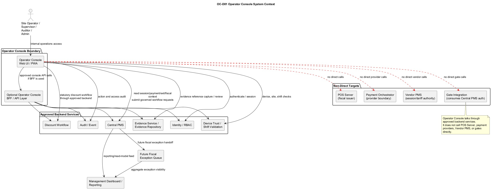
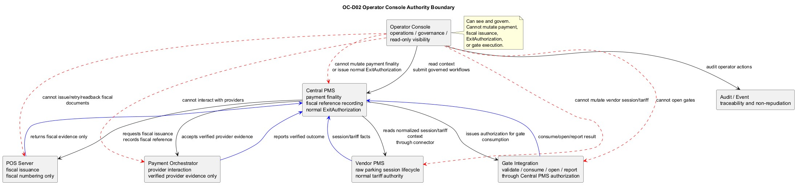
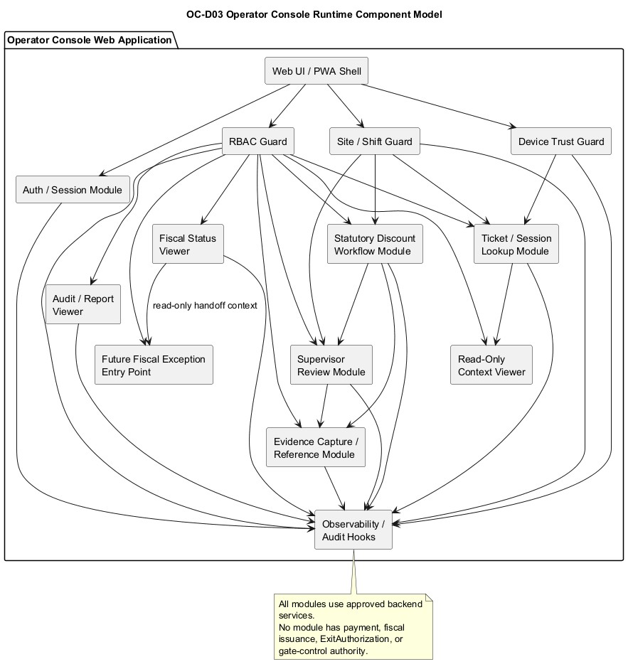
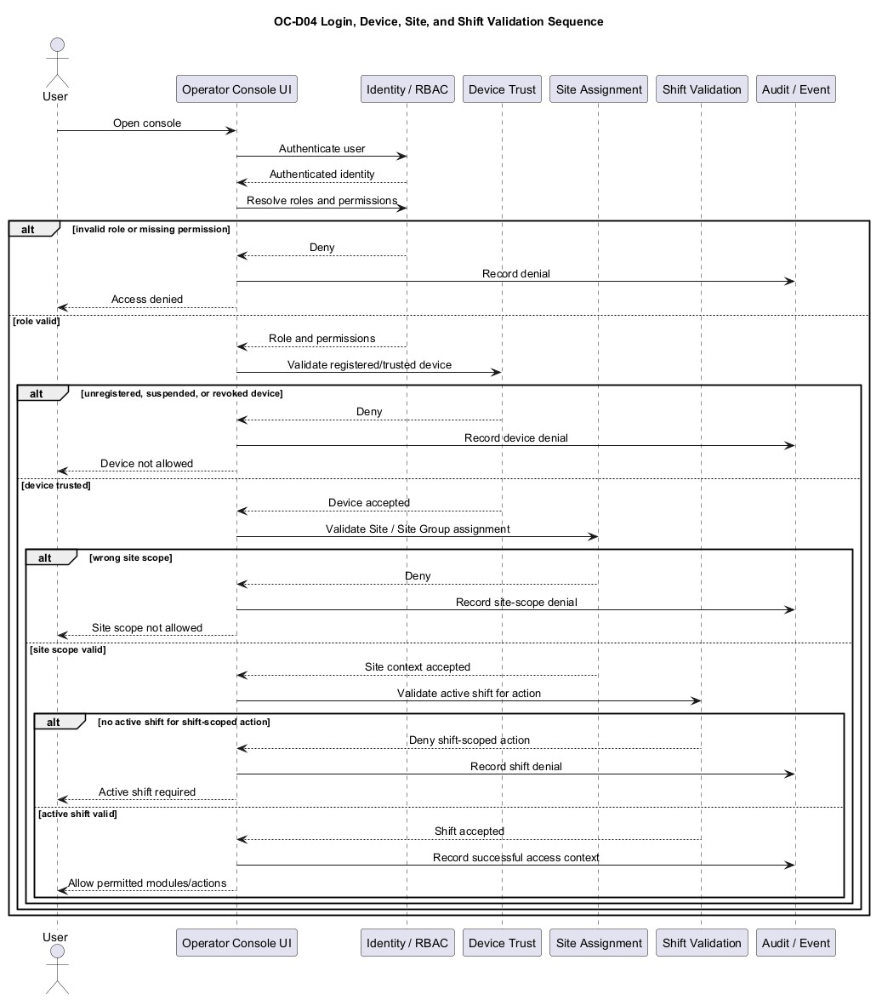
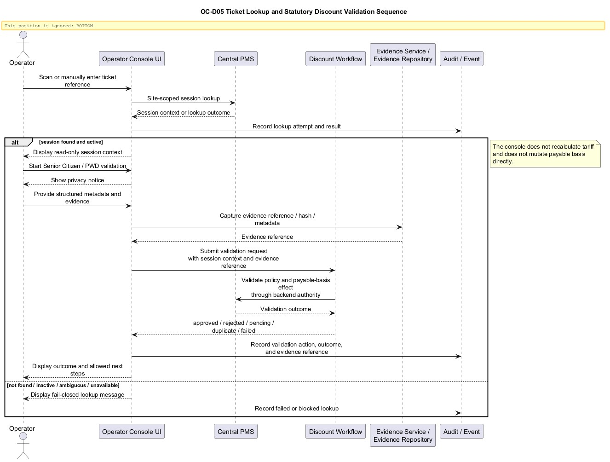
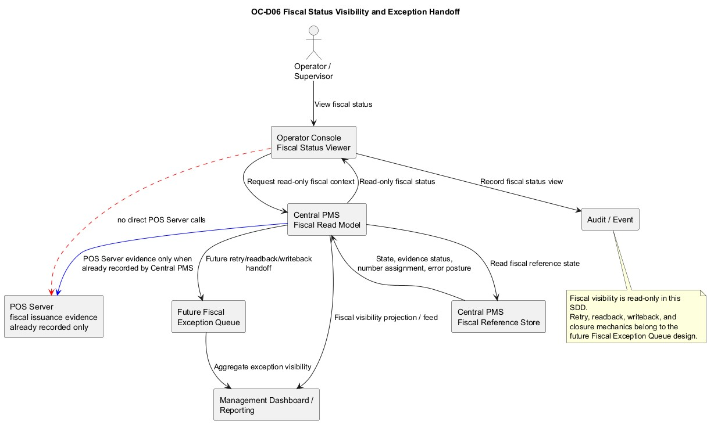
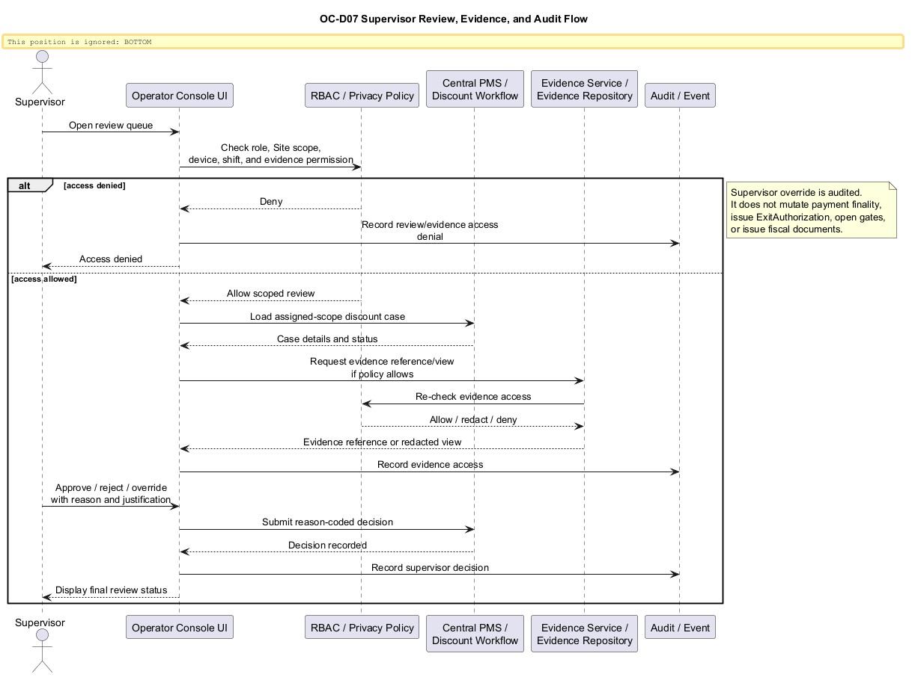

# ExitPass Operator Console System Design SDD v1.0

## 1. Document Control

| Field | Value |
| --- | --- |
| Document | ExitPass Operator Console System Design SDD |
| Version | v1.0 |
| Date | 2026-07-03 |
| Status | Draft for review |
| Branch | `docs/v1.3-operator-console-system-design` |
| Scope | ExitPass v1.3 Operator Console operations and governance surface |
| Owner | ExitPass v1.3 documentation stream |

This SDD is a docs-only system design. It does not implement source code, database schema, endpoint contracts, migrations, runtime configuration, or POS Server behavior.

## 2. Purpose

The Operator Console is an internal operations and governance surface for parking site personnel, supervisors, auditors, compliance users, support users, and administrators. It supports controlled workflows such as ticket/session lookup, statutory discount validation, evidence capture, supervisor review, audit review, operational reporting access, and future fiscal exception visibility.

The Operator Console is not a payment authority, not a fiscal authority, not an exit authority, and not a gate control surface.

The design goal is to give v1.3 implementation teams a practical system boundary and interaction model that preserves the ExitPass authority model while enabling operational work that cannot be handled by public WebPay, Assisted Payment Terminal, POS Server, Management Dashboard, or gate systems.

## 3. Source Baseline and Inspected Files

Primary sources inspected:

| Source | Use in this SDD |
| --- | --- |
| `docs/v1.3/ExitPass_BRD_v1.3.md` | Core v1.3 authority model, Site/Site Group semantics, fiscal-before-exit posture, audit and degraded-mode principles. |
| `docs/v1.3/ExitPass_System_Design_v1.3.md` | Architecture-level boundaries, component responsibilities, trust model, observability, and runbook posture. |
| `docs/v1.3/operator-console/ExitPass_Operator_Console_BRD_v1.1.md` | Operator Console product scope, user roles, non-payment boundary, discount/evidence/fiscal exception/continuity/manual release requirements. |
| `docs/v1.3/system-design/input-packs/04_security_trust_and_rbac_input.md` | RBAC, device trust, privacy, evidence, export, and non-repudiation posture. |
| `docs/v1.3/assisted-payment-terminal/ExitPass_Assisted_Payment_Terminal_System_Design_v1.0.md` | Separation from payment-capable terminal workflows and statutory discount capture handoff. |
| `docs/v1.3/continuity/ExitPass_Continuity_System_Design_v1.0.md` | Continuity governance, manual release, fiscal exception, and post-restoration review boundaries. |
| `docs/v1.3/management-dashboard-reporting/ExitPass_Management_Dashboard_and_Reporting_BRD_v1.0.md` | Management Dashboard visibility/reporting boundary and handoff expectations. |
| `docs/v1.3/central-pms/engineering-pack/08-operator-console-queues-plan.md` | Future fiscal exception queue planning and field candidates. |
| `docs/v1.3/central-pms/engineering-pack/09-dashboard-visibility-plan.md` | Read-only fiscal visibility and dashboard handoff posture. |
| `docs/v1.3/central-pms/runbooks/ExitPass_Central_PMS_POS_Server_Controlled_UAT_Post_Run_Review_v1.0.md` | Controlled Central PMS to POS Server UAT lessons learned, safety posture, and deferred fiscal exception/dashboard work. |
| `docs/v1.3/diagrams/system-design/D-09_Operator_Console_Governance_Boundary.puml` | Existing governance boundary diagram posture. |
| `docs/v1.3/operator-console/diagrams/*.puml` | Existing Operator Console context, module, evidence, fiscal exception, continuity, and manual release diagram concepts. |

Database/DDL files were not needed because this SDD does not name final persistence tables or columns. Where persistence is required but not confirmed by existing design, it is marked as a future design requirement.

## 4. Scope and Non-Goals

### In Scope

- Operator Console Web UI / PWA-oriented operations surface.
- Authentication through ExitPass identity services.
- RBAC by role, Site/Site Group, device trust, active shift, and action type.
- Registered device access and device trust/status visibility.
- Site assignment validation.
- Active shift validation for operator actions.
- Ticket scan and manual ticket lookup.
- Read-only session context display.
- Read-only payment, exit authorization, and fiscal status display.
- Statutory discount validation for Senior Citizen and PWD workflows.
- Evidence capture policy, evidence references, minimization, and privacy controls.
- Supervisor review and override workflows.
- Operator action logging and audit access.
- Report access within operational scope.
- Fraud and abuse signals for statutory discount workflows.
- Read-only fiscal status visibility.
- Future fiscal exception queue handoff.
- Management Dashboard and Reporting handoff.

### Explicit Non-Goals

- No payment collection.
- No manual payment confirmation.
- No refund, reversal, void, or provider interaction.
- No direct payment provider interaction.
- No gate opening.
- No normal ExitAuthorization issuance.
- No POS Server fiscal issuance command execution from the console.
- No fiscal retry/readback/writeback mechanics in this SDD.
- No continuity activation workflow detail beyond governance references and handoff.
- No new database schema design unless explicitly marked as future requirement.
- No source code changes.
- No runtime configuration changes.
- No reopening of the controlled Central PMS to POS Server UAT workstream.

## 5. System Context

The Operator Console sits inside the internal ExitPass trust boundary and uses Central PMS-backed services as its primary system of interaction. It is a human operations and governance surface, not a source-of-truth service for payment, fiscal, tariff, exit, vendor session, or gate execution.

See [OC-D01 Operator Console System Context](diagrams/OC-D01_Operator_Console_System_Context.puml).

Context posture:

- Central PMS remains the control authority for payment-linked platform state, payment finality, fiscal reference recording, and normal ExitAuthorization.
- Vendor PMS remains the raw parking-session lifecycle and normal tariff authority.
- Site Integration Adapter and Vendor PMS connector instances normalize vendor-specific session, tariff, and projection behavior.
- Payment Orchestrator performs payment provider interaction and reports verified provider evidence; it does not declare platform finality.
- POS Server owns fiscal issuance and fiscal numbering only.
- Gate Integration validates, consumes, opens, and reports through Central PMS authorization.
- Audit/Event capability records operator and system activity.
- Management Dashboard consumes reporting and visibility signals but does not execute operator workflows.

## 5A. Diagrams

| ID | Diagram | Purpose |
| --- | --- | --- |
| OC-D01 | [Operator Console System Context](diagrams/OC-D01_Operator_Console_System_Context.puml) | Shows the Operator Console, approved backend services, and non-direct POS Server/payment/vendor/gate targets. |
| OC-D02 | [Operator Console Authority Boundary](diagrams/OC-D02_Operator_Console_Authority_Boundary.puml) | Shows authority ownership and reinforces that the console can see and govern but cannot mutate payment, fiscal, exit, or gate execution. |
| OC-D03 | [Operator Console Runtime Component Model](diagrams/OC-D03_Operator_Console_Runtime_Component_Model.puml) | Shows UI modules, guards, workflow modules, viewers, handoffs, and audit hooks. |
| OC-D04 | [Login, Device, Site, and Shift Validation Sequence](diagrams/OC-D04_Login_Device_Site_Shift_Validation_Sequence.puml) | Shows authentication, RBAC, device trust, Site assignment, active shift validation, and denial paths. |
| OC-D05 | [Ticket Lookup and Statutory Discount Validation Sequence](diagrams/OC-D05_Ticket_Lookup_and_Statutory_Discount_Validation_Sequence.puml) | Shows site-scoped lookup, privacy notice, evidence reference capture, backend discount workflow validation, and audit. |
| OC-D06 | [Fiscal Status Visibility and Exception Handoff](diagrams/OC-D06_Fiscal_Status_Visibility_and_Exception_Handoff.puml) | Shows read-only fiscal visibility, no direct POS Server call, future Fiscal Exception Queue handoff, and Management Dashboard feed. |
| OC-D07 | [Supervisor Review, Evidence, and Audit Flow](diagrams/OC-D07_Supervisor_Review_Evidence_Audit_Flow.puml) | Shows supervisor review, evidence privacy/RBAC checks, reason-coded decision, and audit recording. |

### OC-D01 Operator Console System Context

PlantUML source: [OC-D01_Operator_Console_System_Context.puml](diagrams/OC-D01_Operator_Console_System_Context.puml)

### OC-D02 Operator Console Authority Boundary

PlantUML source: [OC-D02_Operator_Console_Authority_Boundary.puml](diagrams/OC-D02_Operator_Console_Authority_Boundary.puml)

### OC-D03 Operator Console Runtime Component Model

PlantUML source: [OC-D03_Operator_Console_Runtime_Component_Model.puml](diagrams/OC-D03_Operator_Console_Runtime_Component_Model.puml)

### OC-D04 Login, Device, Site, and Shift Validation Sequence

PlantUML source: [OC-D04_Login_Device_Site_Shift_Validation_Sequence.puml](diagrams/OC-D04_Login_Device_Site_Shift_Validation_Sequence.puml)

### OC-D05 Ticket Lookup and Statutory Discount Validation Sequence

PlantUML source: [OC-D05_Ticket_Lookup_and_Statutory_Discount_Validation_Sequence.puml](diagrams/OC-D05_Ticket_Lookup_and_Statutory_Discount_Validation_Sequence.puml)

### OC-D06 Fiscal Status Visibility and Exception Handoff

PlantUML source: [OC-D06_Fiscal_Status_Visibility_and_Exception_Handoff.puml](diagrams/OC-D06_Fiscal_Status_Visibility_and_Exception_Handoff.puml)

### OC-D07 Supervisor Review, Evidence, and Audit Flow

PlantUML source: [OC-D07_Supervisor_Review_Evidence_Audit_Flow.puml](diagrams/OC-D07_Supervisor_Review_Evidence_Audit_Flow.puml)

## 6. Operator Console Responsibility Model

| Responsibility | Design stance |
| --- | --- |
| Session lookup | Site-scoped lookup and display through approved backend APIs. |
| Session context | Read-only operational context only. |
| Payment status | Read-only display of Central PMS payment state. |
| Exit status | Read-only display of Central PMS ExitAuthorization state and gate consumption context where authorized. |
| Fiscal status | Read-only display of Central PMS-recorded fiscal status/reference. |
| Statutory discount validation | Initiates and reviews approved backend discount workflows; does not independently approve entitlement or mutate payable basis. |
| Evidence handling | Captures or reviews required evidence through controlled references and privacy controls. |
| Supervisor review | Reviews/overrides only through approved reason-coded, audited backend workflow. |
| Audit/report access | Provides scoped operational/audit views and report access subject to RBAC. |
| Fiscal exception visibility | Shows read-only exception context and hands off retry/readback/recovery details to later Fiscal Exception Queue design. |
| Device/shift/site controls | Enforces device trust, Site assignment, and shift preconditions before operator actions. |

## 7. Authority Boundary Matrix

See [OC-D02 Operator Console Authority Boundary](diagrams/OC-D02_Operator_Console_Authority_Boundary.puml).

| Domain | Authority owner | Operator Console capability | Explicit prohibition |
| --- | --- | --- | --- |
| Payment finality | Central PMS | Display status and related context. | Cannot confirm, reverse, refund, void, or mark payment paid. |
| Provider interaction | Payment Orchestrator | Display normalized provider status only if exposed by backend. | Cannot call provider APIs or verify provider outcomes. |
| Parking session lifecycle | Vendor PMS via Central PMS/connector | Lookup and display normalized session context. | Cannot mutate raw vendor session lifecycle. |
| Tariff/payable basis | Vendor PMS and Central PMS payable-basis workflow | Display current payable basis/status and submit discount workflow request. | Cannot recalculate tariff locally or mutate payable basis directly. |
| Statutory entitlement decision | Central PMS / Discount workflow | Capture evidence, submit request, review status, supervisor override where approved. | Cannot approve entitlement independently or bypass backend policy. |
| Fiscal issuance and numbering | POS Server | Display Central PMS-recorded fiscal status and safe fiscal document reference/number. | Cannot issue SI, retry issuance, read back POS Server directly, or mutate fiscal documents. |
| Fiscal reference recording | Central PMS | Display fiscal reference state and exception indicators. | Cannot edit fiscal reference state directly. |
| ExitAuthorization | Central PMS | Display issued/expired/consumed/blocked status. | Cannot issue normal ExitAuthorization. |
| Gate behavior | Gate Integration consuming Central PMS authorization | Display gate/exit context if available. | Cannot open gates or consume authorization. |
| Manual release | Approved operations/manual emergency policy | Record/review governance request where policy allows. | Manual release is not normal ExitAuthorization and cannot be silently converted into one. |
| Continuity | Approved continuity governance and Central PMS policy | Review activation/post-restoration context where allowed. | Cannot silently activate degraded mode or become Continuity Terminal. |
| Reporting | Management Dashboard and Reporting | Provide scoped operational reports/access where in Operator Console scope. | Cannot become executive/financial dashboard authority. |

## 8. User Roles and RBAC

| Role | Intended access |
| --- | --- |
| Site Operator | Assigned-site lookup, read-only session context, statutory discount initiation/evidence capture where allowed, and exception routing within active shift. |
| Site Supervisor | Operator activity review, discount review/override, manual release governance review where policy allows, exception escalation, and assigned-site audit access. |
| Compliance Auditor | Evidence access review, statutory discount decisions, manual release records, fiscal exception history, and audit trail review subject to privacy controls. |
| Administrator | User, role, device, Site/Site Group, policy, and configuration governance where explicitly in scope. |
| Support / Technical Operations | Device trust status, connector/projection health, fiscal status posture, incident context, and technical diagnostics without payment/fiscal/exit authority. |
| Finance / Revenue Assurance | Read-only payment/fiscal/reconciliation context and report access where authorized. |

RBAC dimensions:

- User role and permission.
- Site/Site Group assignment.
- Device trust status.
- Active shift status for operator actions.
- Action type and risk level.
- Evidence sensitivity and retention class.
- Report/export scope.

High-risk actions requiring elevated permissions and audit:

- Evidence access or export.
- Supervisor override.
- Statutory discount rejection/approval review.
- Manual release governance action.
- Fiscal exception acknowledgment/escalation.
- Cross-site report access.
- Device trust change.

## 9. Device Trust, Site Assignment, and Shift Validation

Operator Console access is evaluated in layers:

1. User authenticates through ExitPass identity services.
2. RBAC permissions are evaluated.
3. Device registration and trust status are checked where required by policy.
4. Site/Site Group assignment is checked.
5. Active shift is checked before shift-scoped operator actions.
6. The requested workflow action is authorized against role, Site, device, shift, and evidence sensitivity.

Access rules:

- Invalid role denies the action and logs the denial.
- Unregistered, suspended, or revoked devices deny or restrict access according to policy and log the result.
- Wrong Site/Site Group assignment denies lookup/action outside scope.
- No active shift denies operator actions that affect case creation, evidence capture, or review state.
- Device possession alone never grants payment, fiscal, exit, discount, or manual-release authority.

The exact device trust mechanism remains open: mTLS, browser key binding, managed-device attestation, or another approved control may be selected later.

## 10. Runtime Components

See [OC-D03 Operator Console Runtime Component Model](diagrams/OC-D03_Operator_Console_Runtime_Component_Model.puml).

| Component | Responsibility |
| --- | --- |
| Operator Console Web UI | Internal web/PWA surface for lookup, workflow, evidence, review, audit, and report views. |
| Operator Console BFF/API layer | Optional backend facade if adopted by implementation; enforces UI-specific authorization, request shaping, and response minimization. |
| Identity/RBAC integration | Authentication, role resolution, permissions, and session management. |
| Device trust validation | Device registration, trust status, revocation/suspension checks, and device context logging. |
| Shift/site assignment validation | Confirms assigned Site/Site Group and active shift before operational actions. |
| Session lookup client | Calls Central PMS-approved lookup APIs with Site scope and no heuristic cross-portfolio search. |
| Discount validation workflow client | Calls Central PMS / Discount workflow for statutory discount validation, supervisor review, and override. |
| Evidence capture/reference client | Captures required evidence metadata/reference through controlled backend path; prevents unmanaged local storage. |
| Supervisor review module | Queues, review details, reason codes, decision submission, and audit context. |
| Audit/report viewer module | Scoped audit and operational reports with privacy and export controls. |
| Fiscal status viewer module | Read-only fiscal state/reference/error posture display from Central PMS. |
| Future fiscal exception queue entry point | Placeholder/handoff to later Fiscal Exception Queue / Readback / Retry design. |
| Observability/audit hooks | Emits audit and operational telemetry for all sensitive actions, denials, and evidence access. |

## 11. API / Service Interaction Model

All Operator Console interactions go through approved backend services. The console does not call POS Server, payment providers, Vendor PMS, or gates directly.

| Interaction | Target | Model |
| --- | --- | --- |
| Authenticate user | Identity service | Login/session token acquisition through approved internal identity path. |
| Resolve roles/permissions | Identity/RBAC service | Role, Site/Site Group, action, and evidence-scope authorization. |
| Check device trust | Device trust service or Central PMS policy endpoint | Read/validate registered device and trust status. |
| Check shift | Shift/operations service or Central PMS policy endpoint | Validate active shift before operator actions. |
| Lookup session | Central PMS | Site-scoped lookup by scanned ticket or manual reference. |
| Display payment/exit/fiscal state | Central PMS read APIs | Read-only state projection with source/freshness labels. |
| Submit statutory discount validation | Central PMS / Discount workflow | Structured request with evidence references and operator attestation. |
| Supervisor review/override | Central PMS / Discount workflow | Reason-coded, audited review decision. |
| Evidence capture/reference | Evidence service or Central PMS evidence workflow | Store evidence reference/hash/metadata; avoid unmanaged local storage. |
| Audit view/report access | Audit/report services | Scoped read/report/export access subject to RBAC. |
| Fiscal exception visibility | Central PMS fiscal exception/read model | Read-only visibility in this SDD; action design deferred. |

Final endpoint paths, DTOs, OAuth scopes, mTLS topology, and database tables are deferred.

## 12. Data and Evidence Model

This SDD does not define final tables or columns. The conceptual model includes:

| Concept | Description |
| --- | --- |
| Operator session | Authenticated user session bound to role, device, Site/Site Group, and optional shift context. |
| Device trust context | Registered device identity, trust state, revocation/suspension status, and last validation result. |
| Site assignment context | Authorized Site/Site Group scope for lookup and action. |
| Lookup attempt | Ticket/manual lookup request, Site scope, outcome, timestamp, and operator/device attribution. |
| Session context view | Read-only projection of session, vendor status, payable basis, discount, payment, exit, fiscal, and exception states. |
| Discount validation case | Structured Senior Citizen/PWD validation request, evidence references, status, decision, reviewer, reason, and audit trail. |
| Evidence reference | Controlled evidence pointer/hash/metadata, not raw unmanaged image or uncontrolled payload. |
| Supervisor review record | Review decision, override reason, justification, actor, device, shift, Site, and timestamp. |
| Fiscal status context | Central PMS-recorded fiscal issuance status/reference, POS Server call status if recorded, fiscal document number if safe to display, and error summary. |
| Audit event | Authenticated actor/service/device action record with correlation ID and result. |

Evidence posture:

- Prefer structured metadata and evidence references/hashes over raw payload replication.
- Do not store raw ID images locally on the device.
- Do not place raw provider payloads, secrets, PAN/CVV, unmanaged customer PII, or uncontrolled images/files into console notes.
- Evidence access is separately auditable.
- Evidence retention is policy-driven.

## 13. Main Workflows

### 13.1 Login, Device, Site, and Shift Validation

See [OC-D04 Login, Device, Site, and Shift Validation Sequence](diagrams/OC-D04_Login_Device_Site_Shift_Validation_Sequence.puml).

1. User opens Operator Console.
2. User authenticates through ExitPass identity.
3. RBAC resolves role and permissions.
4. Device trust is checked if required.
5. Site/Site Group assignment is loaded.
6. Active shift is checked before operator actions.
7. Console grants only the allowed modules/actions for the resolved context.

Failure handling:

- Invalid role: deny and log.
- Unregistered or revoked device: deny/restrict and log.
- Wrong Site assignment: deny cross-site lookup/action and log.
- No active shift: allow read-only views only if policy allows; deny shift-scoped actions.

### 13.2 Ticket Scan and Session Lookup

The ticket lookup and discount validation path is shown in [OC-D05 Ticket Lookup and Statutory Discount Validation Sequence](diagrams/OC-D05_Ticket_Lookup_and_Statutory_Discount_Validation_Sequence.puml).

1. Operator scans QR/barcode or enters a ticket reference.
2. Console submits a site-scoped lookup to Central PMS.
3. Backend returns found, not found, inactive, ambiguous, expired, or unavailable result.
4. Console displays only authorized details and next allowed actions.
5. Lookup attempt and result are audited.

Rules:

- Lookup must be Site/Site Group scoped.
- No global cross-portfolio search for ordinary operators.
- No heuristic matching that could join unrelated sessions.
- Backend unavailable or ambiguous results fail closed into clear operator messaging.

### 13.3 Read-Only Session Context Display

Display only context needed for operations:

- Site and Site Group.
- Ticket reference, masked where appropriate.
- Plate reference, masked where appropriate.
- Entry time.
- Vendor session status where available.
- Current payable basis/status where available.
- Discount status.
- Payment status.
- ExitAuthorization status.
- Fiscal status/reference, if available.
- Alerts and exceptions.

The context display must label stale, projected, unavailable, or exception state clearly. It must not imply payment finality, fiscal success, or exit eligibility unless Central PMS reports those states.

### 13.4 Statutory Discount Validation

See [OC-D05 Ticket Lookup and Statutory Discount Validation Sequence](diagrams/OC-D05_Ticket_Lookup_and_Statutory_Discount_Validation_Sequence.puml).

1. Operator starts statutory discount validation only after active session lookup.
2. Operator selects Senior Citizen or PWD workflow.
3. Console shows privacy notice before evidence capture.
4. Operator captures required structured metadata and evidence references.
5. Console submits request to Central PMS / Discount workflow.
6. Backend validates policy and persists result.
7. Console displays approved, rejected, pending supervisor review, duplicate, failed, or expired status.
8. Approval/rejection and evidence access are audited.

Rules:

- Console does not directly recalculate tariff.
- Console does not mutate payable basis directly.
- Repeated/duplicate claims must be handled deterministically by backend idempotency/policy.
- Fraud signals should include repeated claims, conflicting identity metadata, excessive failed attempts, device anomalies, and operator override patterns.

### 13.5 Supervisor Review and Override

See [OC-D07 Supervisor Review, Evidence, and Audit Flow](diagrams/OC-D07_Supervisor_Review_Evidence_Audit_Flow.puml).

1. Supervisor views pending/approved/rejected cases within assigned scope.
2. Supervisor reviews structured data, safe evidence references, prior decisions, and fraud/abuse indicators.
3. Supervisor submits approve/reject/override decision through approved workflow.
4. Decision requires reason code, justification where required, and audit attribution.
5. Backend records final review state and payable-basis effect where approved.

Rules:

- Override does not mutate payment finality.
- Override does not issue ExitAuthorization.
- Override does not open gates.
- Override does not issue fiscal documents.

### 13.6 Audit and Report Access

1. User selects audit/report view permitted by role and scope.
2. Console requests scoped data from audit/report service.
3. Sensitive evidence fields are redacted unless role/policy allows access.
4. Export, if allowed, requires explicit permission and is audited.

Report access in this SDD is operational and audit-focused. Broader portfolio, executive, financial, fiscal, and BI reporting is handed off to Management Dashboard and Reporting design.

### 13.7 Fiscal Status Visibility

See [OC-D06 Fiscal Status Visibility and Exception Handoff](diagrams/OC-D06_Fiscal_Status_Visibility_and_Exception_Handoff.puml).

Operator Console may show read-only fiscal context:

- Fiscal issuance status.
- POS Server call status if recorded by Central PMS.
- Fiscal document reference/number if recorded and safe to display.
- Fiscal issuance evidence status.
- Fiscal number assignment state.
- Error summary or retry-needed indicator if available.
- ExitAuthorization blocked reason where fiscal prerequisite is pending/failed.

Rules:

- Operators cannot trigger fiscal issuance, retry, readback, writeback, or POS Server calls.
- Console does not query POS Server directly.
- Retry/readback/recovery mechanics are deferred to the later Fiscal Exception Queue / Readback / Retry design.

### 13.8 Future Fiscal Exception Queue Handoff

This SDD reserves a handoff point for future fiscal exception queue design. Candidate queue states from Central PMS planning include pending fiscal issuance, retry needed, configuration correction required, idempotency conflict, unknown outcome, incomplete numbering evidence, fiscal reference mismatch, manual release requested after fiscal failure, and reconciled/closed exceptions.

This SDD does not design the retry engine, GET readback worker, exception closure workflow, or dashboard projection store. Those are future designs.

## 14. Fiscal Exception Visibility Design

See [OC-D06 Fiscal Status Visibility and Exception Handoff](diagrams/OC-D06_Fiscal_Status_Visibility_and_Exception_Handoff.puml).

Fiscal visibility in Operator Console v1.3 is read-only and context-driven.

Display principles:

- Show Central PMS fiscal reference state as the primary platform view.
- Show POS Server fiscal document ID/number only when Central PMS has safely recorded it.
- Show error posture and retry-needed indicators without exposing raw POS Server payloads.
- Label fiscal status as `not_started`, `pending`, `recorded`, `failed`, `unknown`, `conflict`, or equivalent backend-returned status when available.
- If fiscal-gated ExitAuthorization is enabled in the future, show why exit is blocked, but do not allow the console to override the gate.

Handoff to future design:

- Retry/readback decisions.
- POS Server GET readback mechanics.
- Exception closure rules.
- Manual release under fiscal exception.
- Dashboard fiscal visibility projection.
- Fiscal exception SLA and queue assignment.

Controlled UAT learning applied:

- Fiscal evidence must distinguish source-controlled fixes from local runtime-only fixture repairs.
- Evidence packages must preserve failed attempts separately from success evidence.
- Console visibility must not become a diagnostic invocation or fiscal command surface.

## 15. Security and Privacy Model

Security controls:

- Authenticate every user.
- Authorize every action by role, Site/Site Group, device trust, shift, and action risk.
- Treat device trust as a precondition, not an authority grant.
- Require least privilege for evidence, report, supervisor, and fiscal exception views.
- Deny and audit unauthorized attempts.
- Avoid direct browser access to trusted core services beyond approved internal APIs.
- Protect service credentials and vendor/POS/payment secrets from UI exposure.

Privacy controls:

- Minimize evidence capture.
- Show privacy notice before statutory evidence capture.
- Prefer structured metadata, redaction, references, and hashes.
- Do not store raw ID images locally on the device.
- Do not expose unmanaged customer PII, raw provider payloads, raw entitlement evidence, or sensitive blobs in notes/logs.
- Audit evidence access, export, and review.
- Apply retention policy by evidence type and jurisdiction.

## 16. Audit, Traceability, and Evidence Handling

Audit events should capture:

- Authentication and denial events.
- Device trust validation and denial events.
- Site/Site Group assignment and scope denials.
- Active shift validation and denial events.
- Lookup attempts and outcomes.
- Statutory discount case creation, submission, status changes, review, and override.
- Evidence capture, access, redaction, and export.
- Fiscal status views and fiscal exception acknowledgments if implemented later.
- Manual release governance view/action where policy allows.
- Report access and export.

Traceability should support reconstruction from:

Site/Site Group, operator, device, shift, ticket/session, payable basis, discount case, evidence reference, PaymentAttempt/PaymentConfirmation status, fiscal reference, ExitAuthorization status, gate outcome if applicable, and audit event correlation.

## 17. Observability and Operational Dashboards Handoff

Operator Console observability:

- Authentication/authorization denial rates.
- Device trust failures.
- Lookup success/not-found/ambiguous/unavailable rates.
- Discount validation volume, pending review age, rejection reasons, duplicate attempts, and override rates.
- Evidence capture failures and evidence access/export counts.
- Fiscal status view counts and exception indicators.
- Backend dependency availability for Central PMS, discount workflow, evidence service, and audit/report services.

Management Dashboard handoff:

- Aggregated operational metrics.
- Fiscal exception backlog trends.
- Discount validation trends.
- Operator and supervisor activity summaries.
- Connector health/projection freshness and stale warnings.
- Financial/fiscal/reconciliation reports with source-of-truth labels.

Dashboard/reporting remains visibility only and must not become payment, discount, fiscal, exit, gate, continuity, or manual release authority.

## 18. Failure Modes and User / Operator Messaging

| Failure mode | Console behavior | Message posture |
| --- | --- | --- |
| Invalid role | Deny action and log. | "Your role is not permitted for this action." |
| Unregistered device | Deny or restrict and log. | "This device is not registered for Operator Console use." |
| Suspended/revoked device | Deny and log. | "This device is currently suspended or revoked." |
| Operator not on active shift | Deny shift-scoped actions. | "Start or assign an active shift before continuing." |
| Wrong site assignment | Deny lookup/action. | "This ticket is outside your assigned site scope." |
| Ticket not found | Show not found, allow safe retry. | "No active session was found for this reference." |
| Ambiguous session | Fail closed and route to supervisor/support. | "Multiple possible sessions were found. Supervisor review is required." |
| Inactive/closed session | Display closed/inactive status. | "This session is no longer active." |
| Vendor PMS unavailable | Show backend unavailable / stale context. | "Live vendor session data is unavailable. Do not infer payable basis." |
| Central PMS unavailable | Disable actions requiring backend authority. | "Central PMS is unavailable. Operator actions are temporarily disabled." |
| Discount policy unavailable | Do not approve discount locally. | "Discount policy cannot be validated now. Route to supervisor or retry later." |
| Evidence capture failure | Do not submit incomplete case. | "Evidence capture failed. Retry or escalate." |
| Duplicate discount attempt | Display deterministic duplicate status. | "A discount request already exists for this session." |
| Payment already final | Display read-only finality. | "Payment is already final; discount changes require approved exception handling." |
| Payment pending | Display pending status. | "Payment is pending. Exit is not authorized by payment status alone." |
| ExitAuthorization already issued/expired/consumed | Display exact backend status. | "Exit authorization status: issued/expired/consumed." |
| Fiscal status unavailable | Display unavailable and do not infer success. | "Fiscal status is unavailable. Do not infer fiscal completion." |
| POS Server fiscal issuance failed/pending | Display read-only exception indicator. | "Fiscal issuance is pending or failed. Follow approved exception workflow." |
| Audit write failure | Fail closed for sensitive action. | "Action cannot be completed because audit logging is unavailable." |
| Reporting unavailable | Disable reports/export. | "Reports are temporarily unavailable." |

## 19. Configuration and Feature Flags

Configuration areas:

- Operator Console module enablement.
- Allowed Sites/Site Groups.
- Device trust requirement and enforcement mode.
- Shift validation requirement.
- Statutory discount workflow enablement by Site and entitlement type.
- Evidence capture requirements and retention class by entitlement type.
- Supervisor review thresholds.
- Evidence access/export controls.
- Fiscal visibility enablement.
- Future fiscal exception queue visibility enablement.
- Reporting/export permissions.
- Continuity governance visibility.

Feature flag posture:

- Fiscal exception queue actions remain disabled/deferred until later design approves them.
- Fiscal status visibility is read-only.
- Payment/exit/gate mutation actions must not exist as flags in Operator Console.
- Continuity activation details remain governed by Continuity design and policy.

## 20. Open Decisions

| ID | Open decision |
| --- | --- |
| OC-SDD-OQ-001 | Exact Operator Console endpoint paths and DTOs. |
| OC-SDD-OQ-002 | Whether implementation uses a dedicated BFF/API layer or direct Central PMS internal APIs. |
| OC-SDD-OQ-003 | Exact permission matrix for operator, supervisor, auditor, admin, support, finance, and read-only roles. |
| OC-SDD-OQ-004 | Exact device trust mechanism: mTLS, browser key binding, managed-device attestation, or another control. |
| OC-SDD-OQ-005 | Exact shift service/source and offline/edge behavior, if any. |
| OC-SDD-OQ-006 | Exact evidence retention periods, redaction rules, and allowed evidence media by Site/jurisdiction. |
| OC-SDD-OQ-007 | Exact statutory discount duplicate/fraud scoring rules. |
| OC-SDD-OQ-008 | Exact fiscal exception queue actions, retry/readback mechanics, and closure rules. |
| OC-SDD-OQ-009 | Exact Management Dashboard projection model for Operator Console activity and fiscal visibility. |
| OC-SDD-OQ-010 | Exact local/device cache policy, if any. Default posture is no unmanaged sensitive local storage. |

## 21. Implementation Roadmap

| Phase | Scope |
| --- | --- |
| Phase 1: Foundation | Identity/RBAC integration, device trust check, Site assignment, active shift validation, session lookup, read-only context display, audit logging. |
| Phase 2: Statutory discount workflow | Senior Citizen/PWD validation initiation, evidence reference capture, privacy notice, backend submission, supervisor review, duplicate handling, fraud signals. |
| Phase 3: Audit and reports | Scoped audit views, operator activity reports, evidence access logs, supervisor review reports, report/export controls. |
| Phase 4: Fiscal visibility | Read-only fiscal status/reference display and exception indicators from Central PMS. |
| Phase 5: Handoffs | Management Dashboard activity/projection feeds and future Fiscal Exception Queue entry point. |
| Future: Fiscal exception queue | Dedicated retry/readback/recovery/closure design, not in this SDD. |

## 22. Acceptance Criteria

| ID | Acceptance criterion |
| --- | --- |
| OC-SDD-AC-001 | Operator Console is documented as an internal operations and governance surface. |
| OC-SDD-AC-002 | Operator Console is explicitly non-payment, non-fiscal, non-exit, and non-gate-control. |
| OC-SDD-AC-003 | User authentication, RBAC, device trust, Site assignment, and active shift validation are covered. |
| OC-SDD-AC-004 | Ticket scan/manual lookup is Site-scoped and avoids global/heuristic search. |
| OC-SDD-AC-005 | Session, payment, exit, and fiscal context are read-only displays. |
| OC-SDD-AC-006 | Senior Citizen and PWD statutory discount workflows route through approved backend validation. |
| OC-SDD-AC-007 | Evidence minimization, privacy notice, references/hashes, access audit, and no unmanaged local evidence storage are covered. |
| OC-SDD-AC-008 | Supervisor review and override require reason, justification where required, RBAC, Site scope, and audit. |
| OC-SDD-AC-009 | Fiscal exception visibility is read-only and retry/readback mechanics are deferred. |
| OC-SDD-AC-010 | Failure modes include invalid role, device trust failure, no active shift, wrong site, lookup failures, dependency outages, duplicate discounts, payment/exit/fiscal status conflicts, audit failure, and reporting outage. |
| OC-SDD-AC-011 | Management Dashboard and Fiscal Exception Queue handoffs are explicit. |
| OC-SDD-AC-012 | No source code, SQL, migration, or runtime configuration change is implied by this SDD. |

## 23. Traceability Matrix

| Requirement area | Source baseline | SDD coverage |
| --- | --- | --- |
| Non-payment boundary | Operator Console BRD v1.1; System Design v1.3 | Sections 2, 4, 6, 7, 22 |
| Authority separation | BRD v1.3; System Design v1.3 | Sections 5, 7, 11, 14 |
| Identity/RBAC/device/shift | Security/RBAC input pack; Operator Console BRD | Sections 8, 9, 10, 15 |
| Site-scoped lookup | BRD v1.3 Site/Site Group model; Operator Console BRD | Sections 5, 9, 13.2 |
| Read-only session/payment/exit/fiscal context | Operator Console BRD; System Design v1.3 | Sections 13.3, 13.7, 14 |
| Statutory discount validation | BRD v1.3; Operator Console BRD; APT SDD | Sections 12, 13.4, 13.5, 15, 16 |
| Evidence privacy | Security/RBAC input pack; Operator Console BRD | Sections 12, 15, 16, 18 |
| Supervisor review/override | Operator Console BRD; Continuity SDD | Sections 8, 13.5, 16 |
| Fiscal visibility | Central PMS fiscal queue plan; UAT post-run review | Sections 13.7, 13.8, 14, 21 |
| Management Dashboard handoff | MDR BRD; dashboard visibility plan | Sections 17, 21, 23 |
| Failure modes | BRD v1.3; Continuity SDD; Operator Console BRD | Section 18 |

## 24. Review Checklist

| Check | Status |
| --- | --- |
| Preserves Central PMS payment finality authority | Pass |
| Preserves Central PMS fiscal reference recording authority | Pass |
| Preserves Central PMS normal ExitAuthorization authority | Pass |
| Preserves POS Server fiscal issuance/numbering-only authority | Pass |
| Preserves Payment Orchestrator provider-only authority | Pass |
| Preserves Vendor PMS session/tariff authority | Pass |
| Preserves Gate Integration consumption-only authority | Pass |
| Keeps Operator Console non-payment | Pass |
| Keeps fiscal visibility read-only | Pass |
| Defers fiscal retry/readback mechanics | Pass |
| Covers authentication/RBAC/device/site/shift controls | Pass |
| Covers statutory discount/evidence/privacy controls | Pass |
| Covers supervisor review and audit controls | Pass |
| Covers Management Dashboard handoff | Pass |
| Covers Fiscal Exception Queue handoff | Pass |
| Avoids database table/column invention | Pass |
| Avoids source/runtime implementation changes | Pass |
